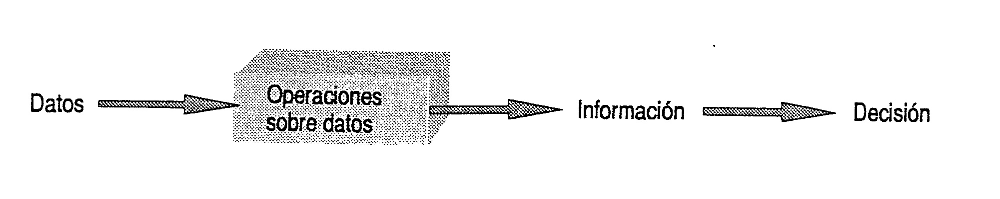
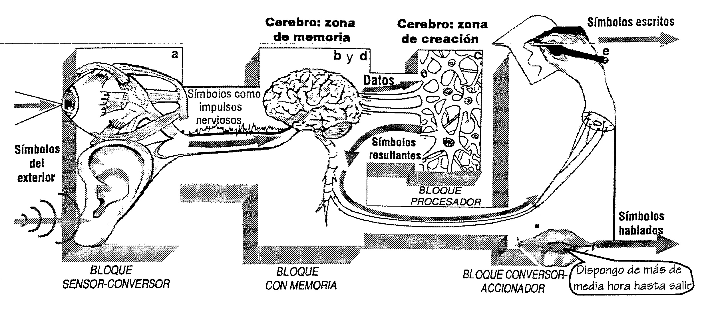
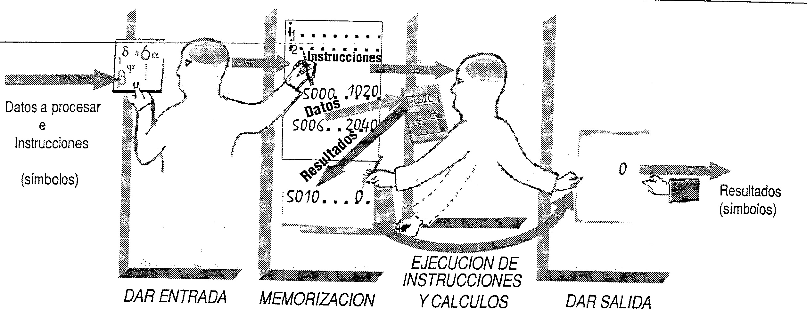

[Índice](../README.md)

[Siguiente](../Cap02/capitulo02.md)

----

# 1.1 Símbolos, datos, procesos de datos e información

### ¿Qué significa que un computador realiza automáticamente procesos de datos que constan de entrada, memorización, procesamiento y salida?

----
> Se debe tener siempre presente que en esencia un computador lleva a cabo procesos de datos, con la particularidad que se puede operar velozmente gran cantidad de datos en forma automática, sin intervención humana.
----

Como primer paso para ubicarse en el funcionamiento de un computador es importante tener claro los cuatro subprocesos principales que realiza (entrada, memorización, procesamiento y salida) y ver que no son familiares, por estar presentes en cualquier proceso de datos – Mental, manual, o con calculadora- que hacemos sin computador.
En los párrafos siguientes se pasa revista a procesos semejantes a los que ocurren dentro de un sistema de computación, a la par que se tratan conceptos tales como símbolos, datos, e información asociada a la decisión.
Para no sucumbir, los seres vivientes debemos permanentemente llevar a cabo anticipaciones provisorias que aseguren una buena adaptación al mundo exterior. Por ejemplo, cuando sin darnos cuenta exponemos alguna parte de nuestro cuerpo a una fuente de calor excesivo, la retiramos rápidamente, sin pensar.

En "cámara lenta" podemos descomponer el proceso ocurrido en cuatro subprocesos:

1.	Las células de nuestro piel de la zona expuesta han convertido la acción calorífica intensa proveniente del exterior en señales eléctricas que van hacia la medula, sin para por el cerebro.
Así se ha internalizado dicha acción, o sea que se dio entrada a nuestro sistema de algo exterior representado por señales internas que podemos operar.
2.	Células de la medula memorizan informaciones anteriores vitales- vía código genético- acerca de señales eléctricas que son “normales”, por no superar su intensidad cierto umbral ancestral de “peligrosidad”. Las señales que de modo continuo llegan del exterior también son retenidas muy brevemente.
3.	Este tiempo es el necesario para que en mediante otras funciones de la medula se pueda determinar, cotejar, comprar – como quiera llamarse- si no supero dicho umbral. En esencia se han procesado señales eléctricas, con un cierto resultado.
4.	Si del consejo llevado a cabo resulta que la señal recibida supera ese umbral, códigos genéticos almacenados desatan reacciones, a partir de señales eléctricas enviadas a músculos del cuerpo para alejar la zona en peligro de la fuente calorífica externa- Esta vez se han convertido señales internas en acciones (movimientos) hacia el mundo exterior. O sea que nuestro organismo dio salida, exteriorizo, el resultado del cotejo efectuado.

En un nivel de anticipación más abstracto, cerebral, no es necesario por ejemplo, que una fuente calorífica peligrosa está cerca nuestra para alejarnos de ella. Basta que alguien nos comunique de la existencia de un incendio próximo para que, de ser necesario, tomemos la decisión de alejarnos del peligro. El mensaje que recibimos consiste en señales audibles, que simbolizan, representan, el incendio, sin necesidad que el mismo este presente frente nuestro. Estas señales audibles, merced al órgano del oído o la vista, se convierten en señales eléctricas que permiten almacenar ese dato simbólicamente en el cerebro.
De igual forma, cuando pensamos en relación con cualquier tema, mentalmente realizamos operaciones con imágenes y palabras que son símbolos que representan sucesos, objetos, personas, etc., **que no necesitan estar presentes necesariamente**.
Más concretamente, realizamos operaciones sobre representaciones simbólicas de propiedades, cualidades conocidas de entes o sucesos.
Estas representaciones simbólicas son **datos** que seleccionamos, reunimos, y sobre los cuales operamos.
La operatoria realizada con símbolos que seleccionamos y reunimos, da por resultado información, que también son símbolos de propiedades de entes y sucesos, que antes desconocíamos. Si bien datos e información pueden ser sinónimos en el lenguaje común, en informática son “input”, “output” de un proceso

----
> La información sirve para *tomar* **decisiones**, con vistas a un accionar concreto (presente o futuro) y se obtiene realizando operaciones sobre datos. Su elaboración permite tomar conocimiento de algún aspecto de la realizar desconocido, lo cual disminuye la incertidumbre existente antes de tomar una decisión.
----

Por ejemplo, supongamos que una persona tiene que comprar un mismo artículo en tres comercios diferentes. Antes de concretar su compra, en su mente podrá tener las siguientes alternativas:

* Si en el comercio A el precio es más barato, entonces compro en A
* Si en el comercio B el precio más barato, entonces compro B
* Si el comercio C el precio es más barato, entonces compro C

Dicha persona por los medios apropiados obtendrá el valor de venta de dicho artículo en cada comercio (datos), como ser en el A: $20; en el B: $19; y en el C: $21. Luego realizara operaciones de comparación entre los datos a fin de determinar cuál es el precio más bajo. Entonces habrá elaborado la información que le interesaba, supuestamente construida por la representación simbólica “en B venden más barato”, la cual le permitirá tomar la decisión de comprar en el comercio B entre las tres alternativas posibles. Obviamente, de no haber elaborado información, y si compra sin más en A o en C, la decisión hubiese sido mal tomada, si el objetivo es el menos costo.

> Los pasos necesarios para obtener información (resulta) a partir de datos (materia prima) constituyen un 
> proceso de datos, o tratamiento de datos.

La información producida en un proceso de datos puede servir como dato en otro proceso.
A continuación determinaremos cuatro subprocesos en que puede dividirse un **proceso de datos mental** entre los innumerables que realizamos con el fin de obtener información, para poder conducirnos, para determinar por medio de representaciones simbólicas que hacer en cada situación cotidiana.
Supongamos que alguien debe ir al cine a cierta hora, y debe decidir, si alcanza a bañarse o no; como ha de vestirse acorde al clima reinante, y que a qué hora debe salir para llegar a horario. En este momento podría tener expectativas tales como “si tengo tiempo que me gustaría bañarme”, “si el tiempo está lindo me gustaría usar tal vestimenta”, etc.
El procesamiento de datos que llevara a cabo puede componerse en una serie de acciones que ocurrirán en su interior, que están en relación con los bloques referenciados de a) hasta e) en la siguiente figura 1.1.

La persona en cuestión podría proceder así:
* a) *Entrada:* primero incorporaría selectivamente los datos pertinentes necesarios, usando típicamente la vista y el oído para escenarios del exterior.
* b) *Memorización:* los registraría en su mente, reunidos:
  * Ir al cine
  * Hora de inicio de la función: 20Hs (leída en un periódico)
  * Hora actual: 19hs (leída en un reloj)
  * Estado y pronostico del tiempo (de la radio o televisión)
  * Ropa de vestir para ese tiempo (datos en su memoria)
  * Tiempo que tarda en bañarse: 15 Minutos (dato en su memoria)
  * Tiempo de viaje normal: 15 Minutos (dato en su memoria)

Los valores así hallados a partir de los datos primarios conocidos serán nuevos datos elaborados (información). Al realizar los cálculos anteriores también se establecieron relaciones de orden, al suponer que se hace primero y que después. A continuación relacionaría el pronóstico del tiempo con la ropa más adecuada y lista para usar en esas condiciones climáticas y establecería relaciones de equivalencia, entre vestimentas que tienen propiedades de abrigo similares. Eso también supone que debió realizar una clasificación. Luego podría usar su memoria, para extraer el dato estimativo de cuánto tiempo lleva vestirse de una manera o de otra, etc. 
* c)Conforme al resultado del procesamiento de datos efectuado en el paso anterior, poseerá la siguiente **información**, que en forma escrita podría expresarse así: “Dispongo de más de media hora hasta salir, tiempo suficiente para bañarme rápido y vestirme con tal o tales prendas que están listas para usar. Como máximo debo salir a las 19.45 HS”. Ha resultado así un nuevo conjunto de representaciones simbólicas significativas, obtenidas a partir de aquella correspondiente a los datos primarios, se han obtenido **símbolos** a partir de otros **símbolos**.
d) El resultado alcanzado (información “interna”) puede ser exteriorizada como información externa, ya que en forma verbal o escrita, si el cerebro ordena a los músculos relacionados con el habla que actúen, o a los músculos de la mano que escriban, respectivamente. Así exteriorizada, esta información por ejemplo podría comunicarse con otra persona, para que lo ayude a decidir correctamente. Si queda en la memoria de la persona que la elaboro, ella tomara luego las decisiones pertinentes.

Como punto de partida para comprender el funcionamiento de un computador, describiremos un proceso de datos manual auxiliado por calculadora. Este proceso, también puede desglosarse en cuatro subprocesos: entrada, memorización, procesamiento y salida, esquematizados en la figura 1.2
Antes de la aparición de computadoras, una supuesta oficina de cálculos de ingeniería funcionaba de la siguiente forma. Una persona idónea en el manejo de una calculadora común, se dedicaba a realizar operaciones con esta. Calculistas programaban la serie de operaciones a realizar por el “idóneo” con la calculadora, y otra persona “auxiliar” las escribía ordenadamente en una planilla con renglones numerados, y también en ella los datos a procesar. La última orden de la secuencia puede indicar escribir en otra planilla una copia de resultado obtenido.
Por ejemplo, una secuencia sencilla de operaciones ordenadas, que denominaremos “instrucciones” (simbolizadas * I1, I2…) escritas en renglones sucesivos, podría ser la siguiente:

* I1: Registrar en el visor de la calculadora el número que está en el renglón 500 (o sea 1020)
* I2: Sumarle al número del visor el número que está en el renglón 500 (nuevamente el 1020)
* I3: Réstale al número del visor el número que está en el renglón 506(o sea el 2040)
* I4: Escribir el resultado que totaliza el visor en el renglón 5010 (o sea el 0000 ira en el renglón 5010)
* I5: Copiar en la planilla auxiliar el valor que indica el renglón 5010.

---
> Es importante seguir en detalle esta secuencia de instrucciones, pues más adelante se repiten como instrucciones de máquina que se ejecutaran en una PC.
---

El primer bloque del esquema de la figura 1.2 da cuenta de la entrada de datos e instrucciones a la planilla, merced o a la acción de la persona que programo las operaciones a efectuar. El “idóneo” **leerá en el orden dado** cada instrucción, y digitara en la calculadora la tecla correspondiente a la operación, el cual será introducido a la calculadora por medio del teclado.
La operación ordenada se llevara a cabo al pulsar la tecla (=). Un resultado parcial o total que está en el visor de la computadora podrá registrarse (escribirse) en un renglón indicado de la planilla, cada vez que una instrucción (como **I4**) así lo ordene.
Con el cuarto bloque conversor se representa la acción del “idóneo” de dar salida hacia otra planilla auxiliar, algún resultado o dato existente en la planilla principal, cuando así lo prescriba una instrucción (como **I5**).
Para los valores numéricos supuestos en los renglones, la operación realiza fue 1020 + 1020 – 2014 = 0 habiéndose asignado el resultado 0 al renglón 5010. Si llamamos R al resultado la secuencia de instrucciones anterior permite en general hallar el valor de la variable R en expresión P + P – Q= R 
> Observe que una calculadora común tiene memoria interna, utilizable con la tecla **M+** (que ordena sumar al número memorizado el que está en el visor, y el resultado memorizarlo en reemplazo de dicho primer número). Asimismo, el valor memorizado puede verse en el visor, pulsando **MR**.
> Pero se trata de una memoria para un solo número. Con ello solo se podrían llevar a cabo las instrucciones I1 e I2 de la siguiente forma. Suponiendo en el renglón 500 se haya escrito (memorizado) el número 1020, para hacer lo mismo en la calculadora, primero habría que tipear dicho número (1020) de forma que aparezca en el visor. Luego para memorizarlo se pulsaría **MC** (puesto a cero de la memoria) seguido de **M+**. Cuando se quiera ejecutar **I1** se pulsara **MR** con lo cual necesariamente 1020 pasara de la memoria al visor (si por algún motivo 1020 fue reemplazado por otro número). Para ejecutar **I2** se debe pulsar la tecla + seguida de **MR**, con lo cual al 1020 se le vuelve a sumar 1020 como en esencia ordena **I2**.

# *¿Cuáles son las operaciones primarias en los procesos de datos?*
Existen 8 acciones primarias (“**primitivas**”) que pueden encontrarse en distintos procesos de datos:
* **Entrar** datos al sistema encargado de procesarlos
* **Asignar** un valor como perteneciente a un determinado nombre de datos o variables
* **Comprar** dos valores de datos para conocer la relación (< = >) existente entre ellos
* **Archivar** almacenar datos durante el tiempo en algún medio
* **Recuperar:** leer, datos archivados en algún medio
* **Calcular:** generar, un nuevo valor aplicando una función matemática o textual
* **Borrar** datos archivados
* **Dar salida:** exteriorizar, obtener del sistema datos resultantes. 

----
[Índice](../README.md)
[Siguiente](../Cap02/capitulo02.md)