[^ Índice](README.md) | [Siguiente >](apendice2.md)

----

# **Apéndice 1**

# **REPRESENTACIÓN DE NÚMEROS BINARIOS NATURALES Y OPERACIONES CON ELLOS**

## **A1.1 SISTEMAS NUMÉRICOS POSICIONALES**

### **¿Qué es un sistema numérico posicional?**

La necesidad de representar conjuntos de objetos ha llevado a las distintas culturas a adoptar diversas formas de simbolizar su valor numérico. Una manera primera de representar el número de elementos que constituyen un cierto conjunto, es establecer una correspondencia con un número igual de símbolos. Esto lo hacemos cuando cantamos con los dedos, o sí para representar, como ser, los días de la semana, dibujamos igual número de trazos: | | | | | | |
Tal sistema de representación seria *“uranio”*, pues se usa un solo tipo de símbolo. Su desventaja es que no permite simbolizar cómoda y rápidamente conjuntos con muchos elementos,

Cuando fue necesario designar la existencia de muchos elementos, se trató siempre de **utilizar la menor cantidad de símbolos**, para lo cual se estableciera operaciones implícitas entre los mismos.
Los romanos utilizaron un sistema de signos de valor creciente: I, V, X, L, C, D, M, etc., que se agrupaban de derecha a izquierda, sumándose o restándose entre sí, según siguieran a no el orden creciente: 
				**CXVII**  = cien + diez + cinco + uno + uno
				**MCMV**   = mil + (mil - cien) + cinco

Esta codificación requería nuevos símbolos cuando se agotaban los de mayor valor, a la par que los cálculos por su complejidad convenio realizarlos con ábacos. Fueron los pueblos orientales y americanos (mayas) los que desarrollaron los sistemas posicionales, basados en un conjunto limitado y constante de símbolos, entre lo cuales se encontraba el “cero”, para indicar la ausencia de elementos. Miles de años antes, el ábaco, construido en la tierra o con madera fue el antecesor natural de estos sistemas, siendo que la ausencia de objetos en una posición o varilla implicaba de hecho el cero.

En estos sistemas, **cada símbolo**, ademas del número de elementos de un tipo que representa considerado aisladamente, **tiene un significado o peso distinto, según la posición que ocupa el grupo** de caracteres del que forma parte.|
:-|

De esta manera es posible representar sistemáticamente cualquier número, empleando en forma combinada un conjunto limitado de caracteres simbólicos.

Los caracteres se denominan “dígitos”, y constituyen piezas de información digital (sección 1.10)  

> Relacionado con los diez dedos, el sistema posiciones decimal, también denominado de “base o raíz diez” por utilizar diez símbolos (que forman la sucesión monótona creciente 0, 1, 2, 3, 4, 5, 6, 7, 8, 9) permite representar cualquier número de elementos cocinando dichos símbolos.

Este sistema servirá para comprender conceptualmente en que consiste y cualquier es la estructura de cualquier sistema numérico posicional.

Si bien en la práctica aprendemos mecánica e intuitivamente. sin pensar, la magnitud de un número decimal con solo visualizarlo, en realidad la capacidad de elementos que el número simboliza se determina sumando los productos que se obtienen de multiplicar el valor de una unidad que representa cada dígito por el “peso” (valor) de la  posición que ocupa (unidades, decenas, etc): 

9323 = 9 x 1000 + 3X100 + 2x10 + 3x1 siendo: 10 = 1x10 = 101; 100 = 10X10 = 102; 1000 = 100x10 = 103

Resulta que **el peso de cada posición es el del anterior multiplicado por la base** (diez, o sea el número de símbolos del sistema), resultando así los pesos potencias crecientes de la base. Esto es común a todos los  sistemas posicionales. En caso de necesitarse representar números más grandes se usan siempre los mismos diez símbolos, y solo es necesario agregar nuevas posiciones a la izquierda. Un sistema numérico es una forma de fraccionar una totalidad en posiciones, cuyos tamaños, apartar del valor uno, se van escalonando -a medida que se requieren nuevos tamaños - de forma tal que cada nuevo tamaño que se necesite es el anterior multiplicado por la cantidad de símbolos de la base. El número máximo de posiciones de cada tamaño lo determina el símbolo de mayor valor de la base en cuestión.|
:-|

Cuando leemos 109 persona ( 109 = 1x100 + 0x10 + 9x1) en relación a la totalidad de dichas personas, las mismas de hecho han sido divididas en forma virtual, de modo de conformar de manera única:
* un solo grupo de 100, (pudiendo existir hasta 9 grupos posibles de 100),
* con las restantes (109 - 100 = 9) no se puede formar ningún grupo de 10, y sí 9 grupos de una persona.
También puede pensarse en relación los el número 109, que en una balanza (Figura A1.1) se debe pensar un objeto de peso supuestamente desconocido, pero que a los fines didácticos de simular su pesada debemos partir de que dicho peso es conocido (109 grs.).

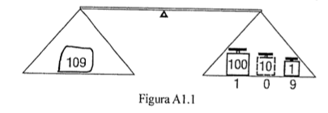

Los juegos de pesas a utilizar en base de 10 serán subconjuntos de 9 múltiples de diez:

* 9 pesas de 1 gramo
* 9 pesas de 10 gramo
* 9 pesas de 100 gramo
* 9 pesas de 1000 gramo… y así de seguido;

o sea que podemos tener más subconjuntos de 9 pesas que sean múltiplos de diez (teóricamente infinitos), según sea la magnitud de peso de los objetos que se quiere pesar.

Para pesar dichos objetos se usaría primero una pesa de 100 grs. (la de mayor peso posible para empezar a equilibrar, sed que con dos pesas de ese tipo se excederían los 109 grs. a pesar: 100 + 100 = 200 > 109). Luego si se prueba con una pesa de 10 grs. también se excederá el peso a ponderar: 100 + 10 = 110 > 109. Finalmente agregando 9 pesas de 1 gr. se equilibra la balanza. En definitiva se usaron una pesa de 100 gas, 0 pesas de 10 gas y 9 pesas de 1 gr. con lo cual el número 109 indica el peso del objeto en base de diez. O sea:

  1  0 9 = 1x100 + 0x10 + 1x9

Es importante observar que tanto con las personas como con las balanzas, se empieza siempre respectivamente por los grupos o pesas más grandes (de valor… 1000, 1000, …) que se puedan formar o emplear. De este modo se asegura que la representación simbólica es única.

### **¿Cuáles son las características de los sistemas numéricos posicionales?**
---

Podemos sistematizar como sigue las características del sistema decimal, que también, como se tratará, son comunes a todos los sistemas numéricos posiciones, cualquiera sea su base (definida por el número de símbolos empleados para formar los números)

* Consta de un número finito de símbolos individuales distintos que constituyen la “base o raíz” del sistema ( diez en el sistema decimal, dos en el binario, etc.).
* Cada símbolo aislado representa un número específico de unidades.
* Existe un símbolo (cero) para indicar la ausencia de elementos a representar.
* Los símbolos que pueden rodearse en forma monótona creciente.
* Formando parte de un número compuesto por varios símbolos, un mismo símbolo tiene un significado o “peso” distinto según su posición relativa en el conjunto.
* La posición extrema derecha corresponde a unidades (peso uno); a partir de ella, **cada posición tiene el peso de la que está a su derecha multiplicando por la base**, resultando siempre que el peso de cada posición es una potencia de la base. Esta en todas las bases se simboliza **10** (“uno cero”).|
:-|

## **A1.2 SISTEMAS NUMÉRICOS OCTAL, BINARIO Y HEXADECIMAL**

### **¿Qué símbolos se emplean en otras bases numéricas y cómo se representan números en ellas?**
---

A los fines de que resulte fácil simbolizar números en otros sistemas numéricos, los sistemas 0 y 1 existen en todos los sistemas con igual significado que en el decimal. Si otras sistemas usan algunos o todos los símbolos decimales restantes del 2 al 9, se ha acordado que su  significado es el mismo que en decimal. Así **7** representa siete unidades, ya sea en decimal, octal o hexadecimal.

El **sistema hexadecimal** tendrá dieciséis símbolos distintos que construyen la base. Del 0 al 9 coinciden en el significado con los correspondientes decimales; para los seis restantes se crearon los símbolos de la **A** hasta la **F**, como aparecen en la figura A1.1 en correspondencia con sus equivalentes decimales y con los números de otros sistemas.

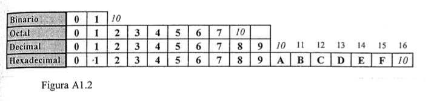

### **Sistema en base de ocho u octal**

En base ocho los ocho símbolos van del 0 al 7 (fig. A1.2), con los cuales se puede formar cualquier número. Con los mismos supuestos que planteamos para la pesada realizada en la relación co la fig. A1.1, pesaremos (fig. A1.3) el mismo objeto cuyo peso en el optar supondremos desconocido, siendo que la base de diez pesa 109 grs. Veamos cuáles son las pesas en la base ocho. Si en base diez cada pesa en relación con la del tamaño anterior era diez veces más pesada, en optar lo será **ocho veces**. Juntando ocho pesas de un valor se construye una pesa del tamaño siguiente. Si para fines didácticos simbolizamos en base de diez el peso de cada tipo de pesa octal, por lo que se tendría la serie de valores: 1gr.; 1gr. x 8d = 8d grs.; 8d grs. x 8d = 64d grs.; 64 d gas x 8d = 512d gas, etc…El símbolo “d” incida que se trata de base diez. el símbolo para representar el 1 es el mismo en ambas bases. De cada uno de los dichos tamaños existe un total de **7** pesas octales (en base diez eran 9), siendo 7 el símbolo octal de mayor valor:

* 7 pesas de 1gr.
* 7 pesas ocho veces mayores que la de 1gr. (8d grs.)
* 7 pesas dieciséis veces mayores que la de 1 gr. (16d gramos) y ocho veces mayor que el tamaño anterior.
* 7 pesas sesenta y cuatro veces mayores que la de 1 gr. (64d grs.) y ocho veces mayor que el tamaño anterior.

y así de seguido, ósea que podemos tener más subconjuntos de 7 pesas que sean múltiplo de ocho (teórica-mente infinitos), según sea la magnitud del peso de los objetos que se quieren pesar.

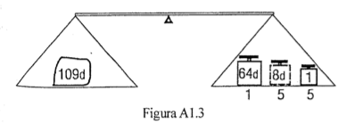

Volvemos a pesar el objeto que en base diez pesaba 109 grs. cuando se pesa un objeto en general se desconoce su peso, el cual hay que determinar. Para ello se requiere ir probando poniendo y sacando pesas (optares en este caso), hasta que con las pesas adecuada la balanza alcance el equilibrio. La selección de las pesas adecuadas la situaremos haciendo cálculos simples en base diez, como se hizo en relación a la figura A1.1. Suponiendo (fig. A1.3) que se empieza adecuadamente a equilibrar la balanza con una pesa sesenta y cuatro veces mayor que la de 1gr. en el platillo derecho. Pensando en la base diez se habrán equilibrado 64d gas, por lo que faltará equilibrar 109 - 64 = 45d grs.
Si se coloca otra pesa del mismo tamaño que el anterior se tendría: 64d +64d = 128d > 109d, y el peso del platillo derecho superaría al del izquierdo, por lo que no puede colocarse más que una pesa de dicho tamaño.

Probando ahora con pesas ocho veces mayores que la de 1 gr. si se colocan en el platillo derecho 5 pesas de 8dn lo Cual suma 40d), de los 45d que faltaba balancear, ahora restarán balancear 45d - 40d = 5 grs., lo cual se reata colocando 5 pesas de 1 gr.
En definitiva, en el platillo derecho se habrían colocado: **1** pesa sesenta y cuatro veces más pesada que 1 gr. ; 5 pesas ocho veces más pesadas que las de 1 gr. y **5** pesas de 1 gr. Esto quedarÌa simbolizado en octal (0) como 155

Entonces    1  0   9d  =  1  5  5  0 (sobre los símbolos en base diez y base ocho se indican sus pesos en decimal)
(La igualdad anterior también implica que si en un plato de la balanza colocamos las pesas en base diez correspondientes al 109, y en el otro las pesas octales correspondientes al **155**, obviamente se equilibrarán)

El mismo objeto que en la fig. A 1.1 fue fraccionado artificialmente en porciones indicadas como 109d; en la fig A1 .3 lo hemos fraccionado también en forma virtual en porciones para simbolizar su peso en octal. Si a los fines de comparar lo efectuado en ambas casos expresamos el valor de las pesas octales en base diez, resulta que 155ø implica que se fraccione dicho objeto en una porción de 64 grs, en 5 porciones de 8 grs. y en 5 porciones de 1 gr.
Asimismo, si pensamos en el conjunto de personas que en base diez fue dividido conforme indican los símbolos 109, dicha totalidad en base ocho fue dividida (pensando el tamaño de los grupos en base diez), en un grupo de 64, 5 grupos de 8, y 5 grupos de una persona, siendo que pueden existir hasta 7 grupos de cada tipo

Nuevamente se verifica que un sistema numérico es una forma de fraccionar una totalidad en porciones, cuyos tamaños, a partir del valor uno, se van escalonando -a medida que se necesitan nuevos tamaños- de forma tal que cada nuevo tamaño que se necesite es el anterior multiplicado por la cantidad de símbolos de la base. El n˙mero máximo de porciones de cada tamaño lo determina el símbolo de mayor valor de la base en cuestión.|
:-|

**¿Cómo se simbolizan los pesos en octal sin necesidad de estimarlos en base diez?**
Hasta acá nos hemos centrado en el objetivo de entender conceptualmente que es un sistema numérico posicional, para lo cual por razones didácticas hemos valorado los pesos en base diez, mediante los cuales simbolizamos el peso de un objeto o de un n˙mero de elementos usando los símbolos en base ocho. Si bien se puso énfasis en que la balanza usaba pesas octales, y que el peso simbolizado 155 se podía lograr -sin conocer que es 109d- equilibrando la balanza con pesas octales, de hecho los cirlculos que hemos realizado en base diez para llegar al 155 **implican un pasaje de base diez a octal método que seguiremos usando**.
A fin de ratificar que cada sistema de numeración no surge del sistema decimal, sino que es independiente, como lo sugiere claramente la posibilidad de pesar usando pesas octales, expresaremos en octal el valor de las pesas o pesos de este sistema. Simplemente (fig. Al.4.a) si ponemos en el plato izquierdo de la balanza una pesa ocho veces mayor que 1 gr. (8 grs. en base diez) para equilibrarlo hace falta una sola pesa ocho veces mayor que 1 gr, y ninguna (cero) pesa de 1 gr., o sea que esta pesa o peso **en octal se simboliza 10** (léase uno-cero, y no “diez”).
 
                                                                           
Conforme con esto, en la fig. A1.2 luego del símbolo mayor 7 sigue el **10** (1 0Û = 8d), así como en base diez después del 9 sigue el 10. Esto es general: **en cada base al símbolo más alto en valor le sigue en valor el 10**. Del mismo modo (fig. A1.4.b), si en el plato izquierdo se coloca una pesa sesenta y cuatro veces mayor que 1 gr se equilibra con una sola de ese tamaño y ninguna de los tamaños menores, por lo que en octal este peso se simboliza lOOÛ (lÈase uno-cero-cero, y no ìcienî). Igualmente una pesa 256 veces mayor que 1 gr se equilibra con solo una de ese tamaÒo, y ninguna de los tamaños subsiguientes, por lo que en octal este peso es **1OOO**0, etc

O sea 100% en octal: 1   5  5  Û = 1x100 + 5x10 + 5xl]Û

Esta cuenta (que indica una pesa de 100, más 5 de 10, más una de 1) realizada en octal daría, obviamente, 155Û.
									

La apreciación de los pesos de 155 0 en base diez era 1 5 5 Û = [1x64 + 5x8 + 5xl]d = 109d ; esto es, pensado en base diez se usaron una pesa de 64 más 5 de 8, más 5 de 1, suma que da 109d.

Al apreciar los pesos en base diez en esencia se está pasando de octal a base diez, siendo que el significado de los símbolos 1 y 5 es el mismo en ambas bases. Este método será el usado para pasar de cualquier base a decimal.|
:-|

**Ejercicios:**
Con la balanza con pesas octales pesar un objeto que en base diez pesa 100d.
Idem otro que pesa 120d

## **Sistema en base dos o binario**

En base dos los símbolos con los cuales se puede formar cualquier número son 0 y 1 (figura A1.2),Con los mismos supuestos que planteamos para la pesada realizada en relación con la fig. A 1.1, pesaremos (fig. A 1.5) eÌ mismo objeto cuyo peso en binario se quiere determinar, siendo que en base diez pesa 109 grs. Veamos cuáles son las pesas en base dos. Si cada pesa en base diez en relación con la del tamaño anterior era diez veces más pesada, en binario lo será dos veces: juntando dos pesas de un valor se construye una pesa del tamaño siguiente. Si para fines didácticos simbolizamos en base diez el peso de cada tipo de pesa binario, se tendría la serie de valores: 1 gr; 2d grs: 4d grs; 8d grs; 32d grs; 64d grs; 128d grs; 256d grs; 512dgrs., etc... El símbolo "d" indica que se trata de base diez. El símbolo para representar 1 gr. es el mismo en ambas bases.
De cada uno de dichos tamaños existe **una sola pesa** (en base diez eran 9), siendo 1 el mayor símbolo binario:
* 1 pesa de 1 gramo
* 1 pesa dos veces mayor que la de 1 gr. (2d)
* 1 pesa cuatro veces mayor que la de 1 gr. (4d)
* 1 pesa ocho veces mayor que la de 1 gr. (8d

Y así de seguido, o sea que podemos tener más pesas, cada una múltiplo de dos (teóricamente infinitas), según sea la magnitud del peso de los objetos que se quiere pesar.		

La pesa de cada valor se usa (1), o no se usa (0)|
:-|

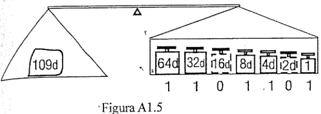

Pesaremos otra vez el objeto que en decimal pesaba 109 grs. La selección de las pesas adecuadas la simularemos haciendo circulos simples en base diez, como se hizo en relación con las figuras A 1.1 y Al.3. Suponiendo (fig. Al.5) que se empieza adecuadamente a equilibrar la balanza colocando en el platillo derecho la pesa 64 veces más pesada que la de 1 gr, pensando en base diez se habríán equilibrado 64d grs, por lo que faltará equilibrar 109-64 = 45d grs. Figura Al .5	64d grs, por lo que faltará equilibrar 109-64 = 45d grs.

Probando equilibrar agregando en el platillo derecho la pesa de tamaño menor siguiente, 32 veces mayor que la de lgr., de los 45d que faltaba balancear, ahora restarán balancear 45d - 32d = 13 grs. Si se prueba colocar la pesa 16 veces mayor que la de lgr, sumando en base diez resultarÌa (64 + 32 + 16)d = 112d > 109d, con lo cual el peso del platillo derecho superarÌa al del izquierdo, por lo que no puede colocarse la pesa 16 veces mayor que la de 1 gr. Esto se simboliza con un cero en relación con esa pesa 16 veces mayor.. Colocando la pesa 8 veces mayor que la de 1 gr. resultan balanceados (64 + 32 + 8)d = 104d grs., faltando ahora balancear (13 - 8)d= 5d grs. Agregando la pesa siguiente, 4 veces mayor que 1 gr. faltarÌa balancear (5 -4)d = Id gr., por lo que no se puede colocar (cero) la pesa 2 veces mayor que la de 1 gr., y sÌ debe agregarse la pesa de 1 gr.
En definitiva, en el platillo derecho se habrían colocado: 1 pesa binaria 64 veces más pesada que la de 1 gr.; 1 pesa binaria 32 veces más pesada que la de 1 gr.; 0 pesa binaria 16 veces más pesada que la de 1 gr.; 1 pesa binaria 8 veces más pesada que la de 1 gr.; 1 pesa binaria 4 veces más pesada que la de 1 gr.; 0 pesa binaria 2 veces más pesada que la de 1 gr.; 1 pesa binaria de 1 gr. Esto quedarÌa simbolizado binario (b) como 1101101b

Entonces   1   0 9d   = 1  1  0 1 1 0 1 b   (sobre los símbolos en ambas bases se indican sus pesos en decimal)

El mismo objeto que en la fig. A 1.1 fue fraccionado artificialmente en porciones indicadas como 109d; en la fig. Al.5 lo hemos fraccionado también en forma virtual en las porciones indicadas para simbolizar su peso en binario. Asimismo, si pensamos en el conjunto de personas que en base diez fue dividido conforme indican los símbolos 109, dicha totalidad en base dos fue dividida (pensando el tamaño de los grupos en base diez), en un grupo de 64, un grupo de 32; entre los restantes no se pudo formar ningún grupo de 16, sÌ un grupo de 8 y otro de 4; entre los restantes no se pudo formar ningún grupo de 2, y si un grupo de una persona.

Nuevamente se verifica que un sistema numérico es una forma de fraccionar una totalidad en porciones, cuyos tamaños, a partir del valor uno, se van escalonando -a medida que se necesitan nuevos tamaños- de forma tal que cada nuevo tamaño que se necesite es el anterior multiplicado por la cantidad de símbolos de la base.

**¿Qué son los bits y bytes?**
El número binario 1101101 consta de 7 dígitos binarios. En inglés serían 7 binary digits, o sea 7 bits.
O sea que un bit es un dígito binario, por lo que es un símbolo que puede valer 0 Û 1.
Un **byte** es un conjunto de 8 bits. El tamaño de las memorias se mide en bytes. En el interior de un procesador se opera con múltiplos pares de un byte: 2, 4, 8, 6 bytes (16, 32, 64, 128 bits)

**¿Cómo se simbolizan los pesos en binario sin necesidad de estimarlos en base diez?**
Nuevamente por razones didácticas hemos estimado los valores de las pesas binarias en base diez. Si bien se planteÛ que la balanza usaba pesas binarias, y que el peso simbolizado 1101101b se podía lograr sin conocer que es 109d- equilibrando la balanza con pesas binarias, de hecho los cálculos que hemos realizado en base diez para llegar al 1101101 **implican un pasaje de base diez a binario, método que seguiremos usando**
A fin de ratificar que cada sistema de numeración no surge del sistema decimal, sino que es independiente, como lo sugiere claramente la posible. dad de pesar usando pesas binarias, expresaremos en binario el valor de cada pesa de este sistema. Simplemente (figura Al.6.a) si ponemos en el plato izquierdo de la balanza una pesa binaria dos veces mayor que la de l gr. (2d grs.) para equilibrarla se utiliza (1) la pesa de dicho tamaño y no se usa (0) la pesa de 1 gr., o sea que esta pesa **en binario se simboliza 10**) (léase uno-cero, y no “diez”).

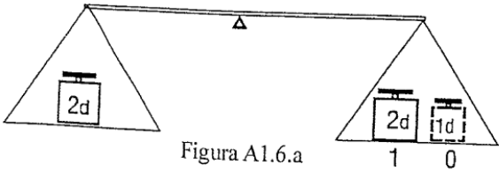

Conforme con esto, en la fig. A1.2 luego del símbolo mayor 1 sigue el 10 (1 0Û = 2d), asÌ como en base diez después del 9 sigue el 10, y en base ocho al 7 le sigue 10.
*Del mismo modo (fig. A1.6.b), si en el plato izquierdo se coloca un cuerpo cuatro veces el peso de 1 gr. (4d grs. en base diez), se equilibra usando (1) la pesa binaria cuatro veces mayor que la de 1 gr., sin usar (0) la pesa dos veces mayor que la de 1 gr., y sin usar (0) la pesa de 1 gr., por lo que en binario este peso se simboliza 100b (léase uno-cero-cero, y no “cien”). Igualmente un objeto ocho veces mayor que 1 gr (8d grs.) se equilibra con la pesa binaria de ese tamaño, y ninguna de los tamaños subsiguientes, por lo que en binario este peso es lOOOÛ, etc. Por lo tanto, en binario las pesas se simbolizan 1, 10, 100, 1000 . . . (estos mismos símbolos representan los valores de las pesas que se usan en base diez, aunque en binario representan 1,2,4 y 8, respectivamente).

      1      1     0    1   1  0 1  b  = (1x1000000 + 1x100000 + 0x10000 + 1x1000 + 1x100 + 0x10 + 1x1)b = 1101101b
Esta cuenta (que indica sumar: la pesa de 1000000, la de 100000, no la de 10000, la de 1000, la de 1000, la de 100, no la de 10 y sÌ la de 1 gr) realizada en binario darÌa, obviamente, 1101101b.
	
									
Los pesos de 1101101b en base diez eran  1  1  0  1  1	0  1 = [1x64 + lx32 + 0x16 + 1x8 + 1x4 + 0x2 + 1x1]d = 109d ; esto 
es pensado en base diez se usaron la pesa de 64 más la de 32, más la de 8, más la de 4, más la de 1, suma que da 109d. Otra vez vemos que al valorar los pesos de una base en base diez, de hecho estamos pasando de esa base a base diez.

**Ejercicios:**
Con la balanza con pesas binarias pesar un objeto que en base diez pesa lOOd.           Respuesta: 1100100b
Idem otro que pesa 124d																	Respuesta 1111100

**Cuál son los números binarios naturales extremos representables en n bits expresados en decimal?**
Vamos a partir de n=4 bits, para luego generalizar para cualquier número **n** de bits.
El valor mínimo es NMIN = 0000b = 0d; y el máximo NMAX = 1111b = 15d = 16-1 = 2^4 - 1 
En general para **n** bits	

NMIN - 00	00b - Od; y el máximo NMAX = 11.....11b = (2^n - 1)d (el número que sigue a NMAX menos uno)|
:-|

**Sistema en base dieciséis o hexadecimal ("hexa")**

Si bien la representación de la información en el interior de un computador sólo puede ser simbolizada en binario, ello implica leer o escribir lasrgas sucesiones de ceros y unos (16, 32, 64). La utilidad del hexadeimal reside en que, como se verá, por un lado resulta sencillo pasar de binario a hexa y viceversa; y por otro, en que para representar un mismo número, se requiere cuatro veces menos símbolos en hexa que en binario.|
:-|

En hexa los dieciséis símbolos van del 0 a F (fig. A 1.2), con los cuales se puede formar cualquier número. Mientras que en base diez para indicar del 10 al 15 se necesitan dos símbolos, en hexa se usa uno solo.
*Con los mismos supuestos que planteamos para la pesada realizada en relación con la fig. A1.1, pesaremos (fig. Al.3) el mismo objeto cuyo peso en hexa supondremos desconocido, siendo que en base diez pesa 109 grs. Veamos cuáles son las pesas en hexa. Si cada pesa en relación con la del tamaño anterior en base diez era diez veces más pesada, en hexa lo será dieciséis veces: juntando dieciséis pesas de un valor se construye una pesa del tamaño siguiente. Si para fines didácticos simbolizamos en base diez el peso de cada tipo de pesa hexadecimal se tendría la serie de valores: 1 gr; lgr xl6d = 16d grs; 16d grs xl6d = 256d grs; 256d grs xl6d = 4096d grs., etc. El símbolo ìdî indica que se trata de base diez. El símbolo para representar 1 gr. es el mismo en ambas bases. De cada uno de dichos tamaños existen un total de F pesas hexadecimales (en base diez eran 9), siendo **F** =15d el símbolo hexadecimal de mayor valor:

* F pesa de 1 gr.
* F pesas diediséis veces mayor que la de 1 gr. (**16**d grs)
* F pesos docientoscincuenta y seis veces mayor que la de 1 gr. (**256**d grs) y dieciséis veces el tamaño anterior
* F pesas mil veinticuatro veces mayor que la de 1 gr. (**1024**d grs) y dieciséis veces el tamaño anterior.
y así de seguido, o sea que podemos tener más subconjuntos de F pesas que sean múltiplos de dieciséis
(teóricamente infinitos), según sea la magnitud del peso de los objetos que se quiere pesar.

Otra vez pasaremos el objeto que en base diez pesaba 109 grs. La selección de las pesas adecuadas la simularemos
haciendo cálculos simples en base diez, como se hizo en relación con las figuras A 1.1 y A 1.3.
Suponiendo que se empieza adecuadamente a equilibrar la balanza con las pesas dieciséis veces más pesadas
que 1 gr., se podrán colocar hasta 6 pesas de este peso, con la cual, calculando en base diez, habremos equilibrado
6x16=96d grs., faltando equilibrar 109-96=13d grs. El equilibrio de los platillos se logra agregando 13d= Dh pesas del
tamaño menor siguiente, que es de 1 gr. Por consiguiente, el peso del objeto en hexa es **6D**. O sea: 109d = 155o = 1101101b = 6Dh

Así mismo, si pensamos en el conjunto de personas que en base diez fue dividido conforme indican los símbolos 109, dicha totalidad en base dieciséis fue dividida (pensando el tamaño de los grupos en base diez), en 6 grupos de 16, y 13 grupos de una persona, siendo que pueden existir hasta F=15 grupos de cada tipo.

**¿Como se simbolizan los pesos en hexadecimal sin necesidad de estimarlos en base diez?**
Al igual que cualquier otro sitema, el hexadecimal no surge del sistema decimal, sino que es independiente, como así lo sugiere la posibilidad de pesar el objeto en cuestión usando pesas hexadecimales, pudiéndose simbolizar en hexa el valor de las pesas o pesos de este sistema. 
Simplemente si ponemos en el plato izquierdo de la balanza un peso dieciséis veces mayor que 1 gr. (16 grs. en base diez)
para equilibrar hace falta una sola pesa dieciséis veces mayor que 1 gr., y ninguna (cero) pesa de 1 gr., osea que esta pesa o peso *en hexa se simboliza 10* (Léase uno-cero, y no "diez").
Conforme con esto, en la fig. A1.2 luego del símbolo mayor F sigue el 10 (1 0h = 16d), así como en base diez después del 9 sigue el 10, en octal después del 7 sigue 10, y en binario después del 1 sigue el 10.
Del mismo modo si en el plato izquierdo se colocarÌa un peso doscientos cincuenta y seis veces mayor que 1gr. se equilibra con una sola de peso de ese tamaño y ninguna de los tamaños menores, por lo que en hexa este peso se simboliza 100h (léase uno-cero-cero, y no "cien")

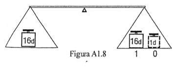

Por lo tanto, también en hexa las pesas se simbolizan 1, 10, 100, 1000 ... (estos símbolos representan los valores de las pesas que se usan en base diez, aunque en hexa representan 1, 16, 256, y 4096, respectivamente). o sea 100% en hexa: 

6   D  h  = 6 x 10 + Dx1]h

Esta cuenta (que indica 6 pesas de 100, más D pesas de 1) realizada en hexadecimal daría, obviamente, 6 Dh.
Con los pesos de 6 Dh en base diez es: 6 Dh = [6x16+13x1]d= 109d; esto es, pensando en base diez se usaron una pesa de 64 más 5 de 8, más 5 de 1, sumar que da 109d. Como ya se dijo, al valorar los pesos de una base en base diez en esencia se está pasando de dicha base diez.

**Ejercicios:**
Con la balanza con pesas hexadecimales pesar un objeto que en base diez pesa 112d.          Respuesta: 70h
Idem otro que pesa 100d																		Respuesta: 64h

### **Cómo se halla fácilmente el siguiente de cada número en una base?**
---

El cuenta vueltas que indica los kms, recorridos por un auto conta de ruedas con los símbolos del 0 al 9. Cada rueda al cambiar de 9 a 0 obliga a la que está a su izquierda a avanzar una posición. La rueda de las unidades progresa una unidad merced a una acción exterior para que las otras puedan cambiar, si así debe ocurrir.

Suponiendo que el número que está frente al visor es 4588, si la rueda de las unidades avanza un símbolo, pasará de 8 a 9 sin afectar la rueda de las decenas, por lo que el número siguiente es 4589. Cuando las unidades vuelvan a aumentar uno,
ahora pasarán de 9 a 0, lo que hará que las decenas también progresen uno. de 8 a 9. Sin afectar las centenas. Por lo tanto, el número que sigue será 4590. Con las mismas consideraciones, si las unidades siguen aumentando uno, sucesivamente se tendrá: 4591, 4592,... 4599. Luego de Èste las unidades pasan de 9 a 0, lo que hace que las decenas también pasen de 9 a 0, lo cual a su vez obliga que las centenas cambien de 5 a 6. Así formará el 4600, y asÌ de seguido.

Cuantas vueltas hexadecimales y binarias nos permitirán hallar fácilmente el número que sigue a otro dado.
En hexadecimal cada rueda tiene dieciséis símbolos (0,1,2,3,4,5,6,7,8,9,A,B,C,D,E,F), y cuando cambio de F a 0 hace cambiar la rueda que está a su izquierda. salvo que hay 16 símbolos en cada rueda en vez de diez, todo es igual al cuenta vueltas anterior.
Asumiendo que el cuenta vueltas hexadecimal indica 3899, si las ruedas de las unidades avanza un símbolo, pasará de 9 a A, sin hacer cambiar la rueda que está a su izquierda, por lo que el n˙mero hexadecimal siguiente es 389A. Luego, cada vez que las unidades aumentan en uno, sucesivamente se irán formando 389B, 389C, 389D, 389E,389F. Con del siguiente cambio de la ruedade las unidades, Esta pasará de F a 0, con lo cual la rueda que Está a su izquierda cambiará de 9 a A, sin afectar a la rueda que está a su izquierda. Por lo tanto, el número que sigue es 389A0, y asÌ sucesivamente. 
Suponiendo que el cuenta vueltas progrese hasta 3FFF, con el siguiente avance en un de la rueda de las unidades Está pasará de F a 0, forzando que la rueda que está a su izquierda también cambie de F a 0, lo que a su vez también hace que su rueda vecina izquierda pase de F a 0, lo que a su vez hará que la rueda que está a su izquierda cambie de 3 a 4. En definitiva de 3FFF se pasa a 4000.

Podemos imaginar un **cuenta vueltas binario** constituido por ruedas que sólo tienen dos símbolos: **0** y **1**, cada uno ocupando una mitad de cada rueda. cuando una rueda pasa de 1 a 0 obliga a la que está a su izquierda que gire mediante vuelta para que pase a 1 si estaba en 0, o que pase a 0 si estaba en 1.
Suponiendo que esta cuenta vueltas indique 1010, si la rueda extrema derecha de las unidades avanza uno pasará de 0 a 1, sin afectar a la rueda que está a su izquierda, por lo que el número binario que sigue será 1011. Cuando la rueda de las unidades vuelve a cambiar, esta vez de 1 a 0, hará que la rueda vecina izquierda que estaba en 1 pase a 0. Esto a su vez obliga a que la rueda vecina izquierda que estaba en 0 cambie a uno, lo cual no afectará a la rueda vecina izquierda de la misma. Entonces a 1011 sigue 1100, etc. En la fig. 1.4 puede verificarse con este método la generación de sucesión de binarios de 0000 al 1111.

### **¿Cuantos bits se necesitan por cada dígito decimal a representar?**
---

El número decimal 109 de 3 dígitos, en binario es 11011001 de bits. Si consideramos que 109 es un poco mayor que el 99 de dos dígitos, resulta aproximadamente 7/2 = 3,5 bits por cada dígito decimal. 512d= 1000000000b o sea 10 bits para representar 3 dígitos decimales: 1073=3,3 bits por dígito decimal.
Con 2 bits se forman 4 = 2^2 Combinaciones binarios (00 01 10 11). Con 3 bits se forman 8=2^3 combinaciones binarios (000 001 010 011 100 101 110 111). En la figura 1.4 de la sección 1,2 aparecen las 16 = 2^4 combinaciones binarios que se forman con 4 bits.

O sea, que el exponente de dos indica la cantidad de bits que se necesitan para formar un número de combinaciones que es potencia de dos, siendo que si el exponente aumenta en uno, el n˙mero de combinaciones se duplica.|
:-|

Es importante recordar siempre que 2^10 = 1024, número cercano a 1000= 10^3 (1K)
El exponente diez de dos indica que con 10 bits puede formarse 1024 números o combinaciones binarias distintas (de 0000000000 a 1111111111b =1023d), número cercano a 1000d que es el número de números o combinaciones que en base diez puesto en el platillo derecho den formarse con 3 dígitos decimales (de 000 a 999), siendo 3 el exponente de diez.

Por lo tanto, un número aproximadamente igual de combinaciones distintas se forman con 10 bits en binario, y con 3 dígitos en decimal. O sea unos 10 bits por cada 3 dígitos decimales, lo que da 10/3=**3,33bits** por cada dígito decimal.|
:-|

**Ejercicio:**

Cuántos bits se necesitan para formar 10^6 (1Mega) números distintos.				Respuesta 6x3,33=19,98 ~ 20 bits
Otra forma de hacerlo: 2^10, se tiene 10^6= 10^3 x 10^3 ~ 2^10 x 2^10 = 2^20  El exponente indica que hacen falta 20 bits

## **A1.3 CONVERSION ENTRE BASES**

### **conversión de una base cualquiera a base diez**

Se trata de una metodología que de hecho hemos realizado anteriormente cuando evaluamos en base diez los valores de las pesas con las cuales formaremos n˙meros en 
otras bases. Así, hemos realizado:

1  5 5 0 = [1x64+5x8+5x1]d=109d

1  1  0 1 1 0  1   b = [1x64+1x32+0x16+1x8+1x4+0x2+1x1]d = 109d

6  D h = [6x16+ 13x1]d = 109d

**Regla:**

**1** Escribir sobre cada posición su peso en decimal
**2** Sumar los productos del peso decimalde cada posición por el símbolo que aparece en ella (en hexa se debe pasar los símbolos A,B,C,D,E,F a base diez).El resultado de esta suma será el número decimal buscado|
:-|

**Ejercicio:** Convertir a decimal el número binario 10000						Respuesta: 164
               Convertir a decimal los números hexadecimales 109 y 100A			Respuesta: 256d y 5006d
	      	   Convertir a decimal el número octal 1037							Respuesta: 543d

### **conversión de base diez a otra base cualquiera por el "método de las pesas"**

Como se puso de relieve anteriormente, el hecho de pesar con pesas de otras bases objetos cuyo peso es conocido en base diez (figura A 1.3, A 1.5, A 1.7) permite determinar en octal, binario, etc. Los símbolos que representan en estas bases el peso de dicho objetos.

O sea que el método de simular que se pesa un objeto, cuyo peso se conoce en base diez, con pesas de una cierta base cuya magnitud se estima en base diez **permite convertir un número en base diez a otra cualquiera|
:-|

#### **Regla para pasar un número decimal a binario:** (no se requiere realizar dibujo alguno)

**a.** Dado el número a convertir, se parte de la pesa binario que en base diez tiene un valor igual a dicho número, o que presenta el valor menor más próximo al mismo; y a partir de este valor se escriben en base diez los sucesivos valores decreciente de las pesas binarias hasta el valor uno, siendo cada valor la mitad del anterior.
**b.** Se coloca un **uno** debajo del primero valor determinado en el paso anterior. A este valor decimal se le sumará el valor decimal de cada peso binario que sigue a la derecha sin omitir ninguno hasta el peso uno. Si al sumar el valor de la pesa que sigue a la última que se analizó el resultado alcanzando iguala o es menor que el número decimal a convertir, e colocará un uno debajo del valor de esa pesa; y si ese resultado supera dicho número se coloca un cero, para indicar que esa pesa no se usa para balancear.
**c.** Los unos y ceros asÌ determinados de izquierda a derecha son los bits del número binario buscando.|
:-|

**Ejemplo:** Convertir el número 284d a binario
a.-> 256 128 64 32 16 8 4 2 1 d
b.->  1   0   0  0  1 1 1 0 0 b   c. 284d = 100011100d

En el paso a. se comenzó con la pesa de valor 256, que es la menor en relación con 284, siendo que la de 512 lo supera.
El paso b. comienza escribiendo un uno debajo de 256. Sumando el valor 128 que le sigue darÌa 256 + 128 = 384 > 284, por lo que se coloca 0 debajo del 128. Lo mismo ocurre si intentamos sumar al 256 ya sea 64 o 32, por lo que también escribimos un cero debajo del 64 y del 32, para indicar que no se han usado estas pesas. Con el peso 16. Con el peso 8 resulta 272 + 8 = 280<284 por lo que también se escribe un uno bajo del 8. Restan equilibrar 284 - 280 = 4, lo cual se consigue con la pesa de ese valor, escribiéndose un uno debajo del 4. Dado que se ha equilibrado el 284 con las pesas indicadas con un uno, no se usarán las pesas de 2 y 1, colocándose un cero debajo de cada uno de esos valores.
**verificación:** Siempre es factible determinar si el resultado de una conversión está bien, realizando el pasaje inverso a base
diez del número binario hallado, según la regla antes indicada:

 1    0    0   0   1  1  1  0  0 b = (1x256+1x16+1x8+1x4)d=284d   Se verifica que la conversión fue bien hecha.

**Ejercicio** Convertir 100d a binario							Respuesta: 1100100b
	      Con el presente método formar los números binarios del 0 al 15, y verificar su concordancia con la fig. 1.4.

#### **Método para pasar de base diez a hexadecimal:**
	**a.** Dado el número a convertir, se parte de la pesa hexadecimal que en base diez tiene un valor igual a dicho número, o que presenta el valor menor más próximo al mismo; y a partir de este valor se escriben en base diez los sucesivos valores decrecientes de las pesas hexadecimales hasta el valor uno, siendo cada valor dieciséis veces menor que el anterior.
	**b.** Repitiendo la metodología de las pesas desarrollada en relación con la figura A 1.7, sistematizaremos la forma de hallar los dígitos hexadecimales a través del siguiente ejemplo representativo.

**EJEMPLO:** Convertir el número 2574d a hexadecimal

 **a.** -> 256 16 1 d

 **b.**     A   0 E h

En el paso a. no se pudo usar ninguna pesa de valor 4096d, por lo que se comenzó con las de valor 256d que es la menor en relación con 2574d. para el paso b., si usamos 10d = Ah pesas de 256d habremos equilibrado 10x256 = 2560< 2574 (de haber puesto 11 = B pesas de 256 excedemos a 1574. Entonces debe escribirse A debajo de 256. Falta equilibrar 2574 - 2560 = 14. Si se probara equilibrar con pesas hexadecimales que valen 16 en base diez, no serÌa posible colocar ninguna (cero), pues si se pusiera una, se tendría 2560 + 16 = 2576  excediéndose el numero 2574, por lo que debe escribirse 0 debajo del 16. Los 14 que falta equilibrar se consiguen con 14d = Eh pesas de valor uno, debiéndose escribir **E** debajo del 1.
En definitiva resulta 2574d = A0Eh.

*verificación*:   A   O   E h = (10x256 + 0x16 + 14x1)d = 2574d     Se verifica que la conversión fue bien hecha.

*Ejercicio* Convertir 45056d a hexadecimal                        ---Respuesta:B00h

#### **Otros métodos para convertir de base diez a otra base cualquiera**

**Método de las divisiones sucesivas por la base a la que se quiere pasar:**

1.Dividir por el valor decimal de la base el número decimal a convertir.
    Idem el cociente aÌ obtenido.
    Idem hasta obtener un cociente menor que divisor
2.Este último cociente y los restos de las divisiones efectuadas, constituyen, en ese orden, el número buscado.|
:-|

**EJEMPLOS** (la justificación de este método se da en la Unidad 4 de la presente obra)
a. Convertir a binario los números decimales 13 y 12

(./img/apendice1/FiguraA1-19.png)

b. Convertir a hexadecimal el número decimal 16140

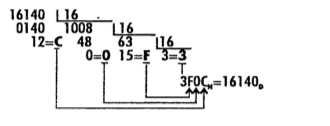

**Ejercicio**: Usando el presente método pasar el número 109d a binario y hexadecimal.

### **¿Cómo se pasa directamente de binario a hexa, y viceversa?**
---

Como se anticipó al traer el sistema hexadecimal, Este se usa para pasar de una forma sencilla de binario a hexa y viceversa **usando en pantalla o en el papel la cuarta parte de los símbolos de los que se utilizan en binario**, siendo que en el interior de un computador solo se puede representar el sistema binario.

**Regla para pasar de binario a hexadecimal**:

1.A partir del bit extremo derecho del n˙mero binario, dividirlo en cuartetos, agregando ceros a la izquierda si se necesita.
2.Asignar a cada cuarteto los pesos 8-4-2-1 en forma escrita o mentalmente.
3.Sumar en base diez los pesos de cada cuarteto correspondientes a los bits de valor 1, o sea hallar su valor en base diez.
4.El número resultante de cada suma así efectuada en cada cuarteto según el paso anterior, será el dígito hexadecimal correspondiente a ese cuarteto, siendo que si dicho número es del 0 al 9 será el mismo en hexa; y si el mismo es 10 el dígito hexadecimal será A, si es B, si es 12 será C, si es 13 será D, si es 14 será E, si es 15 será F.|
:-|

**EJEMPLO** Convertir a hexadecimal el número binario 110011100

Pasos 1. y 2. **8  4  2  1    8  4  2  1    8  4  2  1**
   
                0  0  0  1    1  0  0  1    1  1  0  0  =  19Ch
Pasos 3. y 4.       1            8+1=9       8+4=12=C

**Ejercicio**: Convertir a hexa 1010000011110111 y 1100011101                                *Respuesta: A0F7h y 31DH*

               Con un método semejante al presente y formando tríos, pasar 1101101b a octal  *Respuesta: 155o

> 1. En caso que los restos decimales superen el valor 9.(como puede ocurrir cuando se pasa de decimal a hexa) se debe convertir
dichos restos al símbolo equivalente de la base en cuestión (por ejemplo 10=A; 11=B; etc)

**Regla para pasar de hexadecimal a binario**:

1.Separar los dígitos hexadecimales de modo de poder formar debajo de cada uno de ellos un cuarteto binario a dete-
   minar de pesos 8-4-2-1. Estos n˙meros pueden escribirse o ser imaginados mentalmente.
2.Convertir cada dígito hexadecimal de 0 a F a decimal (serán iguales del 0 al 9), y Este número a su vez en un cuarteto
   de pesos 8-4-2-1 por el método de las pesas ya visto.
3.El conjunto de cuartetos asÌ formados constiuirán el nímero binario buscado.|
:-|

**EJEMPLO**: Convertir a binario el número hexadecimal A07

Paso 1 **8421 8421 8421d**

Paso 2  A=10=8+2     7=4+2+1 -- O sea A07H = 101000000111b
       

Ejercicio: Convertir a binario 10h                                             Respuesta: 00010000b

## **OPERACIONES ARITMÉTICAS CON NÚMEROS BINARIOS NATURALES**

### **¿De qué forma la UAL suma dos números?**
---

En cualquier base numérica pueden definirse las distintas clases de números (naturales, negativos, imaginarios, reales,
etc.), y todas las operaciones que empleamos en base diez. Estas presentan las mismas propiedades conocidas en base
diez, y pueden aplicarse los mismos algoritmos que conocemos para realizarlas con números de varios dígitos.
Comenzaremos con la suma de binarios.
Si bien pueden sumarse manualmente varios números binarios ordenados uno debajo del otro, interesa especialmente operar dos
números binarios por vez, como lo hacen las unidades aritméticas de los microprocesadores y las calculadoras de bolsillo.

> Para sumar en binario se debe tener presente que en la sucesión de los números naturales: 0,1,10,11 etc. si se suma
cero a un número debe resultar el mismo, y si se suma uno debe obtenerse el siguiente.

Esto se verifica en las siguientes sumas elementales, que son las variantes que tienen lugar en la suma de dos números binarios:

                                         0    1    0    1    10
                                        +    +    +    +    +
                                         0    0    1    1     1                                       
                                        ---  ---  ---  ---   ---
                                         0    1    1    10    11

Efectuar    110110100 + 11010110 

                                         1 1 1 1   1
                                         1 1 0 1 1 0 1 0 0
                                        +
                                           1 1 0 1 0 1 1 0
                                       --------------------  
                                       1 0 1 0 0 0 1 0 1 0 
                                         i h g f e d c b a 

La suma se ha realizado, posición por posición, como se detalla:

a.    0 + 0 = 0

b.    0 + 1 = 1	

c.    1 + 1 = 10    ----------    se escribe el 0 y "me llevo 1" de acarreo ("carry") a la posición siguiente

d.    1 + 0 + 0 = 1 + 0 = 1

e.    1 + 1 = 10    ----------    (ídem c.)

f.    1 + 1 + 0 = 10 + 0 = 10     (ídem c.)

g.    1 + 0 + 1 = 10              (ídem c.)

h.    1 + 1 + 1 = 10 + 1 = 11     se escribe 1 y "me llevo 1" a la posición siguiente.

i.    1 + 1 = 10

### **¿De qué forma se realiza manualmente una resta de binarios?**
---
                                                                                                    
La tabla de restar binaria es sencilla:                                                                   
												
		0 - 0 = 0								    
		1 - 0 = 1                                                                          
		1 - 1 = 0                                                                     
                                                                                               
		0 - 1 = 1	y se "pide 1" a la siguiente; o sea se hace 10 - 1 = 1

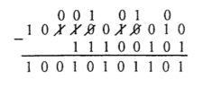

En la resta indicada1, toda vez que se "pide 1" si la siguiente posición del minuendo vale 1, este pasará a ser 0, dado que
(1-1=0) como se indica el renglón superior.
Si la siguiente es 0 pasará a ser 1 (10-1=), debiéndose nuevamente "pedir 1" a la subsiguiente, que también pasará a ser 1
si es 0, y asi sucesivamente. Si hay ceros en el minuendo se transformarán en unos, hasta llegar a un 1 que pasará a ser 0.

El procedimiento de "pedir prestado" no se emplea en los circuitos de un computador, por la complejidad y lentitud que
ocasionarÌa. En su reemplazo se usa el método de **sumar al minuendo el complemento al módulo del sustraendo**,
cuyos pasos se indican a continuación, y cuya justificación se trata en detalle en el "**complemento para enteros y 
punto flotante** que está al final de esta unidad.|
:-|

### **¿Cómo efectua la UAL una resta sin pedir prestado, mediante una suma?**
---

Realizaremos la misma resta anterior sin pedir prestado, mediante **una sola suma** que hace la UAL

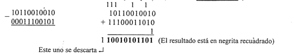

**Regla** 

1. El minuendo se sumará sin modificación.
2. Se invierten cada uno de los bits del sustrayendo, y el n˙mero asÌ formado es el segundo operando.
3. Se escribe un uno para ser sumado en la posición de las unidades.
4. Sumar los tres n˙meros indicados en 1, 2, 3, y descartar el 1 que está fuera del formato de los n bits que se restan.
   Los bits restantes a la derecha del bit descartado constituyen el resultado de la resta.

### **¿Cómo se multiplican y dividen manualmente números binarios naturales?**

La tabla de multiplicar es muy sencilla, al igual que la operatoria manual (que nos se usa en cálculos automáticos): se
repite el multiplicando desplazado a la izquierda, conforme a la posición que ocupen los unos del multiplicador. Luego se
realiza la suma con los sumados asÌ ordenados.

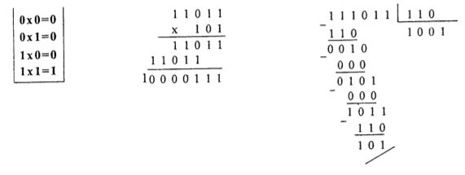

La división se ha realizado con el método de las diferencias sucesivas, siendo que cada sustrayendo se obtiene: multiplicando por 1 al divisor si este último es menor o igual que el resto parcial en cuestión, o por 0 si el mismo es mayor que dicho resto.

Es importante señalar que cada vez que se multiplica o divide un número entero binario **por la base 10b = 2d al
igual que en base diez se agrega o se quita un cero**, respectivamente:|
:-|

(1011 x 10)b = 10110b                                           ---(10 x 10)b = 100b

(10110 x 10 x 10 = 10110 x 100)b = 1011000b (1110/10)b = 111b

(101011000 0 : 1000)b = 1010110b

> 1.Es conveniente comparar las similitudes de la resta efectuada con restas en base diez, como: (80010010 - 5349809)D

## **CODIFICACION ASCII DE CARACTERES ALFANUMERICOS Y UNICODE**

### **¿Que es el código ASCII?**
---

El codigo ASCII (lease "asqui”) siglas de American Standar Cod for INformacion INterchange es un código binario
ampliamente usado para la transacción de información, y para codificar los caracteres de un teclado, así como los que
debe imprimir una impresora en modo text o mostrar una pantalla. También es el código de los archivos de texto.
En la figura 1.11 aparecen los caracteres alfabético-numérico imprimibles, mas los de las teclas que ordenan movimiento
del cursor que antes eran los del carro de una maquina de escribir (**SP** abreviatura de "space"; la tecla de retorno del carro y pasar a un nuevo renglón, **CR**, siglas de "carry return", que aparece en los teclados actuales como ┘"Enter>"; la de "back space" **BS**)¹, más otros relacionados con las teletipos(**STX** -Star of Text- **EOT** -End of Transmisión- ect)¹.
Suman 128=2^7 caracteres y otros a codificar un binario por lo que bastarían 7bit para formar igual numero de combinaciones
binarios distintas, aunque se usan 8 bits (el primer bit de todas las combinaciones del ASCII estándar es cero, pudiéndose usar para paridad u otros fines). cON 8 bitsresultan 2^8 = 256 combinaciones, 128 por ascii estándar y 128 por ascii extendido.
Por ejemplo, las mayúsculas de la A hasta la Z se codifican según una sucesión ordenada de números binarios (que permite realizar ordenaciones alfabéticas)

**A** 01000001 = 41h = 65d;      --         **0** 00110000 = 30h = 48d;      --       **SP* 00100000 = 20h =32d;

**a** 01100001 = 61h = 97d;      --         **1** 00110001 = 31h = 49d;     

**B** 01000010 = 42h = 66d;      --          **2** 00110010 = 32h = 50d;

**b** 00110010 = 62d = 98d;                       ....

**Z** 01011010 = 5Ah = 90d;      --       **9** 00111001 = 39h = 57d

**z** 01111010 = 7Ah = 90d

Arriba aparecen combinaciones binarias del código ACII cuando se pulsa la tecla con el carácter indicado. Así cada vez
que se pulsa **A** queda 01000001 en una celda de memoria. Para poder ordenar alfabeticamenre las letras, la **B** es el 
numero binario siguiente 01000010 y así sucesivamente se aumenta uno hasta la **Z** (01011010).
Al lado de cada combinación binaria aparecen su valores equivalentes en hexa y end decimal, usados en tablas AsCII.
Una mayúscula se diferencia de su minúscula en un solo bit (el tercero desde la izquierda) lo cual se usa en ciertos
programas para no diferenciar un nombre escrito con mayusculas o minúscula, dado que los 7 bits restantes permiten
determinar la tecla de la letra tipeada sin importar si el carácter es el de arriba o el de abajo de dicha tecla.
Los dígitos del 0 al 9 empiezan con 0011, y el segundo cuarteto con pesos 8-4-2-1 indicados determina que dígito es.

Si se tipea 109XP en memoria queda an ASCII como: 00110001 00110000 00111001 01010111 01010000
Así mismo, si a la plaqueta de video le llegan en orden esas 3 combinaciones binarias ASCII, en pantalla se vera 109XP|
:-|  

Cuando se tipea Alt 64 para que aparezca @, dado que 64d = 01000000b éste será el código ASCII de @.

> 1.Una tecla como **SHIFT** es una orden interna para el teclado a fin de que genere una mayúscula o el simbolo superior de los que aparecen en una tecla, por lo que no se codifica en ASCII[^]

La tabla anterior es una forma compacta de mostrar la tabla con el código ASCII expresado en hexa, donde cada carácter
tiene dos coordenadas que escritas consecutivamente conforman el equivalente hexa del código binario.
Así para hallar el código ASCII de un carácter como la **A**, ésta tiene por coordenadas **4** ( horizontal) y **1** (vertical), que forman 41h = 01000001 Del mismo modo, **SP* tiene coordenadas **2** y **0** que forman 20h =00100000;

**ASCII extendido**
Si se tipea Atl 164 para obtener **ñ* dado que 164d = 10100100 b éste será el código ASCII de la ñ. El bit extremo izquierdo es uno. Esto caracteriza a los 128 combinaciones de cualquier ASCII extendido. que puede contener la ñ, 
las vocales con acento, y otros símbolos usados en otras lenguas latinas, según lo establezca la empresa que lo imponga.

**EJERCICIO**: Visualizar con el Debug como quedan en memoria codificados en aaASCII, los caracteres de Ana 3/3/80

Pasos a efectuar a partir del símbolo **C:/>** del DOS:
1. **C:\>** *COPY CON MARIO.COD* ┘  (en itálica aparece lo que se debe escribir, y en negrita lo que escribe DOS)
*Ana 3/6/80 ^ Z*                    (^Z se usa para cerrar el archivo, siendo que ^ se logra pulsando la tecla Ctrl)

              **1 ARCHIVO(s) COPIADO(s)**

2.**C:\>** *DEBUG MARIO.COD*┘  (Para poder ver en memoria mediante el Debug el archivo tipeado)
        -                      (Guión titilante que indica que el Debug está esperando una orden)

3.  *E100*┘                (Orden de leer la memoria a partir de 0100, donde quedan los archivos)

     309D: 0100          41.  6C.    6I.  20.   33.  2F.  36.   2F.

     309D: 0108          39   30. ┘

             
A partir del 41. se debe pulsar la barra espaciadora parqa obtener el valor siguiente de (6C), así de seguido (como se hizo
explícito al describir el uso del Debug) tantas veces como carácter, espacios y "entre" se hayan pulsado en el teclado.
Se verifica que lo números hexadecimales 41, 6C, etc corresponden a los caracteres tipeados (Ana 3/6/80)
El lector debe realizar esta práctica tipeando otros caracteres distintos que Ana 3/6/80 y luego verificar que loa códigos
que se leen en memoria correspondan a la codificación ASCII según la tabla dada.

### **¿Que es el Unicode?**
---

Hacia 1990 se busco definir un sistema de codificación universal que permitiese la incorporación de los caracteres(grafos)
de todas las lenguas escritas del mundo, tanto actuales como pasadas, así como los símbolos utilizados en matemáticas otros
El sistema debería ser ademas extensibles, de forma que pudieran añadirse nuevos tipos en el futuro. Por un lado el **UCS* ("universal character set"), desarrollado por la organización Internacional de Estandarización (ISO); y por otro el denominado **Unicode** impulsado por empresas como Microsoft (integrante del Unicode Consortium), que había incorporado en sus sistemas Windows 9x un juego de caracteres adaptando la mayoría de alfabetos occidentales. Posteriormente implemento Unicode en sus sistemas NT y sucesores Aunque el desarrollo inicial de ambos sistemas fue independiente, luego convergieron, y el sistema **Unicode** se convirtió en un subconjunto de sistemas **UCS**

Unicode es una norma internacional de codificación de carácter. La primera versión(1991), usaba una codificación de 16bita
por lo que podía codificar 65.536 caracteres.Actualmente se representa con tres tipos de codificación*UTF-8-_, _*UTD-16*_ e
_*UTD-32_*) según que use 8,16 o 32 bits para identificar cada carácter. Unicode 4.1, codifica cerca de un millón de caracteres que cubren los principales idiomas escritos en el mundo. Los primeros 128 caracteres del ASCII y tienen su mismo valor. Puesto que ASCII usa 7 bits por carácter es inadecuado para manejar texto multilenguaje, Unicode aporto un formato de 16 bits que extiende las ventajas del ASCII al texto miltilingüe.
Unicode se ha convertido en la codificación dominante para el procesamiento de texto. Cubre idiomas de América, Europa, África, India, Asia y los símbolos técnicos.
Unicode proporciona un número único para cada carácter, no importa cual sea la plataforma, el programa o el idioma que trate. Un numero hexadecimal y un prefijo U, por ejemplo,**u+0041** representa la **A** en 16 bits. Unicode ha sido adoptado por Apple, El HP, la IBM, Microsoft, Oracle, SUN, Sybase, Unisys entre otros. Es usado en java
ECMAScript (Javascrpit); XML, También por muchos sistemas operativos, por los browsers actuales, y muchos otros productos.
LA aparición de Unicode, y la disponibilidad de las herramientas que lo apoyan se encuentran entre las tendencias globales recientes mas significativas de la tecnología del software. Permite que los datos sean transportados a través de muchos sistemas distintos sin que sufran daños, y que un producto de software o un sitio web
pueda orientarse a múltiples plataformas idiomas y países, sin necesidad de rediseñarlo, Una versión de un producto se puede utilizar por todo el mundo. No son necesarios lanzamientos separados para mercados regionales. Un texto en cualquier lengua se puede intercambiar por todo el mundo.

> 1.Las actuales versiones de WindowsTM por razones de seguridad pueden requerir alguna modificación menor de este comando.

**EJERCITACION**

1. Escribir los sucesivos números en hexadecimales del 1048h y 1070h

2. Conforme al ejercicio anterior, indicar cuál es el siguiente de los siguientes números hexadecimales: FFF, 2ABF, 2B99, 1FF, ABCD, C0D0, A0F, 999

3. ¿De cuántos bytes consta el numero hexadecimal 003B, y que numero binario y decimal es?

4. Dado el numero 10 en base dos, y el numero 10 en base dieciséis ¿qué números son en base diez?

5. Generalizar la pregunta anterior dado el numero 10en base X ¿que numero es en base 10?

6. Dado el numero binario 1111111, halar una forma rápida de pasarlo a decimal sin tener que halla el peso decimal de cada bit y luego sumar los pesos. Generalizar el procedimiento hallado.

7. Determinar en la expresión 2^n que sucede con su valor, cada vez que **n** aumenta uno, y calcular el numero de combinaciones binarias distintas que pueden formarse con n=10 y n=11 tener Presente la figura 1.4

8. Convertir a base doce el numero decimal 140.

9. Convertir a hexadecimal el numero 11000000000001b luego convertir este numero binario a octal

10. Los números de las direcciones de una zona de memoria un computador van de 0000 a FFFF. Determinar a cuantas posiciones de memoria existen combinaciones.

11. Se tiene una memoria con 2^20 posiciones y se quiere identificar cada una con un numero binario distinto.
Expresar un binario la primera, segunda, ante ultima y ultima dirección de dicha memoria.
Indicar en decimal cuantas posiciones son, y cuantos símbolos hexadecimales se necesitan para codificar cualquier posición. Indicar en hexa el valor de la posición cero y última.

12. ¿Cuántos bits hacen falta para representar números decimales entre 0 y 999999d? ¿Cuántos dígitos hexadecimales?

13. Los registros de un 386, 486, pentium tienen 32 bits.¿ Cual es el mayor y menor numero natural que se representan?

14. Dados los números naturales 180 y 40

 a) Representar en Código ASCII
 b) Representar en binarios y sumarlos en formato 8 y 16
 c) Representarlos en binarios y restarlos por el método del complemento a la base en formato 8 y 16.

15. Siendo P=180, Q= 40 efectuar en formato 16 la operación P+P-Q. Verificar que el resultado sea correcto.

16. Comparar en base diez y dos que pasa cuando se multiplica por 10 y por 100. generalizar para la división.

**RESPUESTAS A PARTE DE LOS EJERCICIOS**

3.2 bytes.;  003Bh = 0000000000111001b = 59d

4.Dos y dieciséis

5.X

1.Conviene tomar el número siguiente 1000000 = 128d y restarle uno

9.3001h = 30001o    10. 65.536

11.00000000000000000000     00000000000000000001      11111111111111111110     11111111111111111111
   
    1.048.576; 5 dígitos hexa, de 00000 a FFFFF

12.20 bits y 5 dígitos hexa

13.2^32= 2^10 x2^10 x2^10 x2^2 = 1024 x 1024 x 1024 x 4 > 4000.000.000

## **EJERCICIO SISTEMATIZADOR DE CODIGOS**

En un teclado se ha tipeado **3Z**, y la combinación binaria que resulta en memoria es interpretada por 3 programas crean con fines distintos que se indican, siendo que el significado que cada programa asigna a esa combinación debe aparecer pantalla en caracteres alfabéticos y numéricos (alfa-numéricos), indicar en cada caso los pasos a seguir para que ello suceda.
1) Si dicha combinación es interpretada por el programa Debug que convierte de binario a hexa y viceversa.
2) Si 3Z es tipeado mientras se está escribiendo texto en el programa Word, y el mismo se visualiza en pantalla.
3) Si un programa que esta operando con números naturales (magnitudes) interpreta la combinación citada, independien temente de cómo fue generada.

*Aclaración*: como se detalla en la Unidad 2 de esta obra, el teclado no codifica en binario ASCII cada tecla tipeada. £ cambio la plaqueta de video se encarga de convertir cada código ASCII que le llega en el carácter o acción correspondiente"

Para empezar, los dos caracteres tipeados (3Z), en memoria quedarán codificados en ASCII como 00110011 0101 lOlo según se desprende de la tabla ASCII de la figura Al.l 1 (3 = 33 y A = 5A).

1)El Debug está preparado para “ver" -con vistas a que aparezca en hexa en pantalla- cada combinación binaria dividida en cuartetos con pesos 8-4-2-1, que deberá traducir en dígitos hexadecimales (sección A1.3):

8421 8421 8421 8421

0011 0011 0101 1010

 3	  3 	5    A   estos 4 símbolos son los que deben aparecer en la pantalla, para lo cual el Debug deberá generar
*en memoria sus correspondientes códigos ASCII, que deberán llegar luego a la plaqueta de video.
*Ellos son: 000110011 (3) 000110011(3) 00110101(5) 01000001 (A) que en hexason 33 33 35 41 (Tabla A1.11)

2) El Word trabaja directamente con los caracteres ASCII que han sido tipeados, por lo que al tipear 3Z simplemente sus códigos ASCII (00110011 y 01011010) pasan a la plaqueta de video, que los convertirá en pantalla en los caracteres 3Z. Igualmente, si dichos caracteres forman parte de un archivo del Word que se abrió, sus códigos ASCII pasan a dicha pla¬queta, y así son visualizados en pantalla.

3) Dado que el programa opera con números naturales, cuando interpreta la combinación 00110011 01011010 -que ocupa dos posiciones sucesivas de memoria (una por byte)- para que se imprima en pantalla como un número decimal la interpretará con los pesos siguientes:

32783   16384 8192 4096  2048	1024   512   256   128   64   32   16   8   4   2   1   
  0       0    1.   1      0      0     1     1     0     1    0    1   1   1   1   0b = 13146d

Para que estos 5 dígitos decimales aparezcan en pantalla, el programa deberá generar en memoria sus códigos ASCII que llegarán a la plaqueta de video: 00110001 (1) 00110011 (3) 00110001 (1) 00110100(4) 00110110(6).

## **EJERCICIO INTEGRADOR DE CONOCIMIENTOS**

Un programador ha desarrollado para variables (datos) que son magnitudes, un programa en un cierto lenguaje “X” de alto nivel, cuyas sentencias tipeó desde el teclado de un computador. Para una porción de dicho programa ha tipeado la sentencia que más abajo se indica. Se supone que luego de ella, se puede escribir el valor de las variables a operar.

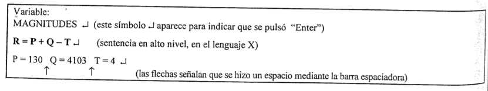

2. Representar cómo quedan en memoria los caracteres tipeados, supuestos escritos a partir de la dirección 0100.
3. Si posteriormente el programador llama al programa compilador del lenguaje "X", indicae cómo el compilador deja traducida en memoria la sentencia R = P + Q - T en la secuencia de instrucciones en código de máquina, para un procesador de Intel o AMD. Para tal fin usar los códigos definidos en la figura 1.15, y escribirlos en memoria a partir de la dirección 03AC. Asignar a las variables (datos) R, P, Q y T las direcciones A23E, A240, A242, y A244 respectivamente. Para cada variable usar 2 bytes.
4. Una vez que todo el programa en el lenguaje “X” fue traducido a código de máquina, se ordena ejecutarlo. 

> 1.Designamos “sentencia" a cada orden (instrucción) que constituye cada “línea” escrita de un programa expresado en un lenguaje de alto nivel (Pascal, C, Basic, Cobol, Java, etc.), la cual si se tipea quedan codificados en ASCII los caracteres que la compone11 Reservamos la palabra “instrucción” o sea “código de máquina” (a veces llamado “código” a secas) a las órdenes que puede ejecutar una UCP (microprocesador), siendo que cada sentencia debe ser traducida en una secuencia de estas instrucciones.

Indicar, suponiendo que se ejecute la secuencia de instrucciones traducida en el unto anterior, para las intrucciones
que ordenan sumar o restar, como la UAL realiza estas opreraciones con los datos correspodientes, y como queda el registro
AX luego de que se ejecuta cada una de las intrucciones de dicha secuencia, Tambien pasar a base diez cada resultado binario que esta en AX, verificando que sea el valor esperado.
5. Representar luego de ejecutar la intruccion **I4** como queda en memoria el resultado asignado a la variable R,
conforme ordena dicho instrucción.
6. Suponiendo que luego de la sentencia R=P+Q-T siga la sentencia **PRINT "R=" R** (o sea imprimir el decimal el valor R hallado), el compildor la traducira a varias intruciones en código de mñaquina una de las cuales llamara a una subrutina de impresion. Si esta ordena que la impresora opere en modo texto, iunidcar como debe quedar codificada en memoria desde la direccion 7100, la informacion a enviar a la impresora, para que imprima en decimal el valor R.
Este ejercicio integra de forma concreta, los 4 pasos de un proceso de datos:entrada, memorización, proceso y salida

1. Como se establecio en A1.5 el ratar el codigo ASCII, en una operacion de entrada desde el teclado, los sucesivos
caracteres tipeados(sean de untxto para un procesador de textos o de un prorama en alto nuvel) quedan almcenados en binario, en posiciones sucesivas de memoria (digra A1.15) en este caso desde la 0100, codificados en ASCII. Para más claridad, al lado dse cada casillero aparece el caracter codificado, y su codigo ASCII en hexa, segun la tabla (fig A1.11).

2. Cualquier programa en alto nivel se encunetra codificado en ASCII al igual que una carta, o cualquier texto, es una sucesión de caracteres aislados, codificados individualmente en combinaciones de 8 bits que representan.

> Si bien el código ASCII es un código binario, la UCP **no** puede ejecutar ningun programa en lenguaje de alto nivel, cualquiera sea este lenguaje; del mismo modo que la UCP no puede ejecutar una carta o una nota que hayamos escrito y que haya quedado en memoria

Un programa en alto nuivel es un texto codificado en ASCIIm compuesto por ordenes (sentencias), que debe ser escrito siguiendo estrictamnree una sintaxis especificada, para quie pueda ser reconocida como un prograama por el programa traductor (**compilador**). El se encarga de traducir cada sentenia en una secuencia de inrcuciones de maquina apropiadas al micropocesador (UCP) que lo ca a ejecutar.
Del archivo del disco rigido donde se encunetrea el compilador de un leguaje X, este pasa a memoria. AL ordenar, compilar, los datos a procesar son los caracteres codificados en binario ASCII, que representan el progrma en alto niuvel para el programa compilador. LUego de ser ejecuitado(por la UCP) el programa compilador dejará en memoria, traducido a codigo maquina( em este caso para el microprocesador de intel), el programa que originariamente estaba en alto nivel. Esto es, el compilador es un programa cuto"input" (datos) ES UN RPGRAMA EN ALTO NIVEL CODIFICADO EN ASCII(unos y ceros), y cuyo "output"(resultado) es el programa que fue su"inpuy", pero en el código de máquina (unos y ceros), para que pueda ser ejecutado por un microprocesador específico.

Un compilador para un lenguaje de alto nivel "X" solo traduice programas escritos en este lenguaje, para que solo puedan ser ejecutados en microprocesadores de un cierto tipo. Por ejemplo, un compilador que traduce d eun lenguaje "X" para procesadores de intel o AMD, lso programas que genera un codigo de maquina no pueden ser ejecutados como ser en procesadores HP, PowerPC o SPARC, u otros, por tener cada procesador sus propios codigos binarios de intrucciones.
Ena misma orden de sumar se codifica distinto en procesadores de distintos fabricantes y aun rn modelos no compatibles de un mismo fabricante de microprocesadores.
El compilador para un lenguaje"X" es un programa "inteligente" que recorre repetidamente la zona de memoria donde quedo codificado en ASCII el programda en lenguaje "X". Así va identificado cada sentencia y datos (variables) que ella ordena opera, a fin de traducirlos en instruciones **(codigos= de maquina que le microprocesador pueda ejecutar
y codigos de datos que l UAL pueda esperar.**

**2a.** Con estos fines (figuta A1.15) **primero** debe determinar el tipo de variable( este caso magnitudes, o sea numeros naturales) que las sentencias ordenan procesar, para llevar a cabo las traducciones a instrucciones para procesar magnitudes y códigos de datos correspondientes a estas. Entonces, el compilador **antes** de traducir leerá la memoria que en ASCII esta escrito "MAGNITUDES" a fin de poner en juego las subrutinas de traducción para este tipo de variables.

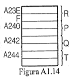

**2b. ASIGNACIONES DE DRECCIONES A LAS VARIABLES**: como se establecio en relación con las figs.1.3 y1.15 **cada instrucción debe indicar la dirección del dato** (valor de la variable) que ordena operar. Es por ello que antes de traducir cada sentencia con sus variables en instrucicones para un procesador, el compilador debe antes de traducir cada sentencia con sus variables en intrucciones para un procesador, el compilador debe asignar la direccion que tendrá cada variable, que será también la dirección de dato cuando se les da un valor a cada variable antes de que se ejecute el programa. Esto hace en 2.d

El compilador reservará (conforme al enunciado del ejercicio) dos bytes de memoria para las variables R,P,Q yT, en direcciones de momeoria **arbitrarias** que en este ejemplo va de A23E hasta A245 (fig A1.14). Esto es **para el compilador la variable R sera la direccion A23E** y la variable P sera la direccion A240, etc *bastando la primer direccion de una variable para identificarla*, dado que se sabe que ocupan 2 celdad todas ls variables tipo"Magnitudes". O sea que el compilador en primer termino solo identifica cada variable por su primer direccion _sinque interese para formar lass instrucciones_ (paso **2c**) _el valor conrecto de la variable_, pues **en estas intruccione se indica donde esta la variuable a fin de poder localizar en memoria este valor** (por lo que no es imprescindible asignar direcciones consecutivas como se hizo). **NO interesa** en la traducion el valor concreto que se le asigna a esa variable antes de la ejecucion del programa, como se hace en 2d, cuando se esbribe dicho valor concreto en las posiciones reservadas para cada variable.

**2c. CODIFICACION DE LAS INSTRUCIONES RESULTANTES DE LA TRADUCCION** Una vez asignada a cada variable una direccion de localizacion, el compilador traduicita la sentencia R=P+Q-T en  instrucviones cuyosd codigos de máquina los tomaremos de la fig 1.15. Recordar en relación con la fig. 1.2 que todo sucede como si tuviéramos que pensar los pasos para hacer esa suma algebraica escrita en un papel con una calculadora de bolsillo. Para ello primero (I1) entramos P al visor (o sea AX). Luego (I2) entramos Q y lo sumamos a P, para obtener P + Q en el visor. A este valor le restamos T, resultando P + Q - T en el visor (I3), valor que se guarda en la memoria de la calculadora mediante la tecla correspondiente (I4). **Como en la descripción relacionada con la fig. 1.15. sin la cual esta traducción no puede entenderse**, estos 4 pasos en un procesador se realizan mediante las instrucciones **I1 a I4**. Sus códigos de máquinas se indican en la zona de instrucciones de la fig. A1.15 desde la dirección 03AC tomada **arbitrariamente** (pues bastaría hacer IP = 03AC antes de ejecutar las instrucciones para que se localice cada una de ellas). Tanto en la suma algebraica R = P + Q - T, como en la R = P + P - Q  traducida en la fig. 1.15, la secuencia de instrucciones 11A14 ordena una asignación a AX (cod-op A1), seguida de una suma (cod-op 0305) seguido de una resta (cod-op 2B06), seguida de otra asignación (cod-op A3). Debajo de cada cod-op está la dirección de la variable (asignada en 2b) que se ordena operar (no el valor de esta), que obviamente difieren en un caso y en otro.
**Recordar para las codificaciones que para Intel una dirección o datos XXYY se escribe YYXX.**

> 1.Más adelante se realizan ejercicios similares al lado, pero para variables que son del tipo "Integers" "Reales" (punto flotante)

> En definitiva el compilador reserva una zona para variables tipo magnitudes, y en otra “zona de programa” deja este codificado en bajo nivel (instrucciones en código de máquina), que puede ser ejecutado por la UPC para la que fue traducido.
 
Hasta acá se describió el proceso de datos que es una traducción. Ahora se supone que se ejecutará la secuencia traducida.

#### **2d. ASIGNACIÓN DE VALOR DE LOS DATOS ANTES DE LA EJECUCIÓN DE LAS INSTRUCCIONES:**

Cada vez que se ejecuta la secuencia I1 a I4 las variables pueden tener un valor distinto (de hay su denominación).
El valor de cada variable (dato) debe estar asignado antes de ejecutar las instrucciones en las posiciones reservadas para cada variables (zona de datos), antes de que se ejecuten las instrucciones, como se hace acontinuación.
Una subrutina traductora preparada para “MAGNITUDES” traducirá cada valor de variables decimal - escrita en ASCII como dígitos separados según aparecen en la columna de caracteres tildados - en el número binario natural de 16 bits equivalente, **pues la UAL solo suma binarios naturales** y no combinaciones binaria ASCII, que a demás empiezan arbitrariamente con 0011. O sea que **esta traducción es para que la UAL pueda operar los datos a procesar**. 

Así el valor decimal 130 de la variable P que en memoria esta en ASCII como los dígitos 001100001 00110010 00110000 en las posiciones 0115, 0116 y 0117 (fig. A1.15) quedará reducida como el valor binario natural 000000010000010, igual a 130 que ocupara la posición A240 y A241 asignada a la variable P.
El valor decimal 4103 de Q, que el traductor encuentra en binario ASCII en las posiciones o11B a 011E (4 bits) las traducirá como el binario natural 00010000000000111 = 4103 que ocupará la posición A242 y A243.

Del mismo modo, el valor de 4 de T que al compilarlo llega como 00110100 en ASCII, ocupando un byte, pasará a ser 0000000000000100 = 4 que el compilador escribirá en la dirección A244 y A245. Para la variable R (cuyo valor recién se conocerá cuando se ejecute el programa que se está traduciendo) el programa compilador (que en este paso es el que se ejecutará), le reserva la posición A23E y la siguiente (como supone el enunciado). De esta forma cada variable cuyo valor al ser tipeado ocupa tantos bytes de memoria como dígitos decimales tenga, al ser codificada como magnitud binaria ocupará 2bytes, siendo que el máximo número que se puede representar en 16 bits es el 65535 = 1111111111111111.

> 1.Debe consignarse que la dirección que se asigna un compilador no son la definitiva, sino que el programa cargado reubica las zonas de instrucciones y datos conforme lo determina el sistema operativo administrador de la memoria.

3. Cuando se ordene ejecutar el programa que el compilador dejó en código de máquina en memoria, y la UCP ejecute las instrucciones L a I4, luego de cada una de ellas, el registro AX quedará como se indica a continuación. La UAL sólo operará en -tes-instrucciones I2 e I3y que ordenan sumar y restar, respectivamente, indicándose para las mismas la operación de la UAL.

Después de ejecutar I1:
AX = 0000000010000010 que es el valor de **P** (130d = 0182h; éste y otros valores en hexa sirven para el Debug).

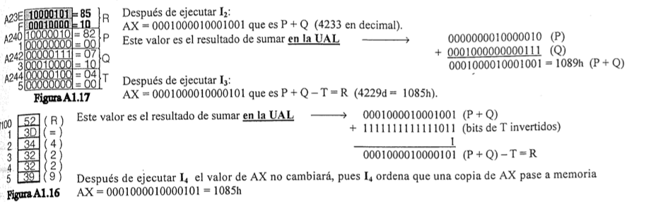

**4.** La ejecución de **I4** ordena que en la dirección A23E y en la siguiente (asignadas a R) copiar el valor de AX (8510 en hexa), por lo que luego de ejecutarse **I4** en memoria se tendrá para R los valores 10 y 85 indicados en la figura Al. 17

**5.** En modo texto, la subrutina de impresión dejará en posiciones sucesivas de memoria ios caracteres a imprimir, cada uno en código ASCII. Previamente dicha subrutina interpretará la orden de impresión (en este caso R = valor de R), siendo que el valor de R que está en A23E y A23F deberá pasarlo a dígitos decimales codificados en ASCII. Esto es, determinará que el valor de R, que es 0001000010000101 es el 4229, el cual en ASCII resultará 00110100 00110010 00110010 00111001, como aparece en memoria en la figura Al. 16 Antes de estos códigos aparecen los códigos de **R** y el de igual (=), como se indica.

#### **EJERCICIO COMPLEMENTARIO:**

Usando el Debug como se explicó en la sección 1.6, escribir en memoria los datos e instrucciones como quedaron en la fig. A1.15. Luego ejecutar cada instrucción y verificar que los resultados concuerden con las respuestas dadas para 3 y 4.

Dado que R no se conoce, se comienza por escribir el valor de P en ia dirección A240, seguido por los valores de Q y T
-E A240 (Comando para examinar memoria y escribir en ella si se desea, siendo que xx indica el contenido “basura” pre-existente)
**309D:A240**	xx.82	xx.00	xx.07	xx.10	xx.04 xx.00  (0082 se escribe 8200, etc.)

- Para corroborar que los valores recién escritos son los nuevos contenidos de las posiciones modificadas, otra vez se examina con E 
-E A240 J	    (Examinar memoria para verificar si la escritura anterior fue correcta)
**309D:A240**	  82.	  00.	  07.	  10.	  04.	  00.     (la escritura fue correcta)
                (A240)	(A241)	(A242)	(A243)	(A244)	(A245)    Entre paréntesis las direcciones

- Con el mismo procedimiento se escriben los códigos de máquina (cod-op + dir del dato) de las instrucciones a partir de 03AC

-E 03AC        (Examinar memoria y escribir en ella)
**309D:03AC** 	 xx.A1.      xx.40.    	xx.A2.	        xx.03.	      xx.06.     xx.42.   	xx.A2.    	xx.2B. (A240 se escribe 40A2, etc.)
**309D:03B4**    xx.06.	     xx.44.   	xx.A2.       	xx.A3.	      xx.3E	     xx.42	 (los cod.op no se invierten: 0306 sigue igual, etc)
               

- E 03AC        (Examinar memoria para verificar si la escritura anterior fue correcta)
**309D:03AC** 	 A1.      40.    	A2.	        03.	      06.     42.   	A2.    	2B.
**309D:03B4**    06.	  44.   	A2.     	A3.	      3E	  42	
               (03B4)	(03B5)	  (03B6)	  (03B7)	(03B8)	(03B9) Entre paréntesis algunas direcciones de los valores

R IP         (comando al Debug para examinar el valor del Registro IP y cambiarlo si se desea)
**IP 0100**  (el Debug informa que actualmente el IP contiene 0100)
03AC         (al lado de los dos puntos que deja el Debug escribimos 03AC, nuevo valor que debe tener IP)

- R  (Antes de ejecutar se deben examinan registros, siendo que el Debug muestra la información siguiente)
AX=0000 BX=0000 CX=0000 DX=0000 SP=FFEE BP=000ü SI=0000 DI=0000 ES=309D SS=309D CS=309D IP=03AC NV UP El PL NZ NA PE NC
309D:03B4	**A140A2** (en negrita se verifica que, como debe ser, el IP está en 03AC, y que la próxima instr. a ejecutar es A140A2)

- T	(Orden para ejecutar una instrucción I1)
**AX=0082** BX=0000 CX=0000 DX=0000 SP=FFEE BP=0000 SI=0000 DI=0000 ES=309D SS=309D CS=309D IP=03AF NV UP El PL NZ NA PE NC 309D:03AF 030642A2 (próxima instrucción I2 a ejecutar)

- Constatamos que I1 se ha ejecutado correctamente, pues se ha cumplido la orden que portaba su código: escribir en AX una copia del contenido de la posición A240, que es 0082. También ha cambiado automáticamente IP a 03AF, para apuntar la dirección de I2, como habíamos previsto al hablar de IP. Asimismo vemos que el código 030642A2 de I2 es el correcto, por lo que podemos ejecutar I2

- T  (Ejecución de la instrucción I2)
**AX = 1089**  BX=0000   CX=0000   DX=0000   SO= FFEE   BP=0000   SI=0000 DI=0000
ES=309D   SS=309D   CS=309D   **IP=03B3**   NV   UP   EI   PL   NZ   NA   PE   NC
309D:03B3   2b0644A2  (próxima instrucción I3 a ejecutar)

- Se ha realizado lo que ordenaba el I2 : sumar el valor 0082 de AX el contenido de la dirección A244 (que es 1007), y el resultado (1089) escribirlo en lugar de 0082. También se verifica que el 2B0644A2 es el código de I3, instrucción de resta que pasaremos a ejecutar:

- T  (Ejecución de la instrucción I3)
AX = 1085  BX=0000   CX=0000   DX=0000   SP= FFEE   BP=0000   SI=0000 DI=0000
ES=309D   SS=309D   CS=309D   **IP=03B7**   NV   UP   EI   PL   NZ   NA   PE   NC
309D:03B7   **A346A2**  (próxima instrucción I4 a ejecutar)
- I3 ordena restar a AX el contenido de A246, que es 0004h, o sea que la UAL ha efectuado 1089h - 0004h = 1085h, como aparece en AX.

- T  (Ejecución de la instrucción I4)
**AX = 1085**  BX=0000   CX=0000   DX=0000   Sp= FFEE   BP=0000   SI=0000  DI=0000
ES=309D   SS=309D   CS=309D   **IP=03BA**   NV   UP   EI   PL   NZ   NA   PE   NC
309D:03BA   **XXXXXX**  (no interesa cuál sea la instrucción pues no se ejecutará).

Es necesario verificar que en las direcciones A23E y A23F se escribió el resultado que está en AX Hacemos:
- E E23E    (Examinar memoria)
309D:**E23E**    **85.**       **10.**
*Con lo cual constatamos que efectivamente se cumplió lo que se ordeno al I4

**CUESTIONARIO**

1. ¿Qué debe llegar a memoria antes de ejecutar un programa y cuál debe ser el valor del **IP**?
2. ¿Por qué las instrucciones de cada secuencia debe estar en posiciones consecutivas en memoria?
3. ¿Por qué las variables no deben necesariamente estar una debajo de la otra?
4. ¿Por qué no hay problemas si las instrucciones y los datos comparten una misma memoria?
5. Durante la ejecución de un programa ¿cómo se localizan las instrucciones si ocupan distinta cantidad de celdas en memoria? u ¿cómo se localiza el dato que cada instrucción opera?
6. ¿Hay algún problema si la dirección presente en una instrucción coincide con su código-op ó con el cod-op de otra instrucción?
7. En las instrucciones tratadas, ¿quién indica que el resultado debe ir a AX?

Más adelante se trata la representación de los números **enteros y reales**, y al final de los temas también se dan ejercicios integradores, también para ser verificados mediante el Debug.

----

[^ Índice](README.md) | [Siguiente >](apendice2.md)