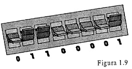
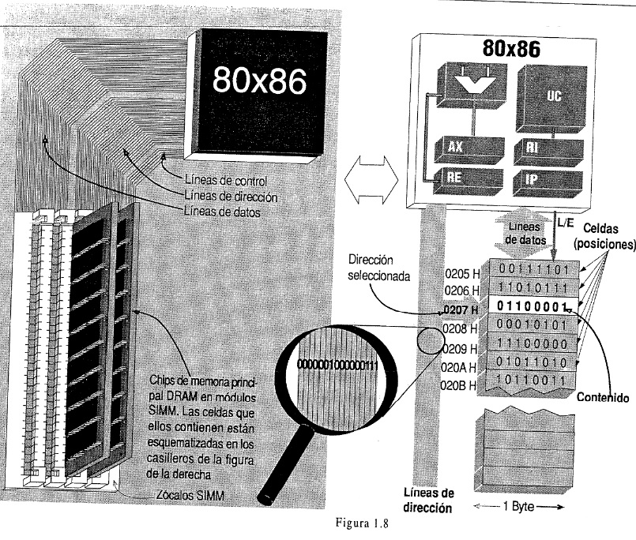
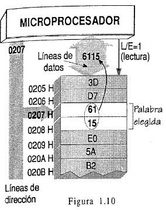
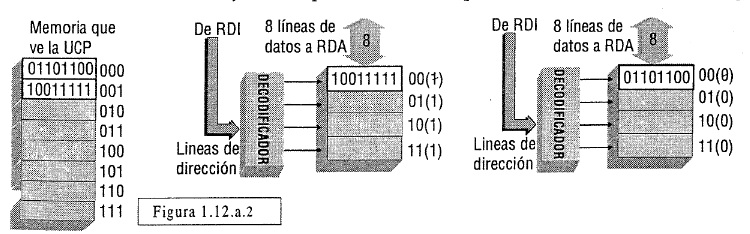
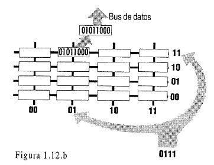
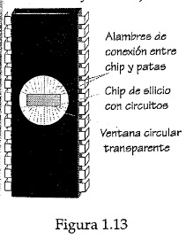
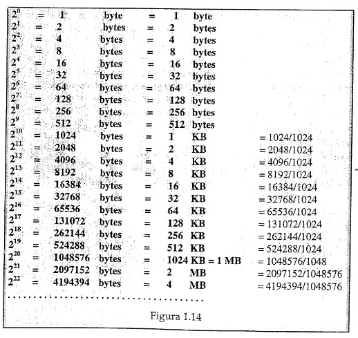

[^ Índice](README.md) | [Siguiente >](capitulo05.md)

----

# 1.4 LA MEMORIA PRINCIPAL O CENTRAL

***¿Que son las direcciones y los contenidos de la memoria principal?***

La memoria principal almacena bits (unos y ceros) en *celdas* independientes, aisladas entre sí, que contienen un byte (8 bits) de información (figura 1.8, página 1.16).
Cada celda se localiza en el conjunto mediante un número binario identificatorio, que constituye su ***"dirección"***, o indicacion de su ***"posición"*** en ese conjunto.
Este número no se puede alterar, pues está establecido circuitalmente.

Por lo tanto, en relación con cada celda se tiene *dos* numeros binarios:

-  un número fijo, la **dirección** (de mas de 20 bits), que presentado en los circuitos de la memoria permite acceder a una celda; y
- un número de 8 bits, que es el **contenido** informativo de esa celda, o sea la combinación, de unos y ceros almacenada en ella. Este número puede cambiarse si la memoria es alterable.

Es costumbre representar las celdas de una memoria, o una porción de ella, mediante un conjunto de casilleros verticales formando una "escalera", siendo sus direcciones números binarios consecutivos.
Estos números binarios se escriben en papel o en pantalla al lado de cada celda, en su equivalente hexadecimal, como muestra la figura 1.8, a fin de no tener que vizualizar largas cadenas de unos y ceros.
En la figura 1.8 (pag 1-16) se supone que en las líneas del bus de direcciones (ampliado con la "lupa") se envía la dirección 0000 0010 0000 0111 = 0207H, en la cual está almacenado el byte 01100001 = 61 H.

Puede ayudar a entender mejor el concepto de byte almacenado, si se piensa que en cada casillero existen 8 llaves del tipo "si-no" (figura 1.9), como las comunes de pared para encender la luz, cada una para retener un uno ("si") o un cero ("no") ^1. Entonces, para una celda dada, como la que contiene 01100001, la combinación de unos y ceros que están formando las 8 llaves es la información contenida en dicha celda. La información que almacena cada grupo de 8 llaves puede referirse a instrucciones o datos. 
El modelo de las llaves también es útil para tener presente que en cada posición de MP siempre existe una cierta combinación de unos y ceros, o sea no es posible que ella no contenga "nada", pues las 8 llaves siempre están presentes, cada una en "si" o en "no".

En cada dirección de memoria (celda) solo pueden leerse o escribirse **8 bits por vez**, sin posibilidad de operar menor cantidad de bits, o un bit aislado.

Puesto que la palabra "registro" en un significado general indica algún lugar donde datos se pueden registrar, guardar, podría designarse "registro" a cada celda de memoria, y decir que *la MP esta formada por un conjunto de registros independendientes de 8 bits cada uno*. Para evitar tener que aclarar "registro de la UCP" y "registro de MP", se entiende que "registro" a secas significa que es de la UCP, y las celdas de MP se denominan "*posiciones*".
Cuando los datos o instrucciones ocupen más de un byte, se almacenan *fragmentados* en varios bytes, los cuales deben estar contenidos en celdas *consecutivas* de memoria, o sea en direcciones sucesivas.
En una operación de lectura o escritura de MP *se puede acceder a varias celdas consecutivas*.
Un cierto número de éstas (2, 4, u 8 bytes) suele denominarse **palabra** ("**word**") de memoria.

Tecnológicamente la MP reside en microcircuitos electrónicos, que pueden guardar un cierto número de bits, construidos sobre una fina capa de silicio (*semiconductor*), conformando un "*chip*" (figura 8.12). Este se protege con un encapsulado de plástico o cerámica en forma de pastilla con "patas" metálicas para conexionado. Se requieren varias pastillas para lograr el total de memoria necesaria (figura 1.8, a la izquierda).

A un subconjunto de "patas" de esas pastillas se le envía cada dirección, en otro subconjunto aparecen los contenidos, etc. Como aparece en la figura 1.8, en una PC varios chips de memoria están insertos en una pequeña plaqueta que constituye un módulo o banco de memoria. Este se inerta en un zócalo ("slot").
Esta tecnología de conexionado puede ser del tipo SIMM (Single in line Memory Module) o DIMM (Dual in line Memory Module, siendo que zócalos DIMM aparecen en la motherboard de la figura 1.5).

***¿Cómo se direcciona, se lee y se escribe la memoria principal?***

En relación con la MP sólo son posibles dos operaciones que puede ordenar la UCP: la *lectura* o la *escritura*, pero antes de realizar cualquiera de ellas, la UCP debe direccionar la MP.

La accion de **direccionar** (**direccionamiento**) consiste (fig 1.8) en colocar en las líneas de direcciones del bus que llegan a MP, la dirección de la celda a la que se quiere acceder, para leerla o escribirla.

A continuación (figuras 1.10 y 1.11) se repetirá el esquema de la derecha de la figura 1.8 para ilustrar cómo se lee y escribe la memoria principal. Los números binarios contenidos en las celdas de memoria de esas figuras han sido convertidos a hexadecimal, y se supone que el procesador puede leer o escribir en memoria un word de 2 bytes, o sea dos posiciones consecutivas, con sólo dar la dirección de la primera.

**Operación de lectura de una palabra en un acceso a memoria** (figura 1.10):
La UCP *"no sabe" que combinación de unos y ceros existe en cada celda*. Para conocerla debe indicar su dirección, y la MP le proporcionará la combinación que guarda la celda direccionada por la UCP.
Si pide leer un word, la MP le enviará dicha combinación junto con la contenida en la posición siguiente.

Más en detalle (figura 1.10), una operación de lectura de un word comprende los siguientes pasos básicos:

1. La UCP ordena lectura mediante la linea de Lectura/Escritura (L/E = 1)[1], que va de la UCP a MP.
2. En las líneas de dirección, la UCP coloca la dirección de la primer celda que se quiere leer (0207H).
3. Luego de un tiempo, una copia del contenido de la posición direccionada (61H) y del contenido de la siguiente (15H), aparecen juntas (6115H) en las líneas de datos del bus, a disposición de la UCP.

Con el modelo de las 8 llaves por celda propuesto, una lectura consiste en determinar en qué estado ("si" o "no") está cada llave, y luego transmitirlo al bus de datos.

**Operación de escritura de una palabra de dos bytes en un acceso a memoria** (fig. 1.11):
Consiste en cambiar la combinación de unos y ceros contenida en las celdas que conforman la palabra de memoria direccionada, para lo cual:

1. En las líneas de dirección del bus la UCP coloca la dirección de la primer celda que se quiere escribir.
2. La combinación binaria a almacenar en las celdas (por ejemplo 25B3 en hexa) es colocada por la UCP en las líneas de datos del bus.
3. La UCP ordena escritura mediante la línea de control L/E la cual queda brevemente en cero.
4. Luego de un tiempo, una copia de la combinación enviada a MP queda almacenada en la celda direccionada y en la siguiente (en cada una cambia la combinación de unos y ceros qe forman las 8 llaves).

Se ha supuesto que las mismas celdas que antes fueron leídas, ahora son escritas con otro contenido distinto. Con la idea de las 8 llaves por celda, algunas o todas cambian su estado (de "si" a "no" o viceversa) para almacenar el nuevo contenido de unos y ceros. De esto se deduce que *una escritura es destructiva*, en el sentido que se pierde, desaparece, el contenido anterior, pues la llaves que cambian de estado no pueden volver al que tenían antes de la escritura. En el ejemplo, los contenidos 61 y 15 fueron reemplazados por 25 y B3.

***¿Qué es tiempo de acceso a memoria y su medida en nanosegundos?***

**Tiempo de acceso**: es el que transcurre entre que se direcciona una memoria, hasta que aparece en sus salidas (conectadas a las líneas de datos del bus) el contenido de la celda direccionada.

Este tiempo suele indicarse en un chip de memoria al final de su código (figura 1.12), como ser el número 70. Esto significa que es tan corto como 70 nanosegundos.

El **nanosegundo** es una unidad de tiempo que significa una *mil millonésima de segundo* (0,000000001 seg. = 10^-9 segundo), o sea mil veces menor que una millonésima de segundo.

En el presente los procesadores operan internamente en el orden del nanosegundo.

***¿Qué significa que el acceso a la memoria principal es al azar (random)?***

En los televisores que tenian un dial rotatorio, para pasar, por ejemplo, del canal 2 al 7 el dial debía recorrer la secuencia de números que están entre 2 y 7. Del mismo modo, en una memoria de cinta magnética

--------
[1] Esto significa que dicha línea de control está en 5 volts. Si L/E = 0, esa línea está en 0 volts. Los procesadores 80x86 pueden leer también un byte de memoria, lo cual implica que debe existir otra línea de control (no dibujada) para indicar leer un word o byte.
--------

-como la de un casete de audio o TV- si se quiere acceder a una determinada porción de cinta, hay que buscarla pasando por todas las porciones que la anteceden, a partir de la que se encuentra frente al cabezal. Decimos que en ambos casos se trata de un *acceso secuencial* al lugar donde está la información buscada, que si bien requiere dispositivos sencillos, los tiempos de búsqueda a veces son inaceptables.
En cambio en una TV con control remoto, mediante la botonera, forma el número de canal al que se quiere acceder, y el campo aparece directamente en la pantalla, sin necesidad de ver pasar otros números de canales.
Esta forma directa de acceder, seleccionar o ubicar algo, se denomina "**random**" (*al azar* en el sentido de que con la botonera de un control remoto puede formarse cualquier número de canal al azar, y éste aparecerá en *igual tiempo* que cualquier otro número de canal seleccionado, sin importar el número del mismo y sin busqueda alguna. Un sistema de este tipo requiere una mayor complejidad, tanto en el selector como en el televisor. Igualmente, acceso directo o "**random access**" en una memoria implica que *cualquier* posición *puede encontrarse en igual tiempo* (para ser leída o escrita), *sin búsqueda alguna*.
Vale decir, *que el tiempo de acceso es el mismo para cualquier dirección sin importar su número*.

A continuación veremos que en la UCP existen funciones que se quiere son análogas a las del control remoto de TV citado. Para tal fin, se requiere añadir en el modelo propuesto de UCP dos registros: RDI y RDA que ahora se definen, y que aparecen en el esquema de la figura 1.12a.
En el **registro de direcciones (RDI)** de la UCP *se forma cada dirección que será enviada a MP por las líneas de dirección* por lo cual está en contacto con éstas. Si bien en la UCP no existe ninguna botonera para formar números correspondientes a direcciones, la UC se encarga de indicar cómo se generará una dirección en RDI, sea porque ella ya existe en otro registro de la UCP, o porque debe ser resultado de un cálculo a realizar. Lo que importa es que *antes que una dirección llegue a MP la misma se forma en RD*, registro del cual salen las líneas de dirección del bus local.
Del mismo modo, el número del canal de TV seleccionado se forma primero en una memoria del control remoto, y luego automáticamente se transmite (mediante ondas infrarojas) a los circuitos del televisor.
En un computador, la UCP y MP no se comunica en esa forma inalámbrica, sino por señales eléctricas que viajan por las líneas de dirección del bus que las interconecta.
Una vez que circuitos de MP decodifican la dirección enviada desde RDI, se accede a la celda direccionada. Análogamente, cada vez que circuitos de un televisor reciben el número del canal seleccionado en el control remoto, se encargan de que sea el que aparece en pantalla.

Así como por RDI debe pasar cada dirección que se envia por las líneas de dirección el bus, existe un registro en contacto con las líneas de datos del bus (en la fig 1.12a esta en la UCP, pero puede estar en MP) que denominaremos **registro de datos (RDA)**. Se usa para guardar en forma transitoria la información que la UCP envia a MP por estas líneas, o que debe recibir desde MP a través de ellas.

***¿Cómo es más en detalle el acceso random a una celda de memoria?***

Los n bits de la dirección formada en RDI (supuesta 1010001100100000 = A320) viajan por las líneas del bus de dirección hasta las entradas del circuito decodificador que forma parte de la memoria (fig. 1.12.a) Cada una de las 2n líneas de salida del decodificador va a cada uno de las 2n celdas de la memoria de n líneas de dirección. Esto es, si hay un millon de celdas, a cada una llega una salida del decofidicador.
Para la combinación binaria supuesta (A320) *una sola* de esas 2n líneas estará a 5 volts, y las restantes a 0 volts. La celda de memoria conectada a la línea que está a 5 volts será la accedida. Dada que una vez que llegó a una dirección al decodificador cualquiera de sus 2^n salidas tarda igual en pasar a 5 volts, resulta que no importa cuál es el número que recibió el decodificador, la celda correspondiente se accederá en el mismo tiempo (*esto permite el acceso random y sin búsqueda*).
En un esquema de memoria al lado de cada celda se acostumbra a escribir su dirección en hexadecimal (que en este caso van de 0000 a FFFF), siendo A320 la dirección de la celda supuestamente direccionada.
Se comprende que las celdas no tienen físicamente ningún número grabado para identificarlas, sino que es el decodificador el que se encarga de establecer la correspondencia entre el número binario que es la dirección de la celda a acceder y la celda asociada con dicho número, mediante el conductor conectado a dicha celda. Esto último implica que para cada dirección que llega al decodificador, siempre se accederá a la misma celda, puesto que el conexionado viene fijado en la fabricación de cada chip de memoria, y es idéntico para todos los chips del mismo tipo y fabricante.
Esta técnica puede asimilarse a un supuesto sistema de localización de viviendas, en el cual en cada esquina existe una botonera en la que se entra el número de la casa a localizar, y luego se enciende una luz en la entrada de dicha casa, para ubicarla sin búsquedas. Ello exige que de la botonera debe ir un cable a cada casa, de modo que con cada dirección se energice el cable que enciende la luz de la vivienda correspondiente.

Cuando se accede a una celda determinada, todo sucede *como si los 8 bits de ella se conectaran a 8 líneas de datos del bus*, para que esos 8 bits sean sensados (leídos) o modificados (escritos) según se ordene.

En la fig. 1.12.a se supuso un solo decodificador conceptual, con una salida por celda. La figura 1.12.b muestra que cada celda se localiza en la intersección de dos líneas, por ejemplo la horizontal 11 y la vertical 01 para la dirección 1101. Por lo tanto en realidad se usan decodificadores: a cada uno va la mitad de los bits de cada dirección. En nuestro caso A3 va al decodificador horizontal, y 20 al vertical.

***¿Cómo se accede a celdas consecutivas en un solo acceso a memoria?***

El decodificador de una memoria de 2^n celdas (figura 1.12.a) *sólo permite acceder a una celda por vez* para leerla o escribirla. Si se quiere acceder también a la celda siguiente, ésta también debe ser luego direccionada, para que luego el decodificador la identifique. Operando de esta forma, para acceder a dos celdas consecutivas harían falta dos tiempos de acceso; y cuatro para cuatro celdas consecutivas, etc. 
A fin de poder acceder en un solo tiempo de acceso a 2^k celdas consecutivas se debe disponer en principio de 2^k módulos (bancos) de memria independientes. Para las DRAM existe la variante "interleaving". 
Acceder por ejemplo a 2 celdas consecutivas (figura 1.10) supone 2 módulos (figura 1.12.a.2) cada uno con su decodificador y 16 líneas para datos en el bus que va a la UCP. La idea básica es la siguiente:

Si bien la UCP direcciona una memoria de 8 celdas (000 a 111), ésta en realidad consta de dos módulos separados de 4 celdas (00 a 11). Si la UCP necesita direccionar 2 bytes, como ser los de las celdas 000 y 001, enviará la dirección (par) de la primera (000) por el bus de direcciones. A los dos decodificadores de los dos módulos no les llega el bit extremo derecho de la dirección emitida por la UCP, sino que a ambos les llega la dirección 00, y cada módulo en una lectura enviará el contenido de 8 bits correspondiente a esa dirección al bus de datos, como se indica. Así la UCP recibirá juntos los dos bytes de las direcciones 000 y 001, en el tiempo que dura un acceso, siendo que se realizaron dos accesos de igual duración simultaneamente. El módulo izquierdo aportará las direcciones pares (000, 010, 100 y 110) y el derecho las impares restantes, o sea que el valor 0 ó 1 del último bit derecho de cada dirección selecciona el módulo donde está su contenido. La dirección del primero de los dos bytes a acceder debe ser siempre par. Caso contrario se requieren dos accesos.
En caso de que se necesite leer el byte par o el impar en forma individual, la UCP seleccionará el que sea entre los dos bytes que proveyó la memoria. La línea que ordena lectura llega a los dos módulos, siendo que ambos son leídos juntos, y la UCP toma los dos bytes o uno de ellos, según necesite.
Para poder escribir uno u otro byte de los dos módulos en forma separada, hace falta que a cada módulo le llegue una línea de escritura propia. En definitiva, en este ejemplo la UCP debe enviar dos líneas para controlar la memoria. Por ejemplo en éstas 11 puede significar leer (uno o dos bytes), mientras que 01 y 10 ordenan escribir el módulo izquierdo o el derecho, respectivamente.
El mecanismo anterior está pensado para la situación más probable de que una memoria es accedida preferentemente en direcciones consecutivas, principio en que se basa el funcionamiento de un caché (seccion 1.12). Un mínimo porcentaje de accesos no siguen esta ley, por lo que para ellos no puede aprovecharse esta concepción. El modelo de la figura 1.12.b puede generalizarse para una memoria cualquiera de 2^n celdas divididas en 4 módulos iguales de 2^k celdas.

***¿Qué es el Controlador de Memoria?***

En un chip *programable* que está en la mother se encuentra el **"memory control"** junto al puente PC? (fig 1.80) vinculado a la memoria principal DRAM, el cual cumple entre otras las siguientes funciones:

1. Conforme al funcionamiento de una DRAM, divide la dirección emitida por la UCP en dos mitades (para direccionar una fila y una columna de la DRAM, respectivamente) enviándolas en forma sucesiva y en su correcta temporización a la DRAM, junto con las señales de control que la controlan (como RAS y CAS). Asimismo, en relación con la UCP, **avisa cuando la información direccionada esta en el bus**, y acepta la que se va a escribir en ella.
2. Realiza el manejo de los "bancos" de memoria en que se divide una DRAM, a fin de poder operar en "page mode" y en "interleaving", a los efectos de minimizar el tiempo de acceso cuando se direccionan posiciones sucesivas de la DRAM.
3. Lleva a cabo las tareas de "refresco" por bloques de los microscópicos capacitores que conforman las celdas de los chips DRAM, a fin de reponerles periódicamente su carga eléctrica, que constituye el uno o cero que guarda cada capacitor.
4. Maneja el acceso a la porción ROM (ROMBIOS) de la memoria principal, inclusive la opción de copiar los bytes de la ROM en la DRAM ("shadow") a fin de poder acceder a ellos más rápidamente.

Naturalmente que esta intermediación a cargo de este chip produce retardos en el acceso a la DRAM, en lo referente al contenido de la primera posición direccionada, pero esto resulta compensado con creces si se accede a un conjunto de posiciones sucesivas en la DRAM.
Las acciones de este controlador en gran medida están programadas: durante el booteo del computador una subrutina de la ROMBIOS inicializa registros del mismo, que determinan sus funciones, el cual también depende de lo establecido en el "set-up" de la máquina (como la opción "shadow").

***¿Qué tienen de común y diferente las zonas RAM y ROM de memoria?***

A los fines de evitar esperas, la UCP debe tener rápido acceso a celdas *de cualquier posición de MP*, o sea que no tiene sentido tener celdas de acceso secuencial.
Las primeras computadoras fabricadas comercialmente ya tenían MP con acceso random, o sea eran **Random Acces Memory (RAM)**, en las que cualquier celda puede ser escrita o leída cuantas veces se desee.

Memoria **RAM** *es sinónimo de memoria de lectura y escritura* y además de *memoria "volátil"*.

Las memorias **volátiles** por sus características físicas pierden la información almacenada cuando se corta el suministro de energía eléctrica al computador. Por lo tanto, la denominación RAM que expresa memoria de acceso "random", se usa también para indicar memoria volátil de lectura y escritura.

En el presente, los chips de memorias RAM que constituyen la MP son del tipo **DRAM** ("Dinamic RAM"). La palabra **"dinámica"** identifica una tecnología que en cada celda de memoria almacena un byte en 8 microscópicos capacitores, que necesitan ser periódicamente recargados eléctricamente, como diminutas baterias, lo cual implica una circulación constante de corrientes eléctricas por el chip.

La cuestión de las denominaciones se complica, desde que, para una porción de MP, a partir de los años 70 se emplean chips de memoria **ROM**, siglas correspondientes a Read Only Memory (memoria de sólo lectura). Estos chips contienen un programa para el arranque inicial de los computadores (sección 1.15), y los programas del BIOS (ver más abajo).
La ROM es una memoria electrónica de acceso **random**, cuya escritura demanda muchísimo más tiempo que su lectura, pero que tiene la ventaja de ser *"no volátil"*, o sea que almacena la información en forma *permanente*. No necesita energía eléctrica para mantener guardados los datos. Sí para leerlos.

Las memorias ROM *también son de "random acces", como se exige que sea una MP, aunque su tiempo de acceso puede ser varias veces más largo que el de las DRAM*.

Típicamente la porción ROM de MP de una PC está en uno o varios chips ROM.

Por lo tanto:

**MEMORIA PRINCIPAL es RAM + ROM[1]**

Las porciones RAM y ROM tienen en común, que al contenido de cualquier posición de las mismas se puede acceder *"al random"*, o sea en igual tiempo, sin búsquedas, indicando un número que la identifica, que es su dirección, siendo dicho tiempo menor en la RAM. Difieren en que cada posición RAM, puede ser leída o escrita cuanta veces sea, siendo su contenido volátil, mientras que se accede al contenido no volátil de una posición ROM sólo para leerla.

***¿ Qué contiene la porción ROM  de memoria principal (ROM BIOS)?***

En una PC la porción de memoria principal que es ROM se denomina ROM BIOS ("Basic Input Output System"). Contiene por un lado programas que se ejecutan al encender un computador y sirven para:

* Verificar el correcto funcionamiento del hardware y su configuración.
* Traer del disco a memoria principal (o sea escribir en ésta) una copia de programas del sistema operativo del computador (acción conocida como *"bootear"* o "arrancar" el sistema).

Por otro lado, almacena programas que se usan permanentemente para la transferencia de datos entre periféricos y memoria, sea en operaciones de entrada o salida de datos.
También la ROM BIOS contiene tablas, por ejemplo relativas a características de discos.

***¿Qué tipos de memorias "random acces" de semiconductores se fabrican?***

En el siguiente cuadro se clasifican las memorias a que hace mención la pregunta en tres grupos, en relación con la facilidad y rapidez con que se puede ser re-escrito cada byte de la mismas.

---------------
[1] Más específicamente, desde un punto de vista electrónico, la memoria principal es por lo general: **DRAM + EPROM** o también hoy en día: **SDRAM + FLASH ROM** (más adelante se tratan las subclases de RAM y ROM).
---------------

Las memorias **DRAM[1]** tienen en cada celda un transistor y un capacitor microscópico. El capacitor presenta dos estados: cargado guarda un uno, y descargado un cero. Al capacitor, al igual que una pequeña batería hay que reponerle la carga eléctrica que pierde, cada 10-20 milisegundos (acción de "refresco"). Esto requiere una constante circulación de corrientes eléctricas hacia las celdas de una DRAM. Por ello se llama memoria *"dinámica"*.
En cambio, cada celda de las memorias **SRAM** (*"Static RAM"*) consta de 4 ó 6 transistores, que forman un circuito con memoria, conocido como "flip-flop". Este permanece *"estáticamente"* en un estado eléctrico (0) ó en otro estado (1) mientras no se apague el computador (o se ordene pasar de un estado al otro en una escritura de la celda). Al no guardar la SRAM los bits en capacitores, no requiere circulación periódica de corrientes en su interior, como sucede en la DRAM.
Dado que un flip-flop tarda varias veces menos en cambiar de estado que un capacitor, *una SRAM es más rápida que una DRAM*. Pero debido a que es varias veces más cara que una DRAM (por su menor capacidad por chip) no se utilizan chips SRAM en memoria principal, sino en la memoria caché (a tratar). Por ejemplo , si una DRAM tiene 60 nanoseg de acceso, una SRAM tiene 20 nanoseg, o menos.

El esquema de la figura 1.12.b con sólo 16 celdas de 8 bits con 16 direcciones que van de 0000 a 1111, servirá para entender más en detalle una DRAM. Cada celda se localiza en la intersección de una línea horizontal (LH) con otra vertical (LV), y cada línea se selecciona con la *mitad* de los bits de cada dirección. Si por el bus de direcciones se envía una dirección como 1101, ésta se parte en dos mitades: 11 y 01. Primero los bits 11 seleccionan la LH 11, y luego los bits 01 la LV 01. Así queda seleccionada la celda que suponemos contiene 01011000. Si es una lectura, una copia de 01011000 pasa al registro de salida, y de éste al bus de datos. Igualmente, como ser, direcciones de 20 bits se parten en dos grupos de 10 bits.

Las nuevas generaciones de DRAM se diseñaron para trabajar rápidamente con tranferencias de bloques de bytes.
Dos tipos de DRAM se comenzaron a utilizar buses de 66 Mhz la **FPM RAM** y la **EDO RAM** (o FPM DRAM y EDO DRAM)

Cada vez que en una DRAM corriente se accede a una celda (con LH y LV), se accede más rápido a la celda siguiente aumentando en uno sólo LV (por ejemplo con LH = 11, LV pasa de 01 a 10). Esto se denomina "Page Mode". En una FPM RAM (Fast Page Mode) luego de direccionar una celda, LV se incrementa en uno automáticamente. Esto es, en FPM se "supone" que luego de acceder a una celda se va a acceder a la siguiente. Para la primer celda, como deben llegar LH y luego LV, se tarda como ser 60 nseg, pero luego en cada acceso siguiente, como sólo debe llegar LV se tarda <25 nseg en obtener el contenido. Esta forma de acceso, a un bloque de celdas consecutivas, se conoce como *modo "burst"* (ráfaga), siendo que en el presente basta dar la primer dirección y la longitud de la ráfaga, no siendo necesario perder tiempo generando direcciones consecutivas.
Una **EDO RAM** opera parecida a la FPM RAM, pero una vez que al registro de salida llega el dato, lo mantiene (de ahi su nombre: "Extended Data Output") para que no se pierda, dado que entonces también a la par comienza el acceso a la celda que está en la siguiente LV, como en las FPM RAM. Este paralelismo interno que se debe a la existencia de registros intermedios, en geenral se conoce en hardware como *"pipe line"* o *"segmentación"*.
De concepción semejante es la pipe line Burst EDO RAM **(BEDO RAM)**.
Las **EDRAM** (Enhanced DRAM, o sea DRAM mejorada) o **CDRAM** (Caché DRAM), integran en el chip un caché SRAM que almacena los contenidos completos de la última línea leída. El refresco se realiza a la par que se lee dicho caché, con lo cual éste no afecta tento al acceso de un chip para ser leído o escrito.
Las **RDRAM** de Rambus (r) son una innovación basada en un bus corto y rápido (500 Mbps contra 33 Mbps de una DRAM corriente) al que pueden conectarse más de 300 chips. En cada acceso sólo se indica

------------
[1] Chips de memoria DRAM conforman los denominados módulos de memoria **SIMM** (Single In-line Memory Module), y en módulos **DIMM** (Dual In Line Memory Module), que son pequeñas plaquetas con chips DRAM, que se insertan a la "motherboard" a través de unos zócalos (figuras 1.8 y 1.5).
------------

la primer dirección, el número de bytes, y si es lectura o escritura.
La **SDRAM** (Synchronous DRAM) intercambia datos con el caché o la UCP al ritmo de una señal de reloj externa relacionada con los Mhz de la UCP, operando así con sus entradas y salidas en sincronismo con ella. Así se evitan retardos y esperas. Si en un determinado ciclo del reloj es direccionada, luego de una cantidad fija de ciclos se obtiene el dato.
También existen las **ESDRAM** (Enhanced DRAM) con un caché SRAM incorporado.
Las **DDR SDRAM** (Double Data Rate SDRAM) realizan transacciones en ambos flancos del reloj.
En los chips SDRAM figura un número dado en nseg. (por ej. 10 nseg.), que **no** se refiere al tiempo de acceso, sino a la duración del periodo del reloj que se puede aplicar (o sea 100 Mhz para 10 nseg).
Con un bus de 100 Mhz (100 millones ciclos/seg) que tenga 64 líneas, se pueden transferir 8 bytes en cada ciclo, o sea 64 bytes/ciclo x 100 millones ciclos/seg=64 Mbytes/seg.

Entre las **memorias estáticas (SRAM)** muy usadas en los cachés externos (4 nseg < tacc < 20 nseg) encontramos:
La SRAM asincrónica **(Async SRAM)**: en el momento que pone un dato en las líneas de datos, activa una línea que va a la UCP. Es la mas lenta de las SRAM para caché externo.
La SRAM sincrónica rápida **(Sync burst SRAM)**, que funciona en sincronismo con los pulsos reloj de la UCP. Así, cada dato leído llega a la UCP en sincronismo con un pulso reloj.
La "pipe lined burst" SRAM **(PB SRAM)**: merced a sus registros de entrada y salida, una vez que ellos están cargados, permiten que mientras está presente en las salidas el contenido de una celda direccionada, se realicen accesos a celdas de direcciones siguientes ("pipe line"). Para buses de hasta 133 Mhz.

Los chips de memoria de vídeo **VRAM** (Video RAM) forman parte de la memoria principal, pero están en la plaqueta de vídeo (fig 1.65). Guardan la información que sale por pantalla. Estos chips tienen casi el doble de patas que los de cualquier RAM. Esto se debe a que una VRAM tiene un bus de direcciones y datos para ser escritos por la UCP, y otro bus para direcciones y datos para ser leídos por los circuitos de la plaqueta de vídeo, que manejan el monitor. Por eso se dice que la VRAM es una memoria de "dos puertas", dado que *simultáneamente* que es escrita por la UCP, puede ser leída por la plaqueta.
También existen **EDOVRAM**, semejantes a las subclases DRAM antes citadas.
Otras RAM para las plaquetas de video son: la **WRAM** (WIndow RAM) que acelera la generación de gráficos, dado que ha sido pensada para anticipar las operaciones típicas que se realizan en vídeo; y la **3D RAM**, especialmente creadas para manejar gráficos en tres dimensiones. Contienen varias UAL en su interior.

Los primeros chips ROM (hoy denominados **ROM** *"fabricados a medida"* se encargaban a los fabricantes de chips, indicándole el contenido que debía tener cada celda. Entonces, cuando se fabricaba cada chip, se grababan los contenidos que siempre tendría. La adquisición de estos chips hoy sólo se justifica económicamente si se encargan decenas de miles de chips iguales.
A diferencia, los chips **PROM** ("Programmable ROM") se fabrican en serie, pero el interior de cada chip está preparado para que -en una segunda etapa- quién utilice uno o miles de estos chips pueda escribir una sola vez los contenidos que tendrán sus celdas. Estos se realiza en un dispositivo electrónico que se vende para tal fin. Una vez así grabada ("programada"), una PROM no puede ser re-escrita.
Las ROM de la clase **RMM**, para ser mayormente leídas, son reprogramables, o sea se pueden volver a escribir, siendo que *la escritura es poco frecuente frente a las operaciones corrientes de lectura*.
Un tipo de RMM aún usada para ROM BIOS en las PC es la **EPROM** ("Erasable-Programmable ROM"). Los pastillas EPROM se caracterizan por presentar una ventanilla transparente en su cara superior (fig. 1.13), que normalmente está cubierta por una etiqueta plateada autoadhesiva.
Se puede cambiar el contenido de todas las celdas, re-escribiendo el nuevo contenido que tendrá cada una en un dispositivo semejante al usado para las PROM. Previo a ello se debe "borrar" (*"erase"*) el contenido de *todas* las celdas[1]. Esto se logra haciendo pasar luz U.V por la ventana durante unos 15 minutos.
Una **EEPROM**, o **E^2PROM** ("Electrically Erasable ROM")[2] no requiere el borrado de todas las celdas con luz U.V, dado que -como en una RAM- se puede seleccionar cada dirección que se quiere re-escribir, sin sacar la pastilla del circuito donde opera. Esto puede hacerse unas 10.000 veces.

----------
[1] Obsérvese al respecto, que este proceso de borrado no es necesario en una RAM, pues una escritura borra un contenido anterior.
[2] A veces identificada con las denominadas **EAROM** ("Electrically Alterable ROM")
----------

Las **"flash" ROM** son un tipo de EEPROM mejorado. En una fracción de segundo se borran eléctricamente por bloques, y luego se re-escriben las celdas consecutivas de un bloque. Este tipo de ROM en el presente se usa en reemplazo de disqueteras en "notebooks", y como parte ROM de la memoria principal. Así puede actualizarse el BIOS con un programa, sin sacar el chip de la mother. Una **FRAM** (Ferroelectric RAM) es una memoria no volátil que incorpora hierro magnetizable en su chip.

***¿Qué es capacidad de memoria, y qué son las unidades KB, MB, GB?***

**Capacidad** (de almacenamiento) de una memoria es la cantidad total de bytes que puede guardar. 
En el presente, lo común es que en cada celda se guarde un byte de información. Entonces una memoria con **N** celdas tendrá una capacidad de **N** bytes. Dicho número es siempre una potencia de dos: N=2^k. El número de celdas (bytes) de una memoria se puede expresar en kilobytes (KB), Megabytes (MB), Gigabytes (GB), Terabytes (TB)... según sea.

Un grupo de 2^10 = 1024 celdas sucesivas, o sea 1024 Bytes se denomina **1 KByte (KB)** por ser 1024 un valor cercano a 1000 ("kilo"). Por lo tanto **1024 B = 1 KB**

Dado por ej. una memoria de 2^16 = 65536 salidas, el cociente 65536/1024 = 64 indica que en 65536 entran 64 grupos de 1024, o sea 64 grupos de 1 KB, por lo que se dice es una memoria de 64 KBytes.

El múltiplo siguiente a 1 KB es 1024 veces mayor: **1 MB** = 1024 x 1 KB = 1024 x 1024 bytes = 1.048.576 bytes = 2^10 x 2^10 = 2^20, siendo 2^20 la potencia de dos más cercana a 1.000.000 (1 "mega"). Así, para una memoria de 2^22 = 4.194.394 celdas (bytes), el cociente 4.194.394/1.048.572 = 2^22/2^20 = 2^2 = 4 indica que en 4.194.394 entran 4 grupos de 1.048.576; se dice que es una memoria de 4 MB.

Así evitamos manejar números como 4.194.394, redondeando en forma práctica hacia abajo.
Siguen los múltiplos 
**1 GB** = 1024 x 1MB = 1024x1.048.576 bytes (supera a mil millones = "giga")
**1 TB** = 1024 x 1GB (supera el millón de millones = "tera").

Conforme a estas unidades, la siguiente tabla de potencias de dos es útil para fijar y generalizar conceptos, siendo que la columna con las unidades en bytes, KB y MB es la que se acostumbra a usar. Las unidades elegidas permiten comparar rápidamente el tamaño de una memoria respecto a otra, y hacen más simple la expresión de la capacidad.
Así, en vez de decir "la memoria es de 1048576 bytes, y voy a pasar a una de 4194394 bytes, con lo cual la capacidad aumentará 4194394/1048576 = 4 veces", es más práctico decir "la memoria es de 1 MB y voy a pasar a otra de 4 MB con lo cual la capacidad aumentará 4 veces".
Se debe tener presente que para pasar de bytes a KB se debe dividir por 1024. Si un programa ocupe 8000 posiciones de memoria de 1 byte. No son 8 KB.
Exactamente son: 8000/1024 = 7,8 KB. 
En una PC cuando se habla de una memoria de por ejemplo 8 MB de capacidad, se asume que se trata de la porción DRAM de la misma, que está en los módulos de tecnología SIMM o DIMM. 

***¿Qué relación existe entre la capacidad de una memoria, la cantidad de bits que tienen sus direcciones y el número de líneas de dirección?***

En una memoria que guarda un byte por posición,debe haber tantas posiciones como bytes tenga la memoria. Esto es, una memoria de 2 MB implica que se deben identificar 2097152 posiciones distintas, asignándole un número binario distinto para cada una, que es su dirección. Se acostumbra a asignar el cero a la primer posición, por lo cual la última sería en decimal el número 2097151. 
*Una memoria tiene un número N de celdas que siempre es una potencia de dos,* por lo cual las mismas se localizan mediante direcciones que son números binarios que van de 000....000 hasta 111....111, siendo que a casa celda le corresponde uno de esos números como dirección.

Las potencias de dos de la figura 1.14 sirven para determinar cúantos bits deben tener los números binarios que son las direcciones de una memoria, de forma de adjudicar un número distinto a cada posición. 
De la figura 1.4 resulta que con 4 bits se pueden formar 16 = 2^4 combinaciones binarios (o sea números binarios) distintas. Inversamente, si se quiere formar 16 números binarios distintos hacen falta 4 bits.
Del mismo modo, por ejemplo, dado que 2 MB = 2^21, resulta que *el exponente 21 indica la cantidad de bits que debe tener cada dirección*, para formar 2.097.152 de direcciones distintas,como se necesita.
Por ejemplo,una dirección de 21 bits sería 0 1001 0111 1001 1010 1110 = 0979AE en hexa, según lo visto.
La primer dirección de memoria sería un número binario con 21 ceros = 0 0000 0000 0000 0000 0000 = 00000 en hexa; y la última otro de 21 unos = 1 1111 1111 1111 1111 1111 = 1FFFFF en hexa.

*De la tabla resulta que al subir uno el exponente del número dos, se duplica la cantidad de memoria.
Osea, si una memoria tiene el doble de capacidad que otra, los números que forman las direcciones.de la primera deben tener un bit más que los números que forman las direcciones de la segunda.*

Si se quiere operar mentalmente, se debe tener presente que **2^10 = 1 KB,**
y que **2^20 = 2^10 = 1 KB = 1024 x 1024 = 1MB.**
A fin de calcular cúantos bits tienen las direcciones de una memoria de 8 MB, partiendo de que 1 MB necesita 20, que 2 MB necesitan 21, que 4 MB necesitan 22, resulta que 8 MB necesitan 23 bits.
Puesto que por cada línea de direcciones de un bus transmite un bit, en principio deben utilizarse al menos tantas líneas de dirección como cantidad de bits tenga cada dirección.

***¿Qué es el bit de paridad en memoria principal, y para qué se emplea?*** 

Supongamos que el contenido de una posición de memoria leída es 01000001, pero que por un ruido  (interferencia electromagnética) durante la operación de lectura, la UCP recibe 01000011, o sea que el bit marcado se recibe invertido. Entonces la combinación recibida será otra, sin que se pueda notar el error.
Como se verificará, *ampliando la capacidad de una memoria de forma que cada posición contenga un bit extra* (o sea 9 bits), *puede detectarse si se ha producido un solo error por inversión,* como el ejemplificado.
El bit denominado de **"paridad"**, *que se agrega al byte a almacenar,* debe ser siempre de valor tal que el conjunto de los **9** bits almacenados tenga un número par de unos (paridad par de unos).
En el momento en que se escribe cualquier posición de memoria un circuito calcula el valor (**0** ó **1**) que debe tener dicho bit; y cuando se lee cualquier posición, el mismo circuito verifica que los 9 bits leídos presenten paridad par de unos. Caso contrario se interrumpe el programa en curso para avisar que hay un problema de error de paridad en memoria.
En una memoria con paridad, cuando por ejemplo se escribe la combinación 01000001 antes citada, dicho circuito le agregará un bit de valor 0 (en negrita): 010000010[1]. Así el nuevo conjunto de 9 bit almacenado presentará un número par de unos.
De esta forma, si durante la lectura en lugar de leerse 010000010, se lee 010000110 por que el bit subrayado se invirtió, se detectará un error, dado que estos 9 bits tendrán un número impar de unos, en lugar de ser par . Por lo tanto, esta convención-de igual paridad en la escritura y lectura- sirve para detectar si *uno* solo de los bits recibidos cambió de valor, que es la mayor probabilidad de errores en una lectura de memoria.
Si los bits errados son dos, la paridad par seguirá, y no hay forma de detectar una combinación mal recibida.

------------------
[1] Para todas las combinaciones de 8 bits a escribir que tengan un número par de unos, el bit de paridad será 0, mientras que las que tengan un número impar de unos, dicho bit valdrá 1. Por ejemplo 01101101 se almacenará en memoria como 011011011.
**ECC** (Error Correction Code)usado en servers, usando paridad no sólo permite detectar bits errados, sino también corregirlos.
-------------------

***¿Qué es un microprocesador de 8, 16 ó 32 bits y qué relación tiene ello con los registros, y la memoria principal? ***

Anteriormente se distinguía entre procesadores de 8, 16 y 32 bits -según sea- para indicar el número máximo de bits  que puede tener un dato a operar por la UAL de cada uno. Desde el 80386 en adelante y hasta Pentium 4 pueden operar en su UAL dos números de 32 bits,siendo que en correspondencia sus registros de uso general pueden almacenar 32 bits. lo mismo ocurre con la mayoría de los microprocesadores de distintos fabricantes, por lo que el número 8, 16 ó 32 que caracteriza la potencia y por ende la velocidad y procesamiento de un procesador, ha dejadode usarse comodistintivo de potencia.
Una UAL de 32 bits puede operar con número del doble de magnitud que otra de 16 bits. Asimismo, si los registros para datos y resultados son de 32 bits, a los efectos de una mayor velocidad de transferencia entre UCP y memoria, deben existir por lo menos 32 líneas de datos en el bus. De esta forma de una sola vez se transfieren 32 bits entre memoria y UCP o viceversa. Esto también implica que la memoria debe estar organizada para que *en un solo acceso* pueden leerse o escribirse 32 bits(4 bytes consecutivos), dando sólo la dirección del primero.
En consonancia con ello, *los registros de la UCP para datos o resultados deben tener una longitud igual al tamaño de los datos que opera la UAL.*
Por ejemplo, el Pentium 1[1] es un procesador de 32 bits[2], con una longitud de palabra de 64 bits. O sea que en cada acceso a MP puede leer/escribir 8 bytes consecutivos, para lo cual se debe indicar sólo la dirección del primero de ellos. A tal efecto, este microprocesador tiene 64 patas destinadas a conectarse a [NUMERO ILEGIBLE EN EL PDF] líneas de datos que forman parte del bus ("local bus")que lo conecta con el caché y con la MP.
Por lo tanto, si bien la UAL del Pentium opera con 32 bits (y con 64 bits su coprocesador matemático incorporado), pueden llegar al mismo datos o instrucciones de 64 bits por vez[3], la cual acelera el procesamiento de los datos.
También son procesadores de 32 bits el 386 y el 486, pero operan la MP con palabras de 32 bits[4].
Se comprende que un procesador de mayor número de bits sea más rápido que otro que opere con menor pues en una sola instrucción puede manipular más bits. Por ejemplo, si un 286 (procesador de 16 bits) quiere sumar dos números de 32 bits cada uno, primero mediante varias instrucciones debe sumar los primeros 16 bits de ambos números, y luego mediante otras tantas instrucciones sumarlos 16 bits restantes[5].

***¿Puede decirse que los registros de la UCP conforman una pequeña RAM?***

Con relación a una pregunta anterior, se vio que se podía considerar una RAM como constituida por registros de un byte. Así, una memoria de 1 MB puede considerarse formada por 1.048.576 registros de un byte, aunque en general no se acostumbra a llamar registros a las posiciones de memoria.
Un registro de una UCP, por ejemplo de 32 bits, al igual que una posición de memoria, se puede considerar constituido por 32 llaves ¨si-no¨, que operan como las 8 llaves de la figura 1.9.
Asimismo, los registros de cualquier UCP (cuyo número en general es 8,16,32) se identifican por un número interno que oficia de dirección dentro de la UCP (a partir de cero, como una pequeña memoria). Dicho número es el que debe figurar en el código de una instrucción que hace mención a un determinado registro de la UCP.
Vale decir, que por ejemplo, los registros de un 80x86 designados simbólicamente AX, BX, CX,... como circuitos de la UCP tienen un número binario que permite localizarlos, de la misma forma que se localiza una posición de memoria por su dirección, siendo su acceso del orden del nanoseg.
Entonces, salvo aspectos cuantitativos referidos a la cantidad de registros de una UCP, y al número de bytes que guardan los mismos (4 bytes en un 386, 486 o Pentium), *los registros de la UCP construyen una pequeña RAM,* siendo que cada registro se localiza al random mediante un número, para ser leído o escrito.

-------------
[1] Al igual que el P6 y la mayoría de los microprocesadores tipo RISC.
[2]Intel define para todos sus procesadores un word como 16 bits, y como "doble word" un grupo de 32 bits (palabra doble).
[3]La memoria interna para instrucciones (caché), puede ser leída de 32 bytes = 256 bits por vez (unas diez instrucciones juntas).
[4]El modelo 386SX lee la memoria sólo de 16 bits por vez, como el 286. La UAL del 286 también opera con 16 bits.
[5]Asimismo, es factible que un procesador necesite operar en su UAL un dato cuyo tamaño sea *menor* que los bits que procesa (por ejemplo de 8 ó 16 bits, si procesa 32). En consonancia debe poder ordenar leer o escribir un número acorde de posiciones de memoria. Por ejemplo, un Pentium o un 3/486 pueden sumar dos números de 8 (ó 16) bits cada uno, y ordenar acceder a una (o dos para 16) posición(es) de memoria (8 es la mínima cantidad de bits que se pueden leer o escribir en memoria). Esto está pensado para que los nuevos modelos de procesadores sean compatibles con los anteriores, de modo de poder ejecutar los programas ya desarrollados para estos últimos.
----------

----

[^ Índice](README.md) | [Siguiente >](capitulo05.md)