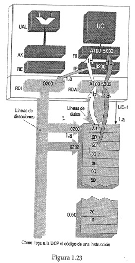
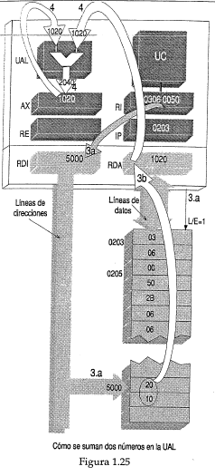

[^ Índice](README.md) | [Siguiente >](capitulo08.md)

# **1.7 PAPEL DE LA UC Y DE LOS MHz DEL RELOJ EN LA EJECUCION DE LAS INSTRUCCIONES**
#### **¿Cómo se ejecutan las instrucciones I1 a I4 mediante movimientos simples entre memoria y registros de la UCP ordenados por la UC?**
---
*Con el fin de comprender mejor como opera la UC, veremos más en detalle la forma en que se ejecutan las instrucciones*, a partir del esquema de la figura 1.8, con el agregado de los registros de direcciones (RDI) y de datos (RDA), definidos en la sección 1.4 al tratar el acceso al azar.
Como se vio en relación con la figura 1.15 cada **sentencia** (orden) de un programa de alto nivel (como R=P+P-T) es traducida por un programa compilador en una secuencia de **instrucciones** (órdenes mas simples, en nuestro ejemplo **I1,I2,I3 e I4**) que una UC puede ejecutar.

**A su vez**, la ejecución de cada instrucción se divide en pasos aún más simples (4 en nuestro caso, figs 1.23 a 1.25). Las acciones que debe ordenar controlar la UC en cada uno de estos 4 pasos están determinadas por 4 combinaciones binarias llamadas **"microcódigos"** que van apareciendo una tras otra en las **líneas de control** con cada uno de los pulsos que constituyen los Mhz (figuras l.29 y 1.30). Estas líneas salen de la UC hacia la UAL, los registros y la memoria (fig. 1.31).La ejecución de una instrucción implica una secuencia de movimientos de transferencia de bytes entre memoria principal y registros de la UCP (o entre estos últimos), establecidos por la UC en un orden determinado, según el código de dicha instrucción. También puede ordenarse una operación en la UAL.|
:-|

*Cada segundo* puede ejecutarse algunos millones de instrucciones, para lo cual deben sucederse muchos *millones* de estos movimientos de pasaje de direcciones, códigos, datos y resultados, *al ritmo de millones de impulsos eléctricos por segundo* (**"megahertz"**, abreviados **MHz**¹) que le llegan a la UC, generados regularmente por un cristal piezo-eléctrico de cuarzo o **"reloj"** ("*clock*"). 
Así se habla de microprocesadores (con reloj) de 100 MHz, 1 GHz, etc. En principio, a mayor número de MHz podrán suceder más de estos movimientos por segundo, con lo cual se podrán ejecutar mas instrucciones por segundo. Un Pentium actual de 1 GHz puede ejecutar más de mil millones de instrucciones por segundo (1000 MIPS), y en ciertos casos hasta 3000 MIPS.
Describiremos *en un modelo simplificado*, el orden, origen y destino de estos movimientos, que deben llevarse a cabo durante la ejecución de una instrucción, para I1,I2,I3 e I4, y los agruparemos por etapas. Dichos movimientos el Debug no los puede mostrar, como tampoco muestra los registros RI, RDI y RDA.

Asi se comprenderá que la UC tiene como función primera dar órdenes de operaciones de lectura o escritura a la memoria y registros de la UCP, y ordenar qué operación debe hacer la UAL, o sea **controlar**, *en el sentido de dar órdenes*, a esos dispositivos. De ahí su nombre de "unidad de control".|
:-|

A fin de hacer más simple la explicación, supondremos que cuando la UC ordena leer la zona de instrucciones de memoria —a la cual apunta el valor de IP—*pide 4 bytes Consecutivos de código de instrucción*². Para ello, si por ejemplo es IP = 0200, asumiremos que primero pide leer 0200 y 0201, y luego 0202 y 0203³. Los contenidos de estas posiciones llegan al **registro de instrucción RI** (figura 1.23).
Para leer dos (o más) direcciones consecutivas basta dar el número correspondiente a la primera de ellas. 

Durante la obtención y ejecución de una instrucción, ocurren en definitiva las siguientes acciones y movimientos principales (figuras 1.23 a 1.26), con los objetivos que se indican, *que como se verá son comunes en general a todas las instrucciones*. Para las operaciones de lectura de la memoria principal (MP), debe tener presente el esquema de la figura 1.10. Comenzaremos con *I1* (figura 1.23).

----
>¹ En Electricidad, si un fenómeno sucede X veces por segundo se dice que tiene una frecuencia de repetición de X Hertz (hercios),en honor a Hertz, descubridor de las ondas electromagnéticas. Un Hertz (Hz) es un ciclo por segundo; 1000 Hz son un kilohertz(Khz), 1000000 I-Iz son un megahertz(Mhz).

>² En los microprocesadores actuales, para ganar tiempo, mientras se están ejecutando instrucciones pedidas anteriormente, se van leyendo de MP códigos de instrucciones a ser ejecutados localizados en posiciones consecutivas. Las Instrucciones pedidas con anticipación se guardan en una memoria interna del microprocesador. Esto se describe en la sección 1.14.

>³. O sea estarnos suponiendo un microprocesador como el 80286 que opera con un word de 16 bits.

1. **Movimientos para direccionar y obtener el código de la instrucción en el registro RI** _(Igualmente para cualquier instrucción)_.
----
**a.** La UC pone en **1** la línea L/E (lectura), y ordena enviar al registro RDI una copia de la dirección 0200 H= 0000 0010 0000 0000 *que indica el IP*. De este    modo dicho número, de 16 bits, llegará a través de 16 líneas de direccion del bus (una línea para cada bit). 

**b.** La MP envía juntos los contenidos de la posición direccionada y de la siguiente (0200 y 0201), o sea en caso el número Al 00, que en binario sería 10100001 00000000. Estos 16 bits van por las 16 lineas de datos del bus, hacia el registro RDA¹, y de éste al RI, Luego siguen la misma ruta los contenidos 50 y 03 de las direcciones 0202 y 0203, como se planteó más arriba. . En consecuencia, al cabo de estos movimientos, en RI existirá en binario la combinacion que en hexa A100503, que corresponde al código de máquina a la instrucción pedida (**I1**,en este caso).

                                                   

---
> ¹ Es importante notar **que en una lectura de MP,los datos de las posiciones leídas permanecen intactos, y una copia de los mismos reemplaza alos que existían en el registro de destino, los cuales se pierden.** 
**O sea que una lectura de MP implica una escritura en un registro de la UCP.**
Esto es semejante en un calculador se pulsa la tecla RM, y una copia de lo que está memorizado pasa al visor, perdiéndose el número que éste contenía anteriormente. 

2. **Decodificación** (Determina los próximos movimientos a realizar por la UC para ejecutar la instrucción que está en RI y *ocurre para todas las instrucciones*).
Cuando un código de máquina (en este caso A1005003) llega al registro RI, el códgio de operación (en este caso **A1**) es **"decodificado"**¹ por la UC. Esto es, el código es detectado por circuitos de la UC, y *su combinación particular de unos y ceros desencadena una secuencia de acciones que ya han sido separadas para esa combinación cuando se diseño el precesador, a saber:*

3. **Movimientos para direccionar y leer un operando** (dato a operar), **cuyo destino es el registro RDA** (fig 1.24)             
**a.** La UC pone **1** la línea L/E (lectura), y ordena enviar al registro RDI una copia de la dirección formada por los dos bytes del código de máquina que siguen al código de operación (en este caso 0050),pero traspuestos (o sea 5000), con lo cual dicho número llega a MP a través de las líneas de dirección del bus.
**b.** La MP envía juntos los contenidos de la posición direccionada y de la siguiente (5000 y 5001), o sea en este caso el dato 1020H. Los 16 bits del mismo llegan por las líneas de datos del registro RDA.

4. **Movimientos y acciones para cumplimentar la operación que ordena la instrucción:** 
**I1** ordena transferir desde MP hacia AX un dato. Puesto que éste ya se encuentra en RDA, solo resta el movimiento de pasar dicho dato del RDA al registro AX (figura 1.24), donde queda almacenado. De esta forma se ha ejecutado lo ordenado por **I1**.

5. **Movimientos y acciones para que IP contenga la dirección de la próxima instrucción a ejecutar:** 
En la UAL se debe sumar al contenido del registro IP, la cantidad de bytes que ocupa la instrucción ejecutada (en este caso 3), y reemplazar el valor anterior (0200) por el resultado de la suma (0203)[1].

La ejecución de **I2** (que ordena sumar al registro AX el dato que está en 5000H) empieza con los pasos **1a.** y **1b.** de la figura 1.23 (iguales para *todas* las instrucciones). En **1a.** será 0203 la dirección que apunta IP; y en **1b.** al registro RI llegara 0306 0050 que es el código de **I2**. Además, **I2** tiene en común con **I1** el movimiento **3a.** y la dirección en este caso es también 5000H. En el movimiento **3b.** (figura1.25) el dato (en este ejemplo otra vez 1020H) obtenido de la lecutra de la dirección 5000H llega al registro RDA.
La operación ordenada en el paso **4** ahora es sumar el operando (1020H) -que está en RDA- al dato contenido en AX (1020H). El resultado de la suma (2040H) debe guardarse en AX reemplazando el valor anterior 1020H, que se pierde (igual que una calculadora cuando se suma). 
El paso **5** consistirá en cambiar el valor de IP, de modo que apunte a la dirección **I3**, para lo cual la UC debe sumar 4 (pues **I2** ocupa 4 posiciones de memoria) al valor 0203, de forma que IP indique 0207H.

**I3** se ejecuta con los mismos movimientos que **I2** con la única diferencia que la UC ordena la resta a la UAL2 ².
Puede verificarse que mediante ellos se llega a los resultados hallados con el Debug (figura 1.21). 
Para la instrucción **I4** (que ordena guardar en 5010H el contenido de AX), luego del movimiento **1b.** (figura 1.23) se tendrá en RI su código A31050.
En el movimiento **3a.** -como en **I1**- se ordena enviar al registro RDI una copia de la dirección formada por los dos bytes del código de máquina que siguen al código de operación (en este caso 1050), pero traspuestos (o sea 5010H), con lo cual dicho número llega a MP a través de las 16 líneas de dirección del bus. (fig 1.26).
En el paso **3b.** el dato (0000H) que se debe enviar a MP para cumplimentar la operación, pasará al RDA. 
Puesto que la operación ordenada en esencia es una escritura de memoria, el paso **4.** consiste simplemente en que la UC pone en **0** la línea L/E (escritura), con lo cual enviará hacia MP, por las líneas de datos, una copia del contenido de RDA (en este caso 0000H). Este se escribirá en las posiciones 5010 y 5011 3. En el paso **5** el IP se actualiza en 020E (no dibujado).

---
>¹ Esta acción circuital no es visualizable en la figura 1.23. Supondremos que cuando la UC lee el primer byte del código (**A1**) de una instrucción detecta cuantos bytes la componen y qué representa cada uno. Por lo tanto la UC así "sabe" que 03 no forma parte del código de la instrucción. Recordar que ésta ordenaba enviar hacia AX una copia del número contenido en la dirección 5000 (y en la 5001)

>² En los pasos 3b de las instrucciones **I2** e **I3** tiene lugar una lectura de memoria seguida de una operación aritmética.

>³ En general, *en una operación de escritura en MP (o en cualquier registro), se destruye el contenido que tenía antes la posición escrita, la cual pasa a almacenar el nuevo valor escrito. Los datos leídos en el registro de origen, cuya copia fue escrita en MP (destino), permanecen intactos.* Asimismo, *una escritura de MP supone una lectura de un registro de la UCP.*

 

#### **¿Qué secuencia de pasos ordena la UC para ejecutar cada instrucción?**
---
Si recapitulamos (figuras 1.23 a 1.26) cómo se ejecutaron las instrucciones en el esquema de UC	supuesto, resulta que la estructura de la UCP está pensada para que repita *permanentemente* la siguiente secuencia de pasos, con las intruciciones del programa a ejecutar que está en memoria principal (MP):

**1. Obtener** (direccionar) **la instrucción a ejecutar de la memoria principal¹**:
+ El IP indica la direción de MP donde comienza el código de máquina² de la instrucción a ejecutar, el caul luego de ser leído de MP llega al registro RI.

**2. Decodificar:** 
+ El código de operación indica: la operacion a realizar, cómo encontrar un dato a operar, y la cantidad de bytes que tiene la instrucción, para que la UC lleven a cabo la secuencia de movimientos preparada para ejecutar dicho coódigo.

---
>[1] En inglés **"fetch"**.
>[2] Por ejemplo en la instrccion **I1** el *código de máquina* era **A10050** (3 bytes), siendo su *código de operación* **A1**, y los 2 bytes restantes **0050** permiten formar la dirección 5000 donde está el dato a operar. **I2** es una instrucción cuyo código de máquina es de 4 butes, y su código de operación es de 2 bytes. En general los bytes que siguen al código de operación permiten determinar la dirección de MP o el registro dónde está el dato a operar, o dónde escribir un resultado.

**3. Obtener un dato a operar:**
+ 3a. Si el dato está en MP, con una dirección que resulta del código de máquina de la instrucción, se direcciona la MP para obtener un dato a operar (“operando”).
+ 3b.	Dicho dato llega al registro RDA (lo mismo en una escritura en MP).

**4. Realizar la operación ordenada y almacenar el resultado:**
+ Según lo ordenado, puede tener lugar una operación en la UAL y almacenar el resultado en un registro, o consistir la operación en un simple movimiento de un registro a otro, donde queda guardado un dato.

**5. Cambiar el contenido del registro IP, para que tome la dirección de la próxima instrucción a ejecutar, y vuelta al paso 1.** (El cambio del contenido de IP puede hacerse junto con el paso 3.)
Las etapas o pasos citados —sintetizados en la figura 1.27— describen, al igual que las figuras 1.23 y 1,24, el **ciclo de una instrucción**,  que puede dividirse temporalmente en una fase de *obtención de la instrucción* seguida de otra fase de ejecución. (Figura 1.27)

#### **¿Cómo hace la UC para no equivocarse con tantos números contenidos en memoria que pueden ser instrucciones, datos o direcciones?**
 ---
En memoria principal existen almacenadas combinaciones de unos y ceros, números binarios que pueden representar códigos de instrucciones, datos o direcciones. El procesador "no sabe" con cuál de estos tipos de información está tratando, pero el orden, la secuencia repetitiva que realiza —descripta en la respuesta anterior— ha sido perfectamente planeada para que no existan problemas de interpretación al respecto.
Este orden empieza cuando se enciende un computador, pues lo primero que pide la UCP de la MP es un código de máquina, el que corresponde a la primera instrucción del primer programa a ejecutar'. La dirección de dicha instrucción está preestablecida, y pertenece a la porción ROM de MP, por lo que al encenderse el equipo el número de dicha dirección siempre debe formarse en el IP (y en el registro CS ²). Luego se suceden en orden los 4 pasos descriptos en la respuesta de la pregunta anterior. De esta forma, lo primero que recibe la UCP de MP es el código de máquina de Una instrucción, que irá al RI.

*Por lo tanto, un computador está pensando que la UCP comience a operar leyendo de MP un número que debe ir al registro de instrucción (RI), por lo que dicho número será interpretado como un código de una instrucción.*|
:-|

Conforme se estableció antes, luego de decodificar el código de una instrucción (paso 2), la UCP está pen¬sada para que forme la dirección de MP donde está un dato a operar. Entonces (paso 3a), lo *siguiente que la UCP lee de MP* (o de un registro de la UCP si el código lo ordena) es *un número que es un dato*
Este dato si bien llega al RDA, no va al RI, como el código de operación, sino hacia .un registro de la UCP (como el AX ejemplificado, o es conducido a la UAL' para ser operado). También puede ocurrir que un número se escriba en esa dirección de MP (como en la ejecución de **I4**).
Después de sumar al IP la cantidad de bytes que tenía la instrucción ejecutada, IP contendrá la dirección de la próxima instrucción a ser ejecutada, con lo cual vuelve a empezar otro cielo, leyendo de MP un número que es el código de dicha instrucción, y como tal es interpretado dado que va en RI en reemplazo del código anterior, y así de seguido.
El orden, establecido supone que *las instrucciones, deben estar escritas en posiciones sucesivas de memoria*, y que  datos a operar por dichas instrucciones están en otra zona de memoria.
Acorde con estas "reglas de juego", si las instrucciones han sido escritas en posiciones sucesivas de memoria y su código es el correcto, no habrá problemas en lo concerniente a cómo la máquina "interpreta" cada combinación binaria que pide de memoria. Esto es así por que el orden establece que lo primero que llega un código, el cual permite localizar otro número que será un dato, y luego nuevamente lo próximo que llega será un código, etc.
En caso que la UC decodifique en el R1 un código que no reconoce, está previsto que la UC pase a ejecutar subrutina, que de ser necesario, por ejemplo haga aparecer en pantalla un aviso de error insalvable.

---
>¹ Como ya se describió, este programa en la porción ROM de MP, dado que el primer programa a ejecutar debe estar siempre en memoria, aunque se apague el equipo, para poder traer del disco los programas del sistema operativo que se pierden en la porción RAM de  memoria al apagar el computador. Al ser ejecutado comienza una secuencia de pasos que permiten traer trae del disco a MP otro programa, que cuando es ejecutado a su vez trae del **disco** a MP programas del sistema  operativo.

>² En un 80X86, el contenido del registro de segmento CS multiplicado por 16 siempre se suma a IP para formar cualquier dirección.

#### **¿Qué analogía didáctica puede establecerse para visualizar la actividad básica de organizar movimientos y operaciones que realiza la UC ?**
---
Si observamos  los movimientos indicados en las figuras 1.23 a 1.26 podemos establecer ciertas similitudes con los que *un sistema de control automático de vías de trenes* (figura 1.28) realizaría entre un galpón con trenes estacionados (simil de memoria), y los andenes de una estación de tren (símiles de registros de la UCP vinculados por *una* única vía bidireccional (similar al bus de datos), para que cada tren vaya al destino que corresponda, según una cierta planificación establecida.
Desde el centro de control se comandaría, por ejemplo, que un tren que está estacionado en un lugar del galpón, se dirija un andén, y que luego otro tren estacionado en otro lugar  se dirija a otra andén. Estos  movimientos tendrían  correlato en el movimiento **1b** y **3b** de las figuras. 1.23 y 1.24. También es factible imaginar un lugar de transformación enganche y desenganche de vagones) para formar nuevos convoyes (símil de la UAL), Por ejemplo, un tren que estaba en un andén sería conducido a ese lugar para ser acoplado, total o parcialmente, con otro que viene del galpón formándose un nuevo tren que luego iría al andén de donde partió el primero de los trenes citados. Algo semejante,  cuando durante la ejecución de un programa procesador de texto se unen los caracteres de dos párrafos para formar uno nuevo.

La función de la UC de encaminar datos hacia un registro de destino, puede apreciarse en este modelo "ferroviario", en el. cambio de vía que debe realizarse, para que un tren que viene desde el galpón de estacionamiento —por la única vía de comunicación con la estación- vaya hacia el andén de destino.

Dentro del microprocesador de la UC permanentemente- mendiante llaves electrónicas (transistores) que comanda — está abriendo y cerrando caminos electrónicos (buses) internos¹, para habilitar en cada movimiento previsto el camino que permita *encaminar* datos del registro de origen   al registro de destino, deshabilitando los restantes caminos. Como se describirá, el control de estos movimientos lo realiza la UC mediante líneas que salen de ella hacia los buses internos, registros y memoria (cable de lectura/escritura), al ritmo de los pulsos que genera el "clock”.|
:-|

Esta analogía también permite visualizar que el bus que comunica, memoria con el microprocesador sólo permite un envío por vez, en un sentido u otro. También la vía principal de la figura 1.28. sólo permite que circule por ella un solo tren por vez, sea de un  andén a un lugar de la playa o en sentido inverso. 
Este modelo que pone de relieve la función de la UC de abrir y cerrar caminos eléctricos mediante líneas de control que salen de ella, puede también servir para aclarar ciertas asociaciones erróneas en torno a la palabra "control" que caracteriza a la UC².	

----
>¹      En Inglés *“data parths”*.

>²      Si bien la semejanza realizada vale en cuanto a las movimientos ordenados, es importante notar una diferencia sustancial en relación con los procesos de datos, Según se vio, por ejemplo si se lee la memoria, una *copia* del dato direccionado es la que llega al registro de destino. A diferencia, un tren "desaparece" del lugar donde estaba estacionado cuando va hacia algún destino.

En primer lugar, en las figuras citadas resulta que **ni datos ni instrucciones entran a la UC,** sino que van a registros, encargándose la UC de que ello ocurra habilitando en cada caso los caminos correspondientes. 
La UC no encarga de controlar si un dato llegó correctamente, sin bits cerrados, a la UCP, o si un resultado de la UAL es correcto' o no, dado que los datos no Van a la UC. 
Sino directamente a registros asociados a la UAL. Lo  mismo pasa con la materia prima en la figura 1.3. 
Así mismo, cuando un código de instrucción llega al registro RI, la UC determina qué ordena ella, para poner en marcha los movimientos preparados para ejecutarla.
Sólo si el código no corresponde a ninguna instrucción, se interrumpe la ejecución del programa en curso y se pasa a ejecutar una subrutina preparada para tal eventualidad. 
Del mismo modo,en el modelo "ferroviario", la oficina de control de vías no tiene por objetivo controlar cuantos vagones tiene cada tren que pasa,o la carga que lleva.

#### **¿Qué relación existe entre los movimientos que ocurren durante la ejecución de una instrucción y el reloj de sincronismo del procesador?**
---
Anteriormente afirmamos que los movimientos que componen la ejecución de cada instrucción se realizan en *sincronismo* con impulsos eléctricos que se suceden *regularmente* a razón de millones de ellos por segundo,generados por un cristal pieza-eléctrico de cuarzo, denominado *"clock"* ("reloj") Profundizaremos más este tema, suponiendo que se generan 50 millones de impulsos por segundo.

Si dichos impulsos se visualizan con un instrumento apropiado, como un osciloscopio electrónico, tienen una forma de onda como indica la figura 1.29. 
Se trata de una señal eléctrica que pasa cíclicamente por dos niveles denominados *"bajo"* y *"alto"*, cada uno de una duración fija.
Esto implica que si midiésemos la señal que sale de dicho cristal oscilador, por ejemplo, durante diez nanosegundos (1/100 de millonésima de segundo) se tendría O volts (nivel bajo), y en los siguientes diez nanosegundos, 5 volts (nivel alto).
Por definición, un ciclo tiene lugar cada vez que se repite un mismo fenómeno. En la figura se ha indicado un ciclo del reloj, considerado desde que comienza un nivel bajo, hasta que dicho nivel se inicia de nuevo,con un nivel alto (pulso) en el ciclo. O sea que en un ciclo tiene lugar un pulso.
En el ejemplo, un ciclo o pulso se repite 50 millones de veces por segundo, por lo cual se tiene una frecuen-cia de repetición de 50 millones de Hertz - 50 Megahertz = 50 **MHz**, siendo 1 Hertz = 1 ciclo por segundo.

Entonces, hablar de megahertz es lo mismo o megahercios que  hablar de millones de pulsos por segundos y es lo mismo que de un millones de ciclos por segundos.|
:-|

Son comunes los microprocesadores con reloj de 100 MHz a más de 1 Ghz. El reloj está incorporado al micro-procesador.
En general, un procesador será más rápido si funciona a más MHz².

Como se planteó, estos pulsos marcan, sincronizan, los instantes en que comienzan los movimientos que tienen lugar durante la ejecución de cada instrucción. Vale decir, que un movimiento empieza al comienzo de un pulso y tiene tiempo de consumarse hasta que el inicio del pulso siguiente, cuando comienza otro movimiento.|
:-|

Con un reloj de 50 MHz de reloj, un movimiento debe concretarse durante un ciclo reloj, siendo que éste dura 1/50 millonésima de segundo, para el caso que ocurran 50 millones de ciclos por segundo. 
En la fig 1.30 se han  indicado los movimientos que empiezan en consonancia con cada pulso, para las instruc-ciones **I1 e I2** antes ejecutadas (ver figs 1.23 y 1.24), suponiendo que con cada pulso tenga lugar un paso de la ejecución de una instrucción, y que se requiere 4 pulsos (pasos) para ejecutar cada una de dichas instrucciones.

Resulta asi que, en general,una instruciòn requiere para su ejecucion unos pulsos reloj.|
:-|

---
>¹ Al encender un computador la ejecución de un programa de diagnóstico que está en RDM lleva a cabo una serie de verificaciones en el Hardware, en relación con el correcto funcionamiento de la UAL, y la memoria, entre otros, y la configuración  del sistema entre otros.

>² La frecuencia de los pulsos reloj no sirve para comparar la performance de procesadores *distintos*.

#### **¿De qué forma la UC pasa de un movimiento a otro abriendo y cerrando caminos?**
---

En la figura 1.23 se tiene que para leer en memoria el codigo de maquina de una instruccion a ejecutar,en movimiento **la.** una copia del contenido de IP pasaba a RDI. Esto lo ordena la UC mediante una linea control que sale de ella *(figura 1.31) que habilita —por estar en **1** — el camino ("bus") que une IP con RDI.
Los contenidos de memoria llegan al registro RDA pasando por el bus de datos que comunica ambas.
Este movimiento de lectura es ordenado por la UC *mediante su lima de control* L/E (de lectura/ escritura *que va de la UC a memoria*, para lo cual dicha linea de control debia estar en **1** (5 volts).
Una vez que dichos contenidos leidos llegaron al RDA, tendran como destino el registro RI, dado que se trata de un codigo de instruccion. Para ello, la UC *habilitará mediante otra linea de control* de valor **1** el camino que une RDA con RI. Observese en el esquema propuesto, que las restantes lineas de control que salen de UC por estar en 0 (0 volts), no permiten la transferencia de datos entre otros registros de la UCP, por cortar la comunicación entre los caminos (buses) que los unen.

De manera analoga (figura 1.32), en la lectura del dato a operar, las lineas de control que estan en **1** permiten los movimientos **3a, 3b** y **4**, que aparecen en Ia figura 1.24. Estos movimientos son ordenados por las lineas de control que en la figura 1.32 estan en **1** (que en la figura 1.31 estaban en **0**), las cuales habilitan los correspondientes caminos entre registros.
Tambien salen lineas de control de la UC hacia la UAL, para ordenar sumar, restar u otra operación.
Si el codigo de una instruccion (como el de **I4**), ordena un movimiento de escritura en memoria, cuando tenga lugar el mismo, un cable de control de la UC habilitara el camino que va de un registro acumulador hacia el registro RDA, y el cable L/E que va a memoria debera estar en 0 volts, para que se escrita la posicion de memoria previamente direccionada, en correspondencia con los movimientos de la figura 1.26.

Por lo tanto, de la UC sale un conjunto de "limas de control" que van 
1. hacia la UAL
2. hacia los caminos entre registros de la UCP
3. hacia la memoria (linea de lectura/escritura -L/E) y hacia los ports de las interfaces (figuras 1.61 y 1.62).

Segun el valor (1 6 0) de estas lineas la UC ordena la operaciOn que hace la UAL, de quo registro a cual otro se pasara la información, y si Ia memoria sera leida o escrita.

     

De esta forma se realiza la accion de control de la UC mediante las lineas que salen de ellas, a fin de lograr los movimientos y operaciones necesarios para ejecutar cada paso de una instruccion. Es como un "director de orquesta" que ordena en cada momento que instrumentos deben ponerse en juego. |
:-|

En la UCP dichos momentos son iniciados, sincronizados, por cada pulso reloj.
Puesto que —como se trató— cada movimiento se lleva a cabo en un pulso reloj, cada uno de las líneas que salen de la UC pueden cambiar de **0 a 1** ó viceversa en cada pulso reloj.
Por ejemplo, si durante un pulso reloj la línea que en el movimiento **1b** habilita la escritura de RI desde RDA (figura 1.31), en el pulso siguiente debe inhabilitarla (cambiando de **1 a 0**), para que el dato no vaya a RI, sino a AX, como aparece en la figura 1.32.

Por consiguiente,  con cada pulso reloj avanza un movimiento o paso la ejecución de una instrucción, y cambia la combinación de unos y ceros presente en las líneas que salen de la UC, a fin de que puedan llevarse a cabo dicho movimiento.|
:-|

Cada vez que se repite un determinado movimiento —como el **1a** ó el **1b**— se repite también en las salidas de la UC la combinación de unos y ceros que determina (controla) dichos movimientos.

#### **¿Dónde reside la "inteligencia" de la UC, para "saber" los movimientos y operaciones en la UAL a realizar; y cómo localizar cada microcódigo?**
---
Esta pregunta equivale a plantear *de dónde sale cada combinación de unos y ceros que aparecen con cada pulso reloj en las líneas de salida de la UC.*

Según se describió (fig. 1.27) la ejecución de cada instrucción se divide en **pasos** aún más simples (4 en nuestro caso, pero que son más en instrucciones complejas). Las acciones que debe ordenar/controlar la UC en cada uno de estos 4 pasos están determinadas por 4 combinaciones binarias llamadas **"microcódigos" (µcod)** que van apareciendo una tras otra con cada .pulso reloj (Clock =**Ck**) en las **líneas de control (LC)**. Estas salen de la UC con destino a la UAL, los registros de la UCP, y laa me'Moria (fig. 1.31). También van hacia los ports.Con cada **Ck** el valor (1 ó 0) de cada **LC** que sale de la UC determina los movimientos (como ser de **IP** a **RDI**) que deben tener lugar, y si interviene la UAL, qué operación debe hacer. El valor de cada **LC** puede cambiar con cada **Ck**. Así, para 500 Mhz (500 millones pulsos/seg) las **LC** cambian 500 millones de veces por segundo, o sea que se generan en ellas 500 millones de µcod/ seg.)Este funcionamiento es común a todos los procesadores, sean CISC o RISC (sección 1.14).|
:-|

En un CISC las salidas de la UC, o sea las **LC**, son salidas de una ROM denominada ROM de Control¹, que contiene escritas en su interior todas las combinaciones binarias que pueden aparecer en las **LC** para determinar qué debe hacer la UC en cada paso de la ejecución de una instrucción. Ello implica que en la **RC** reside la "inteligencia" de la UC, que obviamente fue originada por quienes crearon la UCP.
En general de la UC salen *n* **LC** (como ser *n*= 100), por lo que cada **µcod** será de *n* bits (un bit por cada **LC**), y está guardado (grabado) en una sola celda de *n* bits de la **RC**. O sea que en la **RC** las celdas no son de 8 bits, sino de *n* bits (figura 1.34).
En la figura 1.31 se supone que durante un cierto Ck los valores de las 7 LC supuestas que salen de la UC son 1000101, y en la fig. 1.32 se asume que con el Ck siguiente dichos valores son 0001011. Ambos valores en la figura 1.33 aparecen guardados en 2 celdas sucesivas de 7 bits de una **RC**. Como en cualquier ROM, cuando se accede a una celda una copia de su contenido (**µcod**) pasa a sus líneas de salida, que son las **LC** de la UC. Esto sucede con cada **Ck**. 
Con xxxx se indican otros **µcod** en la **RC**, que como todos los **µcod** constan de unos y ceros. Cuando el **µcod** 1000101 está en las **LC** permite realizar los movimientos de la figura 1.31.

**El esquema siguiente generaliza la fig. 1.33 e intenta acercarse conceptualmente a cómo se localizan los µcod en una ROM de Control**. Sobre la base de la fig 1.33, y suponiendo que cada una de las instrucciones de la fig 1.15 se ejecute en 4 pasos indicados en la figura 1.30 en concordancia con 4 pulsos, hacen falta **4 µcod** (**µcodl, µcod2, µcod3** y **µcod4**) que deberán aparecer en las **LC** con cada pulso, para indicarle a la UC qué hacer en cada uno de los 4 pasos de una instrucción. Con **Ck1, Ck2, Ck3, Ck4**, designamos a cada uno de los 4 pulsos necesarios para que avance un paso la ejecución de cada instrucción, ya sea **I1, ó I2 , ó I3 ó I4** (fig. 1.15). 
En las celdas de la **RC** de una UCP CISC se guardan los **µcod** para pedir y ejecutar cada instrucción de su repertorio.

---
>¹ Tambien llamado **ROM de microcodigo** o **de microinstrucciones**, inmodificable y forma parte del chip del procesador. **Esta ROM no tiene nada que ver con la ROM de la memoria principal**, que contiene los programas de arranque y el BIOS (Basic Input Output System)en una PC, **ni tampoco tiene que ver con el sistema operativo elegido para un computador**. Esta concepcion circuital se empleó en procesadores y microprocesadores CISC de distintos fabricantes, inclusive hasta el Pentium 1, prevaleciendo luego la concepción RISC. 

Puesto que una **RC** es una memoria random -cuyas celdas guardan tantos bits como **LC** existan- *cada celda de* **RC** *se localiza por su dirección*.**Cada ucod proveerá la dirección del siguiente, salvo la dirección del tercer (µcod3)**,que se determina **en la decodificación** a partir del cod-op del a isntrucción que llegó al **RI**. Como se tratará,*dado que en la **RC** existen miles de **µcod** para ejecutar todo el repertorio de instrucciones de una UCP, la localización de los sucesivos **µcodigos** para ejecutar la instrucción que llegó al RI y luego pedir la siguiente, se realiza sempre a partir de la loccalización del **µcod3**, merced al cod-op de dicha instrucción.* |
:-|

Supondremos que después de los pulsos **Ck1** y **Ck2**, en las **LC** han aparecido **µcod**1 y luego **µcod**2, con lo cual llega a **RI** (fig. 1.34) en la 2B06; y que en la decodificación decho cod-op 2B06 que esta en RI permite localizar la  dirección del "**µcod**3 de 2B06" en la **RC**. Osea que cuando llegue Ck los **0s y 1s ** del **µcod**3 del 2B06 al aparecer sobre las **LC** abrirán y cerrarán los caminosque corresponda mediante las llaves que los gobiernan, para que  se lleve a cabo el paso 3 de 2B06: direccionar el dato y llavarlo a RDA.

Asimismo, un subconjunto de bits del **µcod**3 de 2B06 no van a las **LC** sino que proveen  la dirección del **µcod**4, supuesto en la dirección que sigue al a del **µcod**3.
Cuando se genere el pulso **Ck**4, el **µcod**4 de 2B06 aparecerá en las **LC** determinando que se lleve a cabo el paso 4:realizar la resta ordenada por dicho cod-op 2B06.
Asu vez un conjunto de bits del **µcod**4 de 2B06 no van a las **LC**, sino que proveen la dirección (Dir ucod1) del **µcod**1 para pedir  de memoria la siguiente instrucción (de cod-op supuesto A3). Si al pulso que sigue a **Ck**4 lo volvemos a llamar **Ck**1, al ocurrir este pulso el **µcod**1 aparecerá en las **LC** para que se lleve a cabo el paso 1 del pedido. Del mismo modo, bits del **µcod**1. el **µcod**2 permitirá qye el cod-op A3 dela instrucción supuesta ahora en **RI** sea decodificado, para localizar el **µcod**3 de A3, como sucedió antes con 2B06 dado que el **µcod**2 no indica la dirección del **µcod**3 de cada nueva instrucción a ejecutar.
De esta forma, luego de ejecutar cada instrucción (con **µcod**3 y **µcod**4),se pide lo siguiente  \(con **µcod**1 y **µcod**2)\, para seguir con los **µcod**3 y con **µcod**4 que determinan la ejecución de esta siguiente instrucción, **y asi sucesivamente**. En cada secuencia **µcod**3 \=>\ **µcod**4 \=>\ **µcod**1 \=>\ **µcod**2 la dirección de cada **µcod** la provee el **µcod** anterior, siendoque la dirección de **µcod**3 la provee el cod-op de instrucción que llegó a RI, como los señalan las dos simbollizaciones del registro RI en grisado en la figura 1.34.
Los dosprimeros pasos (obtener instrucción en RI y decodifcarla -fig1.31) como se trató, **son comunes a todas las instrucciones**,por lo que los**µcod**1 y **µcod**2 serán compartidos por todas las instrucciones.
Tanto **µcod**3 de XX como **µcod**4 de XX hacen referencia a **µcod** de otra instrucción que puede ejecutar la UCP.

Cada sentencia (por ej. R = P + P -Q) de un programa de alto nivel se traduce en una secuencia de instrucciones (I1, I2, I3, I4 en este caso) y cada instrucción se ejecuta mediante una secuencia de **µcódigos** que en uns CISC etán en una ROM de Control, y que aparecen en las lineas de control al ritmo de los pulsos reloj. Ellos determinan las acciones que deben realizar la UC en cada paso de la ejecución de una instrucción.|
:-|

Cuando el código de operación de una instrucción llega al registro de RI, el mismo permite ubicar (en este ejemplo) la tercera de dichas combinaciones que debe aparecer en las lineas de la UC para que comience la ejecución de dicha instrucción.

*Este conjunto de combinaciones constituyen la "inteligencia" de un computador, habiendo sido preparadas pro el hombre, para que la UC pueda ejecutar cada una de las instrucciones de máquina que forman parte de cualquier programa contenido en memoria principal, sea de usuario o del sistema operativo*.|
:-|

Los procesadores que tienen dichas combinaciones almacenadas en una ROM de Control se dice que son "maquinas **microprogramadas**".

Todo sucede como si la UC fuera como un robot preprogramado, para que con cada orden distinta que se le imparta (instrucción) responda mediante una serie de acciones específicas (ordenadas por las combinaciones que se generan en susíneas de salida), programadas en su interior por sus creadores.

 

----

[^ Índice](README.md) | [Siguiente >](capitulo08.md)
