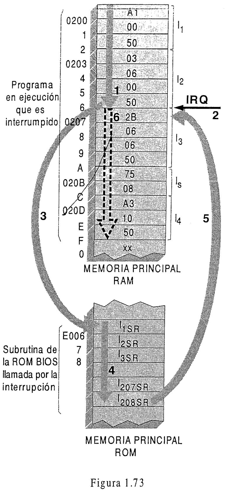
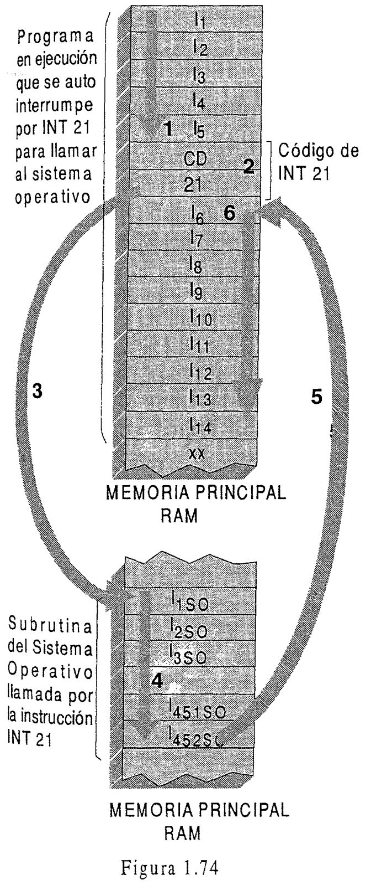
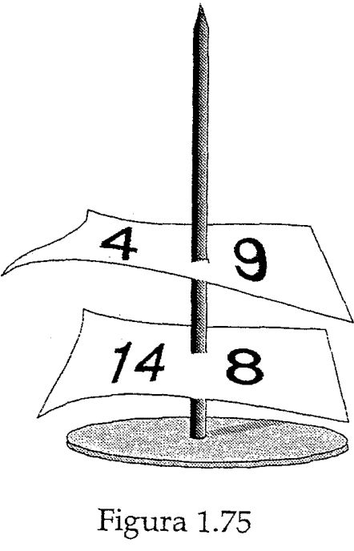

[^ Índice](README.md) | [Siguiente >](capitulo12.md)

----

# 1.11 LAS INTERRUPCIONES PC HARDWARE: ''TIMBRES'' PARA LLAMAR A SUBRUTINA

## *¿Qué son las interrupciones?* ##
---

---
>Una **interrupción** supone la suspensión temporaria de la ejecución de un programa, para pasar a ejecutar una *subrutina de servicio de interrupción, la cual en general no forma  parte del programa* (por pertenecer típicamente al sistema operativo, o al BIOS -Basic Input Output System-)[1].  
Luego de ejecutarse dicha subrutina, debe reanudarse la ejecución de dicho programa.
---

Así, en la figura 1.73, luego que se termina de ejecutar la instrucción **I2** de un programa antes visto, se suspende transitoriamente la ejecución de **I3**, y de las instrucciones siguientes de dicho programa (**1**). Se supone que ello es debido a que una interfaz, por ejemplo la del teclado (figura 1.62), activó su línea de solicitud de interrupción IRQ (**2**), para que se pase a ejecutar la subrutina de la ROM BIOS que atiende al teclado (**3**).  
Luego que se termina de ejecutar esta subrutina (**4**), se vuelve a la secuencia interrumpida (**5**), por lo cual se ejecutará la instrucción **I3** que había quedado en suspenso, y las siguientes (**6**)
---
>Por lo tanto, las interrupciones *son la forma en que se llama*, para su ejecución, *a subrutinas de un sistema operativo y de la ROM BIOS.*

---
>Se debe tener bien en claro que un sistema operativo no se ejecuta porque  “él quiere", ni en simultaneidad con el programa en ejecución, sino que la UCP pasa a ejecutar una subrutina o módulo de un sistema operativo sólo cuando una interrupción así lo determina.

---
>Existen **interrupciones por software** (mediante una instrucción) e **interrupciones por hardware**

Las interrupciones por hardware **externas** (a la UCP) son las del tipo descripto hasta ahora: tienen lugar cuando una interfaz activa su señal de solicitud de interrupción (denominada **IRQ** -Interrupt Request- en las PC), que por una línea de control del bus llega a un chip.  
Cada  línea  IRQ  que  sale de una  interfaz  tiene  un  subíndice  **n**  (del 0  al 15 en una  PC)  que la identifica. Todas las IRQ entran a un chip *"árbitro de interrupciones"*, que decide cuál interfaz interrumpirá primero, para el caso que se activen varias IRQ simultáneamente. Este chip activa una línea que llega al procesador (designada INTR en los 80x86, como muestran las figuras 1.62 y 1.63). Las interrupciones por hardware **internas** (designadas a veces **"excepciones"**) ocurren en el interior de la UCP,  si hay algún problema mientras se ejecuta una instrucción.

Obsérvese que tal como se la ha definido, la palabra "interrupción" designa la suspensión *momentánea* de un programa o subprograma, realizada por medio de una instrucción de máquina específica (software) o por hardware (originada en el interior de la UCP o mediante la línea IRQ citada. Debiéndose luego retomar la ejecución del programa. Todo ello **sin intervención humana.**
>No se trata pues de mero hecho de que un usuario decida cambiar o suspender mediante el teclado o el mouse, la ejecución de un programa por otro a su elección. En general los efectos de una interrupción no son visibles para un usuario, dado que llaman a subrutinas del sistema operativo o del BIOS  

---
[1]: También es factible que programas como procesadores de texto. Hojas de cálculo y otros tengan sus propias subrutinas para interrupción, siendo además que un usuario puede crear sus propias rutinas de servicio de interrupción.

## *¿Cómo opera una interrupción por hardware externa?* ##
---

  

Anteriormente se planteó, que otra función muy importante de una plaqueta interfaz es *generar la señal IRQ que se envía por un cable* hacia un subsistema ligado a la UCP, para solicitarle a ésta la *interrupción del programa en curso de ejecución.*  
Se trata claramente de una interrupción *que tiene su origen en el hardware:* la activación de un cable de control del bus.  
Esta activación tiene lugar en principio cuando en el periférico conectado a una plaqueta interfaz  se concretó algo en el teclado se apretó una tecla, una impresora está lista para recibir más datos, una unidad de disquetes terminó de leer o escribir, etc.

La activación de dicha señal IRQ por una interfaz *(que equipararemos a un toque de timbre)*, causará que en algún momento posterior *se interrumpa momentáneamente la ejecución de un programa, y que la UC pase a ejecutar la subrutina de la ROM BIOS o del sistema operativo [1] preparada para atender a dicha interfaz[2].*  
Al finalizar la ejecución de esta subrutina, podrá seguir la ejecución del programa interrumpido. A continuación se darán dos ejemplos.

Cada vez que en una PC se pulsa o libera una tecla, el código de ésta llega al port de datos de la interfaz del teclado/ lo cual hace activar su señal IRQ (figura 1.62). Esta IRQ sirve de *indicación de que en una operación de entrada puede realizarse la fase de transferencia por acceso indirecto a memoria* (AIM), para que dicho código llegue a la zona buffer de memoria reservada para los códigos de teclas.  
A fin de realizar el acceso indirecto a memoria, luego de la activación del IRQ la UC interrumpe el programa en curso de ejecución, y pasa a ejecutar una subrutina del BIOS. En ésta existirá una instrucción IN (que pasa un byte del port al registro AX), seguida de otra del tipo **I4** (que pasa dicho byte de AX a memoria principal), como ya se trató Luego se reanuda la ejecución del programa.

Cuando finaliza un acceso directo a memoria (ADM) como el que ocurre en la fase de transferencia de las operaciones de entrada y salida de un disquete, entre su interfaz y memoria (figuras 1.63 y 1.72) la interfaz involucrada activa su IRQ, para que se interrumpa el programa en ejecución, y se pase a ejecutar la subrutina que verifica que el ADM fue bien hecho.  
Caso contrario se ordenará intentarlo varias veces. Si el problema subsiste, dicha subrutina hará aparecer un cartel en pantalla indicando dicho error de hardware.  
Para la impresora, en una PC suele usarse la señal IRQ de su interfaz para indicar falta de papel, lo cual origina que la subrutina que atiende este evento indique el mismo con un aviso en pantalla.

Otra fuente de interrupción externa proviene de la interfaz con los contadores usados para generar las horas y minutos que aparece en pantalla. A tal fin, cada segundo dicha plaqueta genera 18 interrupciones, siendo que con cada una de éstas, la subrutina que sirve a esta interrupción actualiza la hora indicada cada minuto.

---
>Obsérvese que estos eventos (tecla pulsada, fin de ADM, reloj, etc.), por un lado, *no pueden ser previstos en un programa cuándo sucederán*, y por otro, cuando en memoria hay varios programas que alternan su ejecución (*"multitasking"*) también puede ocurrir una interrupción en un programa a causa de un periférico que en ese momento está trabajando para otro programa.

---

---
[1] Por sus funciones  puede considerarse a la ROM BIOS como parte de un sistema operativo con flexibilidad para manejar una gama amplia de periféricos, provenientes de distintos fabricantes.  
[2] La dirección donde empieza esta subrutina se halla en una zona de memoria principal, que en las PC se llama de "vectores interrupción”

De lo anterior también resulta -como se anticipó- que *hay un conjunto de líneas de solicitud de interrupción.* Así, por lo menos de cada interfaz sale una línea designada IRQn siendo n distinta para cada una. Hay IRQ compartidas, como la de la interfaz para disquetes y discos.

>Todas estas líneas se dirigen a un chip “arbitro de solicitudes de interrupción” que en el caso de activarse varias IRQ simultáneamente, da curso solo a la que tiene subíndice n menor. Las restantes deben esperar. Una salida de este chip active la línea de control INTR que entra a la UC para indicarle que hay una solicitud de interrupción activa

---
>*Cada vez* que termina de ejecutar una instrucción, la UC sensa si la línea de control INTR está activa (indicadora de solicitud de interrupción). Si el programa en ejecución lo permite [1]
el mismo es interrumpido. De no ser así, *dicha solicitud espera hasta ser atendida.*

---

En las dos primeras generaciones de computadoras este mecanismo de interrupciones que indica un evento externo que debe ser atendido no estaba incorporado. Un método que se usaba consistía en ejecutar periódicamente subrutinas que interrogaban (*"polling"*) a los periféricos, para determinar si tenían datos a enviar. Ello implicaba tiempo de la UCP gastado en su ejecución, aunque no hubiera nada para enviar.

## *¿Cómo operan las  interrupciones por software?* ##
---
>Una interrupción por software realiza ejecutando el código de una instrucción que ordena **llamar a subrutinas del sistema operativo o de la ROM BIOS** cuando necesita el servicio de una de ellas

Este tipo de instrucción en el lenguaje assembler de una PC se simboliza **INT xx**[2] donde el número **xx**, identifica la subrutina llamada y también permite localizarla en memoria principal).  
A diferencia de las interrupciones por hardware, una interrupción por software queda establecido en qué momento de la ejecución de un programa sucederá, pues *se trata de una instrucción que está en determinado lugar de un programa, que llama a dichas subrutinas.*  
Por ejemplo, cuando un programa necesita hacer una operación corriente relacionada con los recursos que maneja el sistema operativo: típicamente abrir/cerrar un archivo, acceder a un disco, imprimir, visualizar información en pantalla, etc.  
En todos los casos se trata, pues, de un llamado a subrutinas que los programas de usuario requieren en su auxilio, cuando  se necesita realizar operaciones típicas, como las citadas.

  

La figura 1.74 -en esencia similar a la 1.73- da cuenta del mecanismo de una interrupción por software, que podemos esquematizar en los siguientes pasos:

**1.** Un programa que se venía ejecutando, luego de su instrucción **I5** necesita llamar a una subrutina del sistema operativo (SO), por ejemplo para leer un archivo en disco.  
**2.**	A tal efecto, luego de **I5** existe en el programa la instrucción de código de máquina CD21, simbolizada **INT 21** en assembler, que realiza el requerimiento del paso 1. Puesto que no puede seguir la ejecución de las instrucciones **I6** y siguientes del programa hasta que no se haya leído el disco y esté en memoria principal dicho archivo, virtualmente el programa se ha *autointerrumpido*, siendo además que luego de INT 21, las instrucciones que se ejecutarán no serán del programa, sino del sistema operativo.
---
[1] Mediante una instrucción especial se puede hacer esperar ("enmascarar") solicitudes dé interrupción.  
[2] En otras computadoras como las PDP y la IBM/370 esta instrucción se llama TRAP y SVC nn (Supervisor Call) respectivamente.

**3.**	La ejecución de INT 21 permite hallar la subrutina del SO  
**4.**	Se ejecuta la subrutina del SO que prepara la lectura del disco.  
**5.** 	Luego de ejecutarse la subrutina del SO, y una vez que se haya leído el disco y verificado que la lectura es correcta, el SO ordenará reanudar la ejecución del programa auto interrumpido en espera.  
**6.** La ejecución del programa se reanuda
---
>Es importante tener siempre presente que tanto las interrupciones por hardware o software son mecanismos para llamar a subrutina del SO o de la ROM BIOS.

>Esto es, **los programas del sistema operativo no se ponen en ejecución por sí mismos, sino que son llamados por las interrupciones, que son los "timbres" que llaman al sistema operativo.** De ahí su importancia.

---
>Dado que tanto los programas o subrutinas del sistema operativo o del BIOS que ejecuta la UCP se originan en interrupciones por software o hardware, estas en esencia marcan, articulan la secuencia automática de procesos que va realizando un sistema de computación, de modo de utilizar la UCP en relación con las necesidades de atención de dichos procesos en el tiempo.

## *¿Cómo se retorna al programa interrumpido?* ##
---
En cualquier caso que exista una interrupción, antes de que se pase a ejecutar la subrutina del sistema operativo o del BIOS que da servicio a dicha interrupción, la UC *guarda automáticamente en memoria, la dirección de retorno*, donde está la instrucción a partir de la cual continúa el programa interrumpido. De esta forma, luego que se ejecutó dicha subrutina, se podrá retornar a ejecutar el programa.

## *¿Que es la zona de memoria principal denominada "pila"?* ##
---
La dirección de retomo mencionada en la respuesta anterior se guarda en una  zona elegida de memoria principal denominada "**pila**" ("*stack*"). Esta se utiliza para retornar al programa que llamó a una subrutina o que fue interrumpido, una vez que se ejecutó la subrutina llamada, *en cualquier llamado a subrutina (del sistema operativo, del BIOS o de una subrutina propia del programa)*, sea por interrupciones o por instrucciones de llamado a subrutina.

---
>La pila es necesaria, porque es común que la subrutina llamada por una interrupción *a su vez sea interrumpida* para llamar a otra subrutina, y esta segunda también puede sufrir interrupciones, y así sucesivamente.

---
  

Para entender esto utilizaremos un libro de cocina. Suponiendo que se elabora una receta de su página 14, que en el renglón 8 remite a la elaboración de la página 4, y que en el renglón 9 de ésta a su vez se requiere hacer otro sub-procedimiento indicado en la página 54. Se podría cuidar el orden de elaboración como sigue.  
Una vez que se llegó al renglón 8 de la página 14 se anotaría en un papel estos números, el cual se insertaría en un pincha-papeles. Luego se elaboraría el procedimiento de la página 4 hasta llegar al renglón 9 en el cual se interrumpe. Estos números se anotan en otro papel que se apila en el pincha-papeles sobre el papel anterior, y se pasa a realizar el subprocedimiento de la página 54. Terminado el mismo, para retornar a terminar el anterior, se leen en el papel que está más arriba del pincha-papeles los números 4 y 9, que permiten reanudar la receta de esa página. Realizada ésta, se leen en la hoja apilada debajo de la anterior en el pincha-papeles, los números 14 y 8, que permiten encontrar la receta principal, para terminar la receta.  
Obsérvese que el último de los procedimientos interrumpidos es el primero en completarse luego, siendo que la pila de papeles del pincha-papeles permite cuidar el orden necesario. Se trata de una pila “ultimo en entrar, primero en salir” (*”last-in- first-out"-LIFO*)

De forma análoga, a fin de guardar *ordenadamente* la dirección de retomo de un programa interrumpido y de las sucesivas subrutinas que fueron interrumpidas posteriormente, con cada interrupción se va escribiendo en posiciones sucesivas decrecientes de memoria cada dirección de retomo (más los datos necesarios para poder reanudar cada subrutina interrumpida sin que nada se pierda).  
Esto es, con cada interrupción o llamado a subrutina, se apila en la cima  de la pila la información que permite retomar al programa o subrutina interrumpida[1].  
Cuando no suceden más interrupciones, y una vez que se termina de ejecutar la última subrutina llamada, se retoma a la subrutina cuya dirección de retomo está en la cima de la pila, o sea a la que se guardó más recientemente. Por consiguiente, la última subrutina que fue interrumpida es la primera  a la cual se retoma. Luego se vuelve a la anteúltima interrumpida, y así sucesivamente hasta retomar al programa interrumpido en primer lugar. Para lograr este orden, en la pila se empieza a desapilar cada bloque de información almacenada, en orden inverso al que fue apilado.  
En la figura 1.76 se supone una pila definida a partir de la dirección de memoria 0436, para el programa de la figura 1.73. Este programa luego de la interrupción debe proseguir en la instrucción localizable mediante la dirección de retomo 0207H.  
No bien la UCP acepta la solicitud de interrupción, guarda automáticamente en la pila (en este caso a partir de la dirección 0436H) dicha dirección 0207H.  
Sobre este valor se supone que guarda otro valor, indicado XXXX, que debe ser del Registro de Estado.

Debe mencionarse que en la UCP existe un registro "**puntero de pila**" ("*stack pointer*"-**SP**), que contiene la dirección de la pila que en el presente corresponde a su cima, siendo el mismo actualizado también *en forma automática* por la UC cada vez que se lee o escribe la pila.

  

En el ejemplo de la figura 1.76, se ha supuesto que al sobrevenir la interrupción se podía apilar a partir del comienzo de la-pila (dirección 0436H), o sea que en la pila no había nada apilado anteriormente. Entones, el SP en una PC estaría con el valor 0437H antes de la interrupción, para alcanzar el valor 0433H luego que ella tiene lugar, indicando así el SP la nueva dirección de la cima de la pila.  
De sobrevenir otra interrupción o llamado a subrutina, situación no planteada en la figura 1.76, los valores a resguardar se apilarían en la dirección 0432H de la pila, sobre XX, variando en correspondencia el SP.  
Cuando se termina de ejecutar la subrutina que atiende la interrupción por hardware, solicitada por la interfaz, se retoma al programa interrumpido leyendo 0207H de la pila, y luego SP vuelve automáticamente al valor 0437H.

## *¿Qué es la zona de memoria de “vectores interrupción”?* ##
---
En la descripción anterior no aclaramos cómo se localiza la subrutina llamada por una interrupción por hardware o por software. Para ambas existe en memoria una zona llamada de *"vectores interrupción"* donde para *cada* número de IRQ y de INT existen dos celdas consecutivas de memoria que indican la dirección de la subrutina que atiende a *esa* interrupción. Por tal motivo a cada par de estas celdas se las llama "vector interrupción", en el sentido que contienen un número que "apunta" hacia donde está dicha subrutina, y a las interrupciones que  encuentran su subrutina de esta manera, se las llama “interrupciones vectorizadas".  
A su vez la dirección donde están las dos celdas (vector) que corresponde a cada IRQ o INT se localiza en la función del número de IRQ o de INT.

---
>En la Unidad 3 de esta obra, páginas 44 a 53 de la 2da edición, se tratan en detalle las interrupciones por software y hardware.

---

---
[1] La pila y el stack pointer se tratan en detalle en la unidad 3 de esta obra (Assembler)

----

[^ Índice](README.md) | [Siguiente >](capitulo12.md)