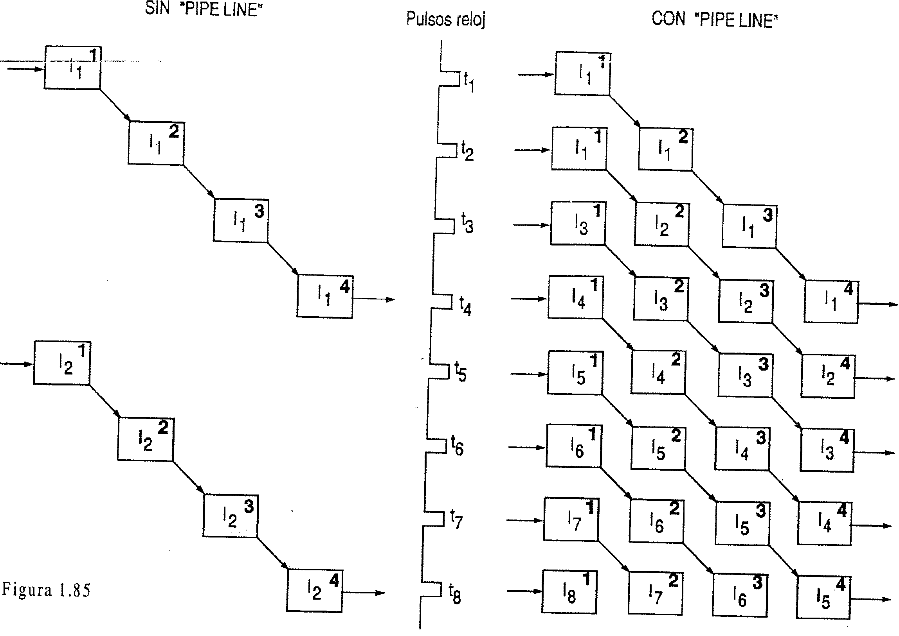

[^ Índice](README.md) | [Siguiente >](apendice1.md)

----

# 1.14 PARA ENTENDER LOS PENTIUM Y LOS PROCESADORES RISC

### ¿Qué es el "modelo de Von Neumann", y en qué medida los procesadores actuales lo cumplen?
 -----------------------------------------------------------------------------------------------------------------
	si bien con importante mejoras en la velocidad de procesamiento, _la mayoría de los procesadores actuales
	procesan en base al esquema de la figura_ 1.7, denominado "__modelo de Von Neumann"__[^nota1], que supone:

	~~~
	+ Existe una sola UCP, que procesa en secuencia una instrucción tran otra.
	  Ejecuta una sola intrucción por vez mediante una serie de paso

	+ Las instrucciones a ejecutar y los datos a procesar, codificados en binario, deben almacenarse en una 
	  rapida memoria interna (memoria principal) antes de realizar el procesamiento de los mismos.

	+ Existen instrucciones de "salto", (figura 1.35) que ordenen a la UC discontinuar o no (según se
	  alcance o no un resultado interno) la secuencia de intrucciones que viene ejecutando, para 
	  pasar a ejecutar otra secuencia, cuya primer intrucción se debe poder localizar. 
	~~~

	En la figura 1.27 se endicaban cinco pasos o etapas básicas para ejecutar una instrucción.
	Una de las primeras mejoras en velocidad para el modelo, fue ejecutar el paso 5 mientras se espera el
	dato a operar (paso 3), quedando asi 4 subprocesas típicos por lo que pasa la ejecución de cada intruc
	ción: los cuales progresan con cada pulso reloj, según se ha visto (figura 1.30, que se repite en la 1.84).

	La figura 1.85 (izquierda) es similar a la 1.84, salvo la dirección (diagonal) en que avanza el proceso, 
	para poder comparar el procesamiento según el modelo original de Von Neumann con otro más eficaz. 
	La ejecución de una instrucción progresa de un renglón al siguiente con cada pulso reloj, por lo
	cual los pulsos se han dibujado en sentido vertical. 
	Primero se termina de ejecutar totalmente una intrucción (__I1__), y luego la siguiente (__I2__), insumiendo 
	ejecución de ambas intrucciones 8 pulsos reloj.

###¿Qué mejora en la velocidad presentan los procesadores actuales con "pipe line"?
-----------------------------------------------------------------------------------------------------------------------
	Hoy día, para aumentar la velocidad de procesamiento se ha mejorado el modelo original, dando 
	lugar a otro que podemos denominar modelo de Von Neumann con "solapamiento de procesos", o
	con "__pipe line__" o "__segmentado__" -como quiera llamarse- que se pasa a exponer conceptualmente.
	Intel en 1978 ya adoptó el "pipe line"°° en el procesador 8086.

	-------------------------------------
	[^nota1]  > En el presente tambén se denomina "escalar o "secuencial", generalizable a cualquier computador que opera en forma secuencial
	> sobre los datos. 
	[^nota2]  > Tracucible "como un tubo"), término originado en el proceso de fabricación en serie de autos, adoptado por Ford en 1919.														1-115
---------------------------------------------------------------------------------------------------------------------
	Esta mejora sustancial en la cantidad de intrucciones que se procesan por segundo se basa en las líneas de
	producción en serie de las fábricas dde autos.. En ellas se divide el proceso de fabricación en una serie de
	subprocesos que se pueden realizar en forma independiente. En una cadena de este tipo, cuando se termina
	un subproceso de fabricación de una unidad (como ser el de pintura), la misma es desplazada al lugar donde
	se realiza siguienta subproceso de la cadena, a la par que otra unidad -también en proceso de fabricación- 
	ocupa el lugar de la primera, para ser sometida al mismo subproceso realizado sobra la unidad anterior.
	De esta forma _se realizan simultáneamente todos los subprocesos_ independientes que requiere el  
	armado de un auto, *pero aplicados a distintos autos* en curso de fabricación. Cuando se termina de 
	producir un automóvil, los que fueron entrando a la cadena estarán parcialmente contruidos.
	Para plantear didácticamente la mejora habida apelaremos a un proceso conocido: el lavado de autos.
	Un lavadero simple tiene una persona a cargo de todas las estapas del lavado. Entra un auto por
	vez, y después de un tiempo, en el cual se sucedieron dichas etapas, el auto sale limpio. Luego 
	entra el auto siguiente a lavar, y así de seguido.
	Esto es semejante al procesamiento de cada instrucción en el modelo original de Von Neumann
	(figura 1.85 izquierda), siendo que la siguiente instrucción recién se peude comenzar a ejecutar 
	luego de transcurrido el número de pulsos que requiere la ejecución de la anterior. 

	En un lavadero semiautomático en el cual el proceso se hace en 4 etapas de 5 minutos (entrada y pago
	del ticket --> cepillado automático --> limpieza de ruedas e interior --> limpieza de vidrios y secado final[^nota1])
	se pueden ir procesando 4 autos simultáneamente. Cada auto tardaría 20 minutos en salir, pero puede
 	salir __un__ auto terminado cada 5 minutos. Esto es, aumenta la cantidad de autos lavados por hora, lo cual
	redunda en un menor precio de lavado, pero _cada cliente debe esperar_ las 4 etapas (20 minutos).

	Si al modelo de Von Neumann se le agrega "piperlining", la UCP mantiene su esquema básico, pero se le 
	debe agregar circuitería adicional, del mismo modo que un lavadero automático requiere más personal, 
	marquinaria y espacio interno para espera, en comparación con un lavadero manual unipersonal.
	Así, se necesita un buffer para almacenar por orden de llegada los códigos de varias instrucciones (como
	ser __4__ ó 5) pedidas a la memoria (o al caché), y los otros buffers intermedios entre etapas. Estos sirven para que 
	no se pierda el código de una instrucción en curso de ejecución, o datos y resultados relacionados con ella.[^nota2]

	La figura 1.85 (derecha) ilustra cómo un "pipe line" permite procesar simultáneamente diversas etapas 
	de distintas instrucciones, completándose en cada etapa una parte de la ejecución de cada instrucción.
	Se ha supuesto a los fines comparativos que el "pipe line" se realiza con las 4 etapas y tiempos 
	(dados por pulsos reloj, designados __t1__, __t2__,. ...) de la figura 1.84 ó 1.30, y que todas las intrucciones 
	requieren para su ejecución 4 pulsos). Entonces la UC ordenará:
	
	En __t1__, la primera de estas instrucciones que corresponde ejecutar (__I1__), pasa del butter al registro RI.
	En __t2__ el código de __Isub1__ es decodificado, y al registro RI pasa a contener el código de __I2__.
	En __t3__ se trae[^nota3] el dato a operar para __Isub1__, se decodifica __I2__, y a RI llega desde el buffer el código de __I3__. 
	En __t4__ termina de ejecutarse __I1__, se trae el dato a operar para __I2__, se decodifica __I3__ y llega RI el código de __L4__

	Así de seguido se llevan a cabo en paralelo los procesos indicados en diagonal en la figura citada, cada uno
	independiente del otro. De esta forma, al cabo de 8 pulsos se habrán terminado de ejecutar 4 instrucciones, o
	sea, 4 veces más que con el modelo sin "pipe line" que aparece a la izquierda de la misma figura.
	En general, si se tiene un "pipe line" de __n__ etapas, teóricamente[^nota4] se puede procesar hasta __n__ veces más
	instrucciones por segundo que sin "pipe line", suponiendo que todas las intrucciones requieran __n__ etapas.
	Esto implica también una situación ideal, con todas las instrucciones de igual complejidad, ejecutándose
	en 4 pulsos reloj. Así, _con cada pulso entra una instrucción al "pipe line", y se termina de ejecutar otra_.
	Resulta, que si bien _no se reduce el tiempo de ejecución de una instruccion_ (cada una requiere __4__ pulsos reloj), 
	en cada pulso __reloj__ se está ejecutando una etapa de 4 instrucciones distintas, lo cual permite ejecutar varias
	veces más rapido (4 en este caso) las instrucciones de un programa que en un modelo sin "pipe line".

	-------------------------------------
	[^nota]  > Suponiendo que esta última etapa sea la que dura 5 minutos y otras mucho menos, ella determina el ritmo de lavado.
	[^nota]  > Del mismo modo, en el lavadero citado puede requerirse un lugar entre dos subprocesos, donde un automóvil que sale de un sub-proceso
	> permanezca en él demorado, antes de pasar al siguiente, so pena de llevarse por delante el auto que aún está en este subproceso.
	[^nota]  > Desde la memoria caché, si está en ella (sino habrá que pedirlo a la memoria principal) o desde un registro de la UCP.
	[^nota]  > Un "pipe line" sin circuitos para "predicción de saltos condicionados" puede cortarse, si por ejemplo __I1__ es una instrucción de salto
	> condicionado (figura 1.35), que obligue que la siguiente que corresponda ejecutar no sea __I2__; o si tiene lugar de interrupción por
	> hardware. O demorarse un pulso reloj por que el dato a operar no está el caché y hay que pedirlo a memoria. Asimismo, la circuitería
	> extra para el "pipe line" hace que cada instrucción se ejecute con pulsos de mayor duración en relación con un modelo sin "pipe line"1-116
---------------------------------------------------------------------------------------------------------------

### ¿Qué es el multiprocesamiento o procesamiento en paralelo?
---------------------------------------------------------------------------------------------------------------
	Los requerimientos actuales de velocidad de procesamiento hicieron necesario el desarrollo de 
	máquinas designadas "__no Von Neumann__", en el sentido de que existen __varios procesadores__ operando 
	juntos, __en paralelo__. Así se puden ejecutar ejecutar, en forma independiente, varias instrucciones de un
	mismo programa, o varios programas independientes, u operar con diversos datos a un mismo tiempo.
	Esto se conoce como "__multiprocesamiento__", contrapuesto al "uniprocesamiento" de Von Neumann.
	De existir varios lavaderos que trabajen "en paralelo" sería factible que varios autos salgan
	terminados simultáneamente y que además se ayuden mutuamente. En las arquitecturas "no Von
	Neumann", varias UCP pueden terminar de ejecutar juntas varias instrucciones por pulso reloj.

	~~~
	No debe confudirse _multiprocesamiento_ con "__multiprogramacion__" ("_multitasking_", también traduci-
	ble como "_multitarea_"), consistente en la ejecución alternada por un UCP de varios programas que
	están en memoria principal. Dada la velocidad de procesamiento, _puede parecerle al usuario como 
	simultánea la ejecución de dos o más programas cuya ejecución en realidad se alterna muy rápidamente_.
	~~~

###¿Cómo funciona básicamente un micropocesador 486?
----------------------------------------------------------------------------------------------------------------
	A continuación describiremos los principales bloques que están en el interior de un procesador 486 (figura
	1.86), y las funciones que cumplen. Luego se concretará de que modo los mismos parcipan, paso a paso,
	en la ejecución de la conocida secuencia de instrucciones __I1, I2, I3, I4__ desarrollada en las figuras 1.23 a 1.26.
	Este procesamiento, que fue realizado en dichas figuras conforme al modelo "original" de Von Neumannm 
	fue acelerado ya en procesadores de Intel anteriores al 486, como se desarrolló en una respuesta anterior.
	En la figura 1.86 aparecen los siguientes sub-bloques y bloques:

	+ Los registros de direcciones (RDI) y de datos (RDA), pertenecientes a la "_Unidad de Interconexión con
	  el Bus_" (__BIU__ en inglés), encargada de la comunicación con el exterior a través de las 32 líneas de datos y
	  32 líneas de direcciones del bus, conectadas a las correspondientes patas del procesador ("local bus"). En
	  Relación con éste, los registros RDI y RDA cumplen las mismas funciones que en la figura 1.23, siendo 
	  que ahora intrucciones y datos leídos en memoria pasan al caché interno de 8 KB del procesador 
														1-117
-------------------------------------------------------------------------------------------------------------
	. La _Unidad de caché_ de 8 KB guarda las instrucciones y datos que seguramente serán requeridos próx-
	  mamente. Por una parte, a través de un bus de 128 líneas,se pueden leer del caché 128/8 = 16 bytes que
	  pasan a un buffer de la Unidad de pre-carga de instrucciones. Corresponden en promedio a unas 5
	  instrucciones a ejecutar, que así llegan juntas para entrar al "pipe line".Por otra, el caché puede ser leído
	  para que se envíen 32 biys de datos a la UAL, o un registro de la UCP ó 64 bits de datos a la Unidad de 
	  Punto Flotante(FPU en inglés). En una escritura van hacia el caché 32 ó 64 bits, respectivamente 

	. La _Unidad de Pre-Carga_ proporciona las direcciones de las próximas instrucciones a ejecturar, y
	  guarda las mismas en orden en dos buffers de 16 bytes, para que luego cada una sea decodificada

	. La _Unidad de Decodificación_ realiza dos decodificaciones de cada instrucción, según se verá.

	. La _Unidad de Control_ (UC) mediante líneas que salen de ella(dibujadas en figuras 1.87 a 1.89), activa las
	  operaciones que con cada pulso reloj deben realizar los distintos bloques de la UCP (U. de pre-carga,
	 U.Decodificadora, UAL UPF y UC), Conforme lo establecen microcódigoa de la ROM de Control.

	. La _Unidad de segmentación, paginación y protección de memoria_, conocida como "Unidad de 
	  manejo de memoria" (__MMU__ en inglés) se encarga de proporcionar las direcciones físicas de
	  memoria que utiliza un programa Para tal fin esta unidad convierte la referencia a la dirección del
	  dato -que viene con la instrucción- en la correspondiente dirección física. Puesto que la memoria
	  de una PC se divide en segmentos, y éstos -de ser necesario- pueden subdividirse en páginas
	  (por ejemplo si se usa el sistema operativo Unix). Esta unidad se encarga de ello, así como de la 
	  protección contra escrituras no permitidas en zonas reservadas de memoria. Conviene aclarar que 
	  el nombre de esta unidad no tiene mucho que ver con la traducción castellana de "pipe line" como
	  "segmentación", razón por la cual se prefirió usar dicha palabra inglesa.

	
	Todas estas unidades participan en el "pipe line" de instrucciones, que en el 486 consta de 5 etapas, 
	que progresan con cada pulso reloj, al compás de sus millones de ciclos por segundo:1-118
-------------------------------------------------------------------------------------------------------------------
	1. __Pre-carga__ ("pre-fetch") consiste en la llegada de los códigos de las próximas instrucciones que entrarán
	   al "pipe line" a dos buffers(de 16 bytes cada uno) de la Unidad de Pre-carga, ,para formar una "cola".
	   En la figura 1.86 se ha supuesto que a uno de estos buffers han llegado desde el caché 5 instrucciones
	   (promedio de instrucciones que entran en los 16 bytes de este buffer) en forma simultánea. Los códigos
	   de ellas son los mismos que hemos usado en la figura 1.15 para __I1, I2, I3, I4,__ que en hexa son A10050,
	   30600500, B0600650, y A31050, respectivamente. La instrucción __I5__, aparece con un código XXXX. De no 
	   haber estado estas intrucciones en el caché, primero se hubiera pedido __I1__ a la memoria principal[nota1], y 
	   llegaría una copia de su código al buffer de pre-carga para que entre al "pipe line", y otra copia del mis
	   mo al chaché. Inmediatamente legarán luego al caché desde memoria, uno tras otro, los códigos de __I2, 
	   I3, I4__[^nota2], que pasarán a la cola del buffer. De esta forma, sólo se pierde tiempo en obtener del exterior a __I1__
	
	2. __Primera Decodificación:__ a la Unidad de Decodificación llegan los primeros 3 bytes de cada 
	   instrucción, para separar -entre todos los bytes que forman su código de máquina- su código
	   de operación, del número que hace referencia a la dirección del dato (Los códigos de operación
	   pueden tener de 1 a 3 bytes). Así, en la figura 1.86, al primer decodificador llegan los bytes
	   A10050H, que en este caso son todos los bytes de la instrucción __I1__, identificándose __A1__ como el
	   código de operación, y __0050__ como la referencia a la dirección del operando, número que pasará
	   a la Unidad de segmentación y paginación, que formará la dirección del dato a operar, de modo
	   que pueda ser leído del caché (si está en éste).

	3. __Segunda Decodificación:__ en la figura 1.87, el código de operación __A1__ identificado en el paso
	   anterior es ahora decodificado. Esto permite determinar la secuencia de microcódigo contenida en la 
	   ROM de Control. Merced a esta secuencia la UC generará las señales de control, que enviará por las 
	   líneas (insinuadas con flechas) que salen de ella, para que cada unidad que controla, ejecute una
	   parte de la instrucción con cada pulsos reloj (como en la figuras 1.31 y 1.32), Si la instrucción es
	   simple se ejecuta en un solo pulso. Al mismo tiempo que __I1__ pasa por esta etapa del "pipe line", tres
	   bytes (030600H) del código de __I2__ (03060050H) entran a la etapa de primera codificación, siendo que 
	   0050 -dirección traspuesta del dato- pasará a la U.de segmentación, para leer luego el dato del caché.

	4. __Ejecución:__ en la figura 1.88 el dato que debe transferirse al registro AX -como ordena __I1__- hay que
	   leerlo en la dirección (500H) que la U. de Segmentación dejó en el registro RDI, la cual permite leer el
	   dato a operar en el caché. Suponiendo que el dato está en la U de caché, el mismo llegará al registro
	   RDA[^nota3]. Paralelamente con la acción recién descripta para __I1__, el código 0306 de __I2__ pasa a la segunda
	   decodificación, a la par que los bytes 2B0606 del código 2B060650 de __I3__ van a la primera decodificación.

	5. __Almacenamiento de resultados:__ a esta etapa final del "pipe line" llega __I1__, completándose su 
	   ejecución, para lo cual el dato (1020H) pasará al registro AX (paso incluido en la figura 1.88).
	   Al mismo tiempo se tiene que: __I2__ entra en la etapa de ejecución obteniéndose del caché el dato
	   1020H, que pasa al RDA. Este dato se suma en la UAL con el contenido (1020H) de AX (figura
	   1.88), conforme ordena el código de dicha instrucción.
	   El código 2B06 de la instrucción __I3__ entra a la segunda decodificación, y los bytes A31050, o sea
	   todos los que conforman el código A31050 de __Isub4__ son sometidos a la primer decodificación.
	
	En la figura 1.89 se ha incluido cómo progresa el "pipe line" con otro pulso reloj, a fin de terminar 
	de ejecutar __I2__, que pasa a la quinta etapa. En ésta, el resultado de la UAL (2040H) debe guardarse
	en AX, así como los "flags" SZVC que ella también genera, resultantes de la operación, en el regis-
	tro de estado (no dibujado). Paralelamente, __I3, I4__ e __I5__, pasan por las etapas 4, 3 y 2 del "pipe line".

	----------------------------------
	[^nota3]  > Si como es corriente, existe un segundo nivel de caché exterior (por ejemplo de 256 __KB__), se buscaría __Isub1__ primero en este caché
	> rápido, y de no encontrarse en el mismo, se obtendría __I1__ de memoria principal.
	[^nota3]  > Cuando no hay un contenido en un caché, su controlador solicita a la memoria el mismo y los que están en las direcciones siguientes
	[^nota3]  > Por razones didácticas se ha buscado continuidad con el modelo de Von Neumann (figuras 1.23 a 1.26), aunque la ejecución de __I1__
	> pueda realizarse en un paso menos en el 486. Esta simplicación puede traer alguna inconsistencias en el paso 5.   1-131
	Las *µops-R generadas por instrucciones complejas son aportadas por la ROM* vinculada al TC (fig.194),por
	ser las mismas infrecuentes de aparecer en un programa.
	También debe suponerse que cuando se direcciona al __TC__ para localizar en una línea del mismo una próxima
	secuencia de 3 µops-R a ejecutar, éstas deben aparecer en las salidas del __TC__. Dichas µops-R (de igual 
	longitud) irán a la etapa de Renombramiento de Registros ( __RR__ ) de donde pasan según el orden originario a
	la "Cola de µops-R", junto con la dirección de la instrucción que los originó. Lo mismo ocurre con las µops-R
	generadas por la ROM. Esta cola oficia de buffer intermediario entre los subsistemas que operan en orden y desorden.
	Para la "HT" este buffer se comparte mitad para cada "thread", pudiéndose identificar en esta cola las µops-R
	de cada "thread". Si para la "HT" se debe acceder simultáneamente al __TC__ para obtener líneas con µops-R de 
	ambos "threads", durante un ciclo pedirá una línea cada uno de ellos, y en el siguiente una línea del otro.
	Mientras uno de ellos esta detenido se podrá acceder durante ciclos sucesivos al __TC__ para obtener líneas 
	del otro.Por lo tanto el __TC__ es un recurso compartido en "HT", puediendo un "thread" tener más líneas que otro.
	También es compartida la ROM de µops-R. Cuando el caché L2 llega una instrucción compleja, el __TC__ le envía a la ROM
	el número que genera la __UPD__ el cual es como la dirección de la ROM donde está la primera de una secuencia de
	µops-R, en que se traduce una instrucción compleja que llegó a la __UPD__. Para "HT" el hardware permite identificar
	a que "thread" corresponde dicha sencuencia.
	Si al direccionar el __TC__ *hay un fallo* ("miss") se debe acceder a la jerarquía de memorias (en primer lugar al caché
	L2) para obtener dos líneas de instrucciones (64 bytes), las cuales serán traducidas por la __UPD__ (de a una por
	vez) y enviadas como µops-R a la __UT__ y también a la "Cola de µops-R".
	>Obsérvese que en esta arquitectura sólo se pierde tiempo en las traducciones cuando hay un fallo en el __TC__ 

## TODO

----

[^ Índice](README.md) | [Siguiente >](apendice1.md)